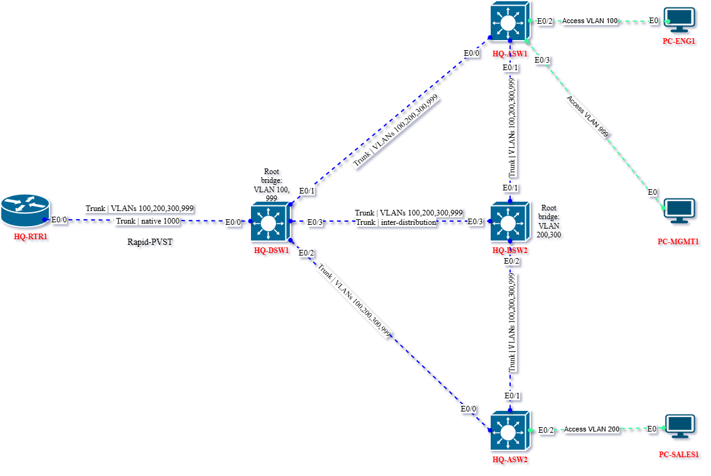
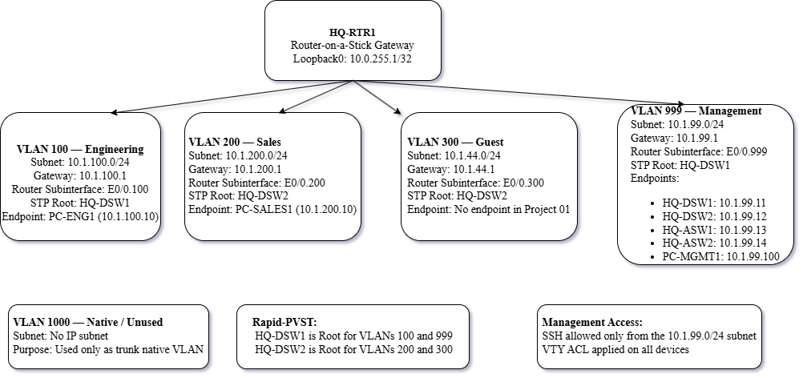

# Project 01 — Campus Foundation

## Problem Statement

Building a single-site campus network from scratch. Multiple departments need network
segmentation, a dedicated management network for device access, and inter-VLAN routing
so departments can communicate through controlled paths.

## STAR Summary

**Situation:** I was studying VLANs, trunking, and inter-VLAN routing as separate topics
and realized I had never designed a complete campus network from a blank canvas.

**Task:** Design and build a fully segmented campus network from a written requirement —
choosing the VLAN scheme, IP addressing, trunk design, STP priorities, and SSH hardening.

**Action:** Built a multi-VLAN campus (VLANs 100/200/300/999) with proper trunk pruning,
router-on-a-stick inter-VLAN routing, deliberate STP root election with backup roots,
and SSH-only management access restricted to a dedicated management VLAN.

**Result:** Can design a multi-VLAN campus network from scratch, explain every design
decision, and verify that VLANs, trunking, STP, inter-VLAN routing, and SSH are all
working correctly together.

---

## Topology

### Physical

### Logical

---

## Technologies Used

- VLANs (100, 200, 300, 999, 1000)
- 802.1Q Trunking with VLAN pruning
- Native VLAN hardening (VLAN 1000)
- Router-on-a-Stick inter-VLAN routing
- Rapid-PVST+ with deliberate root bridge election
- PortFast + BPDU Guard on access ports
- SSH v2 with VTY ACL restricted to management VLAN
- CDP neighbor verification
- Interface descriptions on all links

---

## IP Addressing

| Device | Interface | IP | Purpose |
|--------|-----------|-----|---------|
| HQ-RTR1 | E0/0.100 | 10.1.100.1/24 | Engineering gateway |
| HQ-RTR1 | E0/0.200 | 10.1.200.1/24 | Sales gateway |
| HQ-RTR1 | E0/0.300 | 10.1.44.1/24 | Guest gateway |
| HQ-RTR1 | E0/0.999 | 10.1.99.1/24 | Management gateway |
| HQ-RTR1 | Loopback0 | 10.0.255.1/32 | Router ID |
| HQ-DSW1 | Vlan999 | 10.1.99.11/24 | Management |
| HQ-DSW2 | Vlan999 | 10.1.99.12/24 | Management |
| HQ-ASW1 | Vlan999 | 10.1.99.13/24 | Management |
| HQ-ASW2 | Vlan999 | 10.1.99.14/24 | Management |
| PC-ENG1 | eth0 | 10.1.100.10/24 | Engineering endpoint |
| PC-SALES1 | eth0 | 10.1.200.10/24 | Sales endpoint |
| PC-MGMT1 | eth0 | 10.1.99.100/24 | Management endpoint |

---

## Key Verification

| Check | Command | Expected Result |
|-------|---------|-----------------|
| VLANs exist | `show vlan brief` | VLANs 100,200,300,999,1000 active |
| Trunks up | `show interfaces trunk` | All uplinks trunking, native 1000 |
| Inter-VLAN routing | `ping 10.1.200.10` from PC-ENG1 | Success |
| STP root correct | `show spanning-tree root` | DSW1=root VLAN100/999, DSW2=root VLAN200/300 |
| SSH restricted | `ssh` from PC-ENG1 | Denied (wrong VLAN) |
| SSH working | `ssh` from PC-MGMT1 | Success |

---

## Files

- `configs/` — Running configurations for all devices
- `diagrams/` — Physical and logical topology (draw.io + PNG)
- `verification/baseline/` — Show command outputs before changes
- `verification/post-change/` — Show command outputs after each phase
- `verification/screenshots/` — Key screenshots
- `notes/decision-log.md` — Design decisions and rationale
- `cml/` — CML topology YAML export
