# Project 02 — Multi-Site Expansion + DHCP

## Problem Statement

HQ exists as an isolated campus. The business opens a second site (branch). You need to build the branch from scratch — matching the same VLAN scheme, same management architecture, same security baseline — connect it to HQ over a WAN link, deploy centralized DHCP serving both sites through a relay agent, add IPv6 dual-stack, and prove DNS resolution works end-to-end.

## STAR Summary

**Situation:** A single-site campus network existed with no branch connectivity, no DHCP service, and no DNS. Every endpoint had static IPs. A second site needed to come online and share the same infrastructure.

**Task:** Design and build a multi-site enterprise network from scratch — branch switching, WAN connectivity, centralized DHCP with relay, IPv6 dual-stack, and DNS — all while maintaining the same security and management standards as HQ.

**Action:** Deployed BR-RTR1 (router-on-a-stick), BR-DSW1 (distribution), BR-ASW1 (access) with full VLAN infrastructure matching HQ. Connected HQ and Branch via a point-to-point /30 WAN. Deployed a centralized Dnsmasq DHCP server on HQ that serves all 8 VLANs across both sites using ip helper-address relay. Added IPv6 /64 prefixes on VLAN 100 at both sites with SLAAC autoconfiguration. Configured DNS with static records for all infrastructure and verified end-to-end name resolution across the WAN.

**Result:** Can design a multi-site network, explain every routing and relay decision, configure centralized DHCP serving remote sites over a WAN, and verify dual-stack IPv4/IPv6 connectivity from endpoints at both sites.

---

## CML Lab Topology

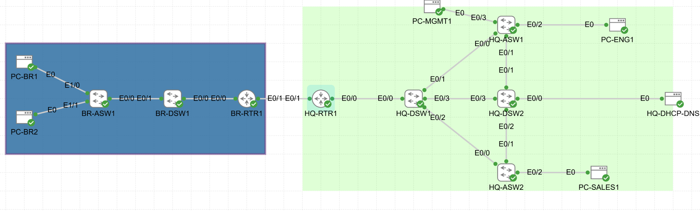

---

## Technologies Used

- Router-on-a-Stick inter-VLAN routing (branch site)
- 802.1Q Trunking with VLAN pruning (VLANs 100,200,300,500,999,1000)
- Point-to-point WAN /30 (10.0.0.0/30)
- Static routing — explicit per-subnet routes both directions
- Centralized DHCP (Dnsmasq) with ip helper-address relay
- DHCP pools for 8 VLANs across 2 sites
- Static DHCP reservations (MAC-to-IP binding)
- IPv6 dual-stack — /126 WAN, /64 VLAN 100 at both sites
- SLAAC (Stateless Address Autoconfiguration) via Router Advertisements
- DNS with static A records via Dnsmasq address= directives
- Rapid-PVST+ STP with BR-DSW1 as root for all VLANs
- PortFast + BPDU Guard on all access ports
- SSH v2 with VTY ACL restricted to management VLAN
- ip routing on access switch (required for remote-subnet ICMP replies)
- bandwidth and delay tuned on WAN interfaces for Project 03 OSPF prep

---

## IP Addressing

### Branch Site (10.2.x.x)

| Device | Interface | IP | Purpose |
|--------|-----------|-----|---------|
| BR-RTR1 | E0/0.100 | 10.2.100.1/24 | Engineering gateway |
| BR-RTR1 | E0/0.200 | 10.2.200.1/24 | Sales gateway |
| BR-RTR1 | E0/0.300 | 10.2.44.1/24 | Guest gateway |
| BR-RTR1 | E0/0.500 | 10.2.50.1/24 | Voice gateway |
| BR-RTR1 | E0/0.999 | 10.2.99.1/24 | Management gateway |
| BR-DSW1 | Vlan999 | 10.2.99.2/24 | Management SVI |
| BR-ASW1 | Vlan999 | 10.2.99.3/24 | Management SVI |
| PC-BR1 | eth0 | 10.2.100.197/24 | Branch Engineering (DHCP reserved) |
| PC-BR2 | eth0 | 10.2.200.108/24 | Branch Sales (DHCP reserved) |

### WAN Link

| Device | Interface | IP | Purpose |
|--------|-----------|-----|---------|
| HQ-RTR1 | E0/1 | 10.0.0.1/30 | WAN hub-side |
| BR-RTR1 | E0/1 | 10.0.0.2/30 | WAN spoke-side |

### HQ Additions (Project 02)

| Device | Interface | IP | Purpose |
|--------|-----------|-----|---------|
| HQ-RTR1 | E0/0.500 | 10.1.50.1/24 | Voice gateway (new) |
| HQ-DHCP-DNS | eth0 | 10.1.99.50/24 | Centralized DHCP+DNS server |

### IPv6 Addressing

| Interface | IPv6 | Purpose |
|-----------|------|---------|
| HQ-RTR1 E0/1 | 2001:db8:0:1::1/126 | WAN HQ-side |
| BR-RTR1 E0/1 | 2001:db8:0:1::2/126 | WAN Branch-side |
| HQ-RTR1 E0/0.100 | 2001:db8:1:100::1/64 | HQ Engineering IPv6 GW |
| BR-RTR1 E0/0.100 | 2001:db8:2:100::1/64 | Branch Engineering IPv6 GW |
| PC-BR1 eth0 | 2001:db8:2:100:5054:ff:fe22:a69c/64 | SLAAC (EUI-64) |

---

## DHCP Pool Summary

| Tag | Subnet | Range | Gateway | DNS |
|-----|--------|-------|---------|-----|
| hq-eng | 10.1.100.0/24 | .100–.200 | 10.1.100.1 | 10.1.99.50 |
| hq-sales | 10.1.200.0/24 | .100–.200 | 10.1.200.1 | 10.1.99.50 |
| hq-guest | 10.1.44.0/24 | .100–.200 | 10.1.44.1 | 10.1.99.50 |
| hq-voice | 10.1.50.0/24 | .100–.200 | 10.1.50.1 | 10.1.99.50 |
| br-eng | 10.2.100.0/24 | .100–.200 | 10.2.100.1 | 10.1.99.50 |
| br-sales | 10.2.200.0/24 | .100–.200 | 10.2.200.1 | 10.1.99.50 |
| br-guest | 10.2.44.0/24 | .100–.200 | 10.2.44.1 | 10.1.99.50 |
| br-voice | 10.2.50.0/24 | .100–.200 | 10.2.50.1 | 10.1.99.50 |

---

## Key Configurations

### Phase 1 — Branch Site Base

#### BR-RTR1: Router-on-a-Stick

```
! WHY: parent interface carries all VLAN traffic — no IP assigned here
interface Ethernet0/0
 description TRUNK-TO-BR-DSW1-E0/0
 no ip address
 no shutdown

! WHY: encapsulation dot1Q tells IOS which VLAN to tag/untag on this subinterface
! WHY: .1 convention — gateway always takes the first usable IP in each subnet
interface Ethernet0/0.100
 description GATEWAY-VLAN100-ENGINEERING
 encapsulation dot1Q 100
 ip address 10.2.100.1 255.255.255.0
 no shutdown

! WHY: VLAN 500 Voice built now even without phones — avoids rework in Project 11 QoS
interface Ethernet0/0.500
 description GATEWAY-VLAN500-VOICE
 encapsulation dot1Q 500
 ip address 10.2.50.1 255.255.255.0
 no shutdown

! WHY: native VLAN explicitly tagged prevents native VLAN mismatch vulnerabilities
! WHY: no IP on native — VLAN 1000 carries no routable traffic
interface Ethernet0/0.1000
 description NATIVE-VLAN1000-UNUSED
 encapsulation dot1Q 1000 native
 no shutdown
```

#### BR-DSW1: STP Root + Trunking

```
! WHY: ip routing enabled now — Project 03 needs DSW1 to run OSPF as an area router
ip routing

! WHY: Rapid-PVST+ converges in 1-3s vs 30-50s for 802.1D
! WHY: priority 4096 = 1/16 of default 32768 — guarantees BR-DSW1 wins election
! WHY: DSW1 must be root — if ASW1 were root, BPDUs would flow away from router
spanning-tree mode rapid-pvst
spanning-tree vlan 100,200,300,500,999,1000 priority 4096

! WHY: encapsulation dot1q MUST be set before switchport mode trunk on IOL-L2
! WHY: explicit allowed VLAN list — never leave trunks as "all VLANs"
interface Ethernet0/0
 description TRUNK-TO-BR-RTR1-E0/0
 switchport trunk encapsulation dot1q
 switchport mode trunk
 switchport trunk native vlan 1000
 switchport trunk allowed vlan 100,200,300,500,999,1000
 no shutdown
```

#### BR-ASW1: Access Ports + ip routing

```
! WHY: ip routing enabled — ip default-gateway alone cannot route replies
!      to remote-subnet sources (e.g. HQ-RTR1 pinging from 10.0.0.1)
!      See troubleshooting log for full diagnosis
ip routing
ip route 0.0.0.0 0.0.0.0 10.2.99.1

! WHY: switchport nonegotiate disables DTP — endpoints never negotiate trunks
! WHY: portfast skips STP listening/learning — endpoint gets link immediately
! WHY: bpduguard err-disables port if a BPDU arrives — prevents rogue switches
interface Ethernet1/0
 description ACCESS-PC-BR1-VLAN100
 switchport mode access
 switchport access vlan 100
 switchport nonegotiate
 spanning-tree portfast
 spanning-tree bpduguard enable
 no shutdown
```

---

### Phase 2 — WAN Connectivity

#### HQ-RTR1 and BR-RTR1: Point-to-Point WAN

```
! WHY: /30 gives exactly 2 usable IPs — perfect for point-to-point
! WHY: hub-side takes .1 (lower IP) by convention
! WHY: bandwidth 1000 and delay 1000 set for OSPF cost accuracy in Project 03
!      Without this, IOL defaults to 10 Mbps and OSPF cost will be wrong
interface Ethernet0/1
 description WAN-TO-BR-RTR1-E0/1
 ip address 10.0.0.1 255.255.255.252
 bandwidth 1000
 delay 1000
 no shutdown

! WHY: explicit per-subnet routes — more visible than summary during troubleshooting
! WHY: includes 10.2.99.0/24 (branch mgmt) — without this, SSH to branch fails
ip route 10.2.100.0 255.255.255.0 10.0.0.2
ip route 10.2.200.0 255.255.255.0 10.0.0.2
ip route 10.2.44.0 255.255.255.0 10.0.0.2
ip route 10.2.50.0 255.255.255.0 10.0.0.2
ip route 10.2.99.0 255.255.255.0 10.0.0.2
```

---

### Phase 3 — Centralized DHCP

#### HQ-RTR1 and BR-RTR1: DHCP Relay

```
! WHY: helper-address goes on the SUBINTERFACE — not the physical parent
! WHY: the relay agent uses the subinterface IP as the giaddr field
!      Dnsmasq reads giaddr to match the correct DHCP pool
! WHY: all data VLANs need helper-address — missing one = that VLAN gets no DHCP
interface Ethernet0/0.100
 ip helper-address 10.1.99.50

interface Ethernet0/0.200
 ip helper-address 10.1.99.50

interface Ethernet0/0.300
 ip helper-address 10.1.99.50

interface Ethernet0/0.500
 ip helper-address 10.1.99.50
```

#### HQ-DHCP-DNS: Dnsmasq Pool Configuration

```
# WHY: domain=lab.local sets default domain appended to all DHCP leases
# WHY: local=/lab.local/ tells dnsmasq to answer lab.local queries locally
domain=lab.local
local=/lab.local/
log-dhcp

# WHY: dhcp-range with set: tag — dnsmasq matches relay giaddr to pick the pool
# WHY: Dnsmasq reads giaddr (relay agent IP) and selects pool whose subnet matches
# WHY: option:router gives clients their default gateway
# WHY: option:dns-server points clients to this same server for DNS
dhcp-range=set:br-eng,10.2.100.100,10.2.100.200,255.255.255.0,24h
dhcp-option=tag:br-eng,option:router,10.2.100.1
dhcp-option=tag:br-eng,option:dns-server,10.1.99.50

# WHY: static DHCP reservations lock endpoints to permanent IPs using MAC address
# WHY: without this, address= DNS records break every time a node restarts
dhcp-host=52:54:00:22:a6:9c,pc-br1,10.2.100.197
dhcp-host=52:54:00:53:da:69,pc-br2,10.2.200.108

# WHY: address= puts DNS records directly in dnsmasq — more reliable than hosts file
# WHY: FQDN format used here — no expand-hosts ambiguity
address=/hq-rtr1.lab.local/10.1.99.1
address=/br-rtr1.lab.local/10.2.99.1
address=/hq-dhcp-dns.lab.local/10.1.99.50
address=/pc-br1.lab.local/10.2.100.197
address=/pc-br2.lab.local/10.2.200.108
```

---

### Phase 4 — IPv6 Dual-Stack

#### HQ-RTR1 and BR-RTR1: IPv6 Configuration

```
! WHY: ipv6 unicast-routing must be enabled globally — without it,
!      the router drops all IPv6 packets even if interfaces have addresses
ipv6 unicast-routing

! WHY: /126 on point-to-point WAN — IPv6 equivalent of /30
! WHY: 2001:db8::/32 is documentation range — safe for labs, never public-routed
interface Ethernet0/1
 ipv6 address 2001:db8:0:1::1/126
 ipv6 enable

! WHY: /64 is mandatory for SLAAC — hosts need this prefix to build their address
! WHY: Router Advertisements sent automatically once ipv6 unicast-routing is on
!      PC-BR1 builds its address via EUI-64: MAC 52:54:00:22:a6:9c
!      → inserts ff:fe in middle → flips 7th bit → 5054:ff:fe22:a69c
interface Ethernet0/0.100
 ipv6 address 2001:db8:1:100::1/64
 ipv6 enable

! WHY: static route needed — OSPF for IPv6 comes in Project 03
ipv6 route 2001:db8:2:100::/64 2001:db8:0:1::2
```

---

### Phase 5 — DNS End-to-End

#### Routers: DNS Client Configuration

```
! WHY: no ip domain lookup was set in Phase 1 hardening to prevent
!      IOS from DNS-resolving mistyped commands (30-second timeout)
!      This same setting also blocks legitimate DNS queries from the router
!      Re-enable it now that we have a valid name-server configured
ip domain lookup
ip name-server 10.1.99.50
```

---

## Screenshots

### Phase 1 — Branch Site Base

**BR-RTR1 show ip interface brief — all subinterfaces up**
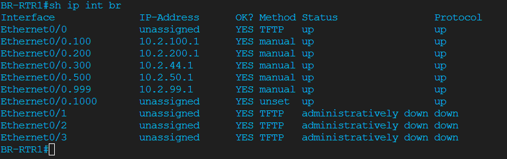

**BR-RTR1 show cdp neighbors — BR-DSW1 confirmed**
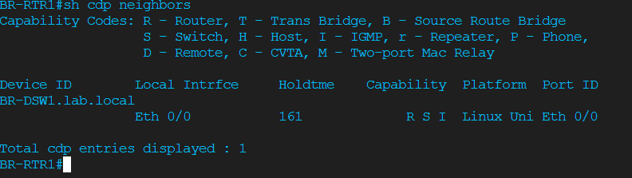

**BR-DSW1 show interfaces trunk — both uplinks trunking**
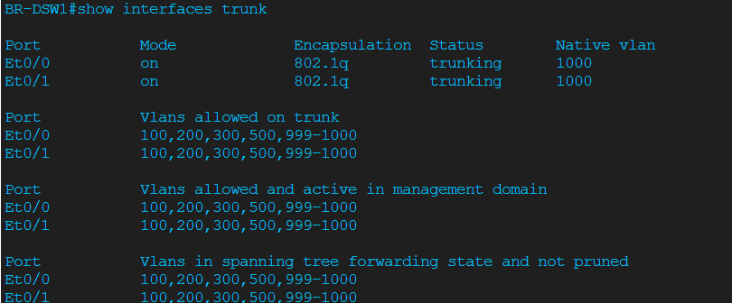

**BR-DSW1 show spanning-tree vlan 100 — root bridge confirmed**
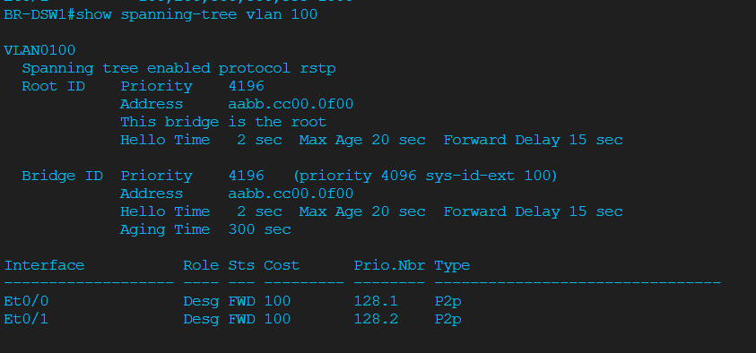

**BR-ASW1 show vlan brief — PC-BR1 in VLAN 100, PC-BR2 in VLAN 200**
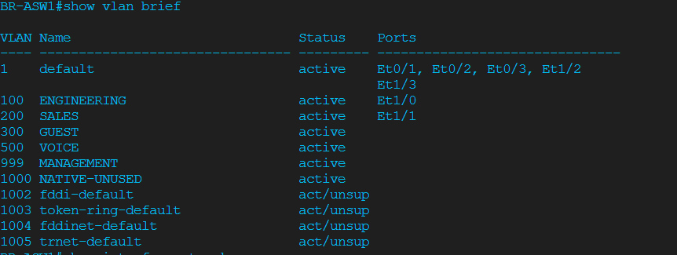

**Cross-device ping — management plane reachable across all devices**
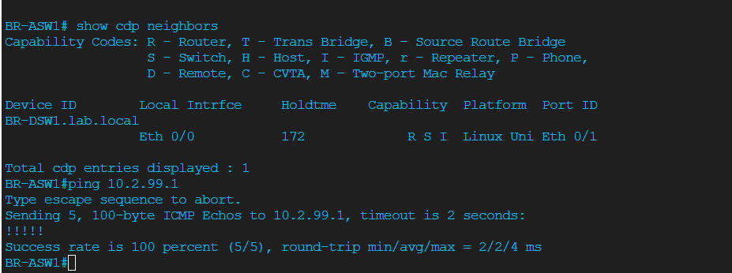

---

### Phase 2 — WAN Connectivity

**HQ-RTR1 show ip route — 5 static routes to branch subnets**
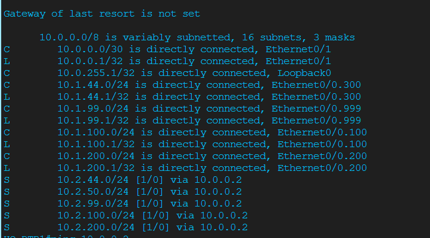

**Cross-site connectivity — PC-MGMT1 reaching BR-ASW1**
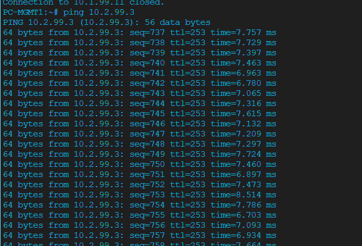

**BR-RTR1 show ip route — 6 static routes to HQ subnets**
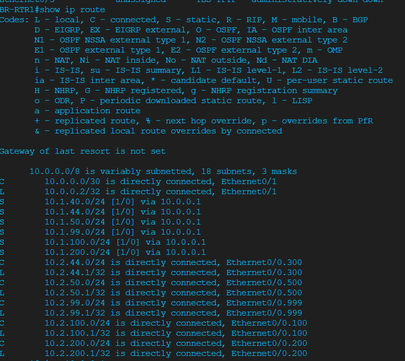

---

### Phase 3 — Centralized DHCP

**dnsmasq log — live DHCP lease assignments across both sites**
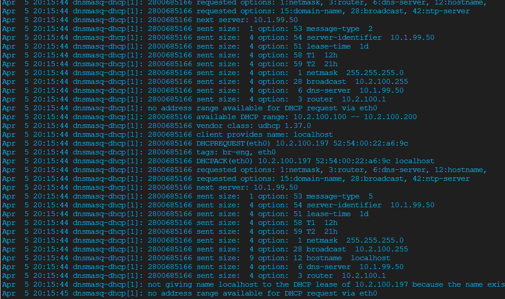

**BR-RTR1 show ip arp — PC-BR1 and PC-BR2 leases visible**
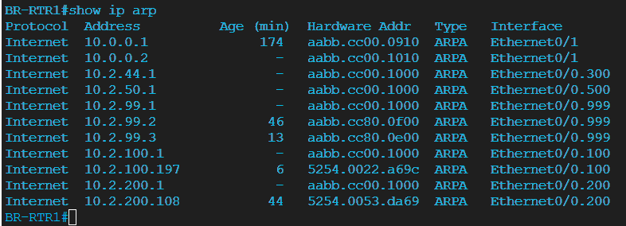

**HQ-RTR1 show ip arp — HQ endpoints with DHCP leases**
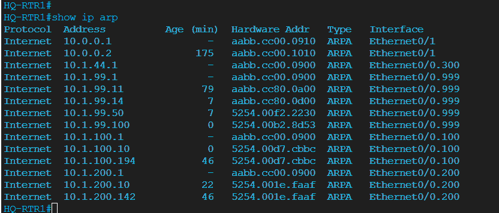

**PC-BR2 ip addr show eth0 — 10.2.200.108 from 10.1.99.50**
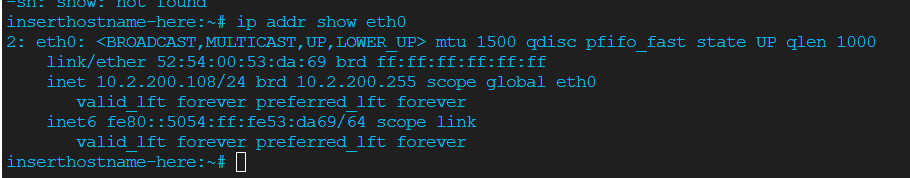

**HQ-DSW2 show vlan brief — DHCP server port Et0/0 in VLAN 999**
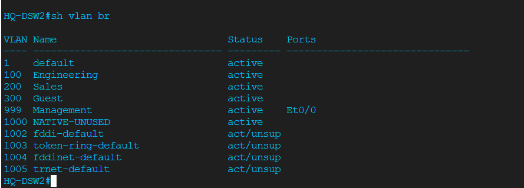

---

### Phase 4 — IPv6 Dual-Stack

**HQ-RTR1 show ipv6 route — static route to branch 2001:db8:2:100::/64**
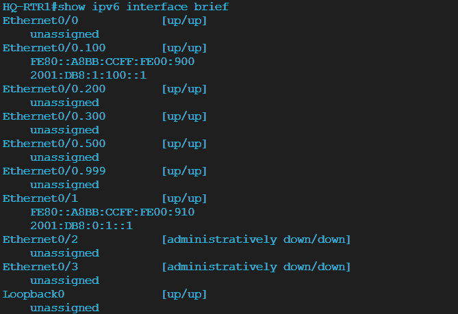

**BR-RTR1 show ipv6 route — static route to HQ 2001:db8:1:100::/64**
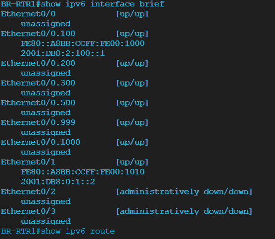

**Cross-site IPv6 ping — HQ-RTR1 to BR-RTR1 VLAN 100**
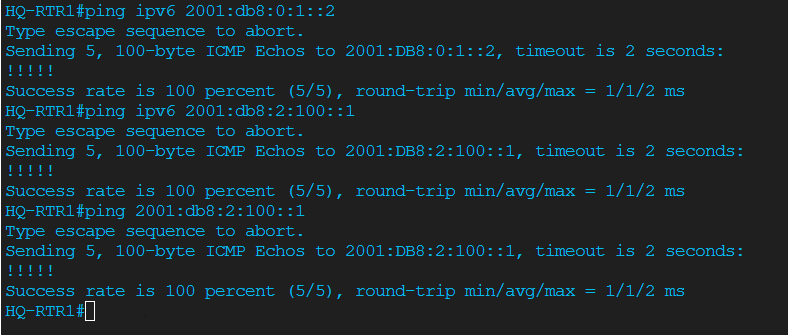

**PC-BR1 SLAAC address — EUI-64 built from MAC address**
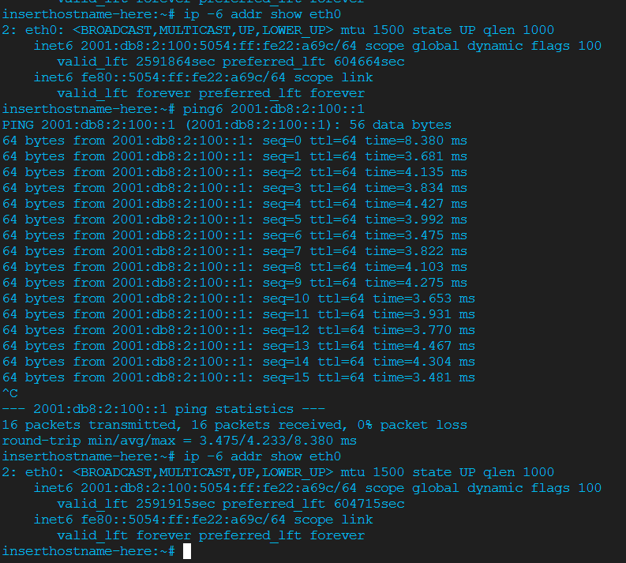

---

### Phase 5 — DNS End-to-End

**PC-BR1 nslookup — resolving hq-rtr1.lab.local to 10.1.99.1**
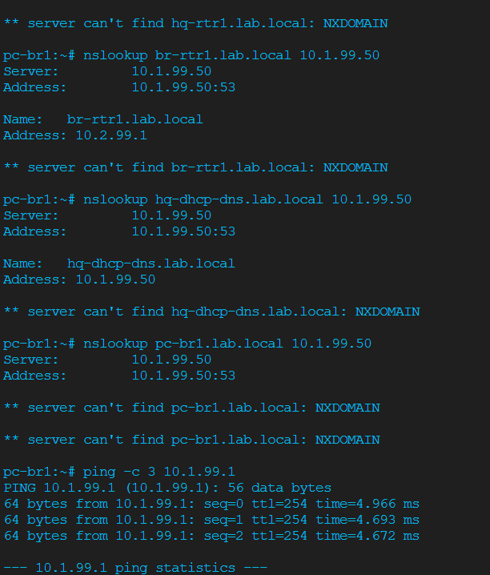

**PC-BR1 nslookup — resolving br-rtr1.lab.local to 10.2.99.1**
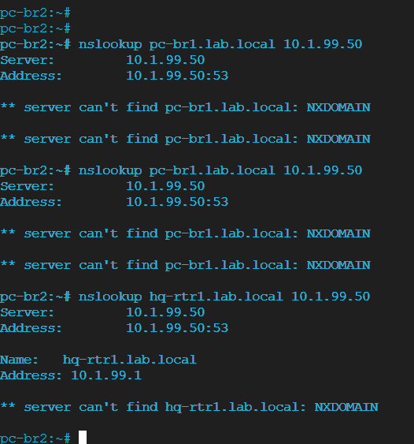

**BR-RTR1 ping by name — hq-rtr1.lab.local resolving across WAN**
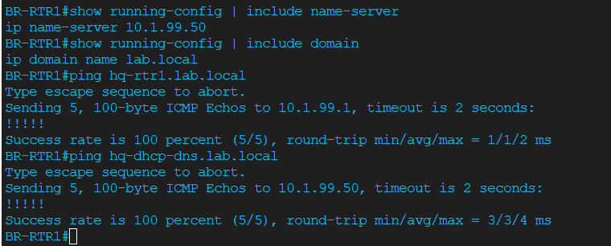

**HQ-RTR1 ping by name — br-rtr1.lab.local resolving cross-site**
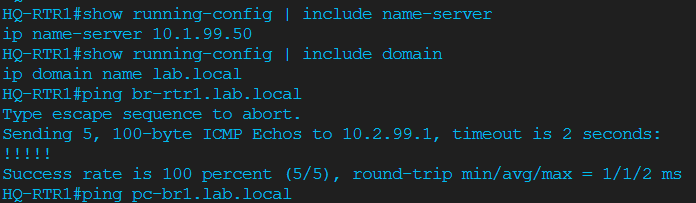

**HQ-DSW2 VLAN verify — Et0/0 confirmed in VLAN 999 for DHCP-DNS server**
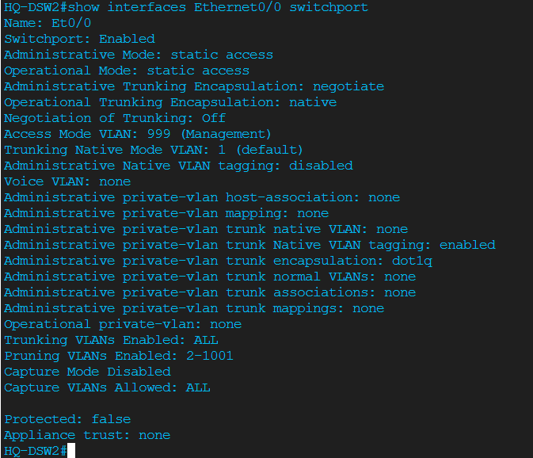

---

### Break/Fix Challenge — Three Simultaneous DHCP Faults

**PC-BR1 DHCP restored after all three faults fixed**
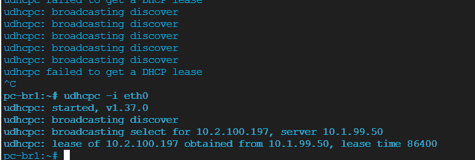

**PC-BR2 DHCP restored**
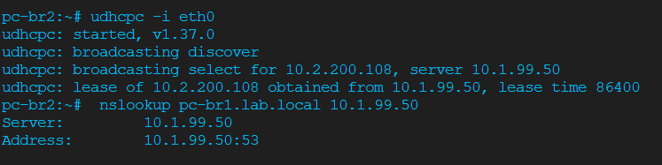

**BR-RTR1 fixed helper-address — all four subinterfaces pointing to 10.1.99.50**
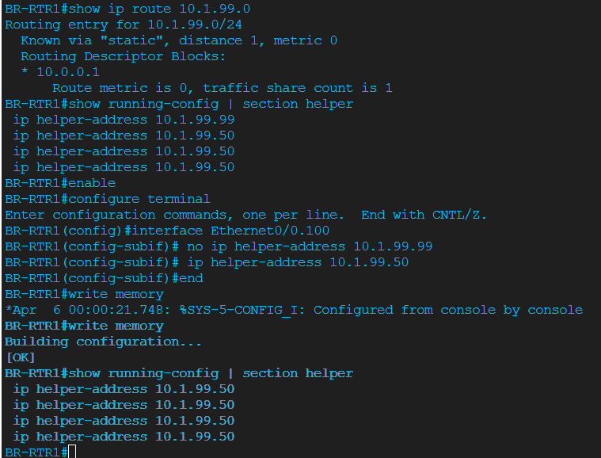

**HQ-RTR1 fixed helper-address**
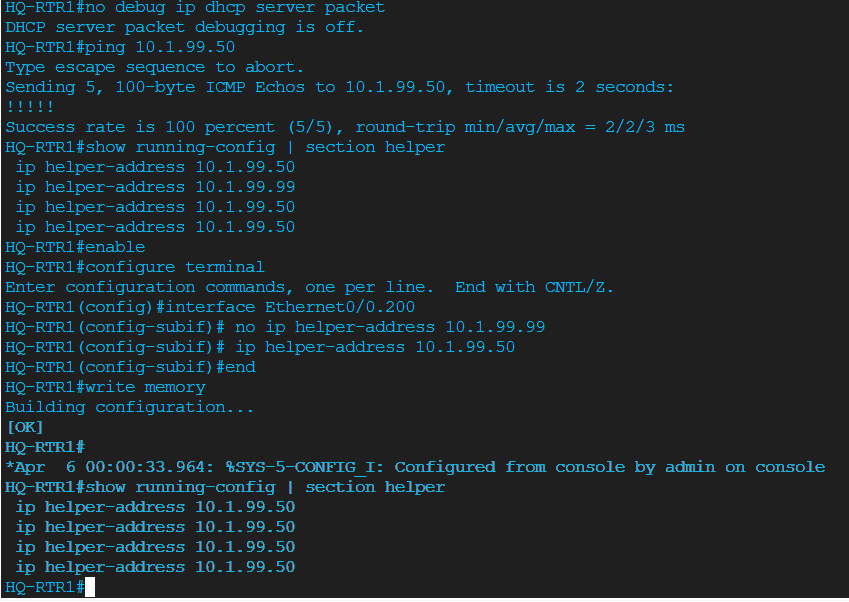

---

## Key Verification Commands

| Command | Device | Expected Result |
|---------|--------|-----------------|
| `show ip interface brief` | BR-RTR1 | E0/0.100–.999 all up/up with 10.2.x.x IPs |
| `show interfaces trunk` | BR-DSW1 | E0/0 and E0/1 trunking, native 1000, VLANs 100/200/300/500/999 |
| `show vlan brief` | BR-ASW1 | Et1/0 in VLAN 100, Et1/1 in VLAN 200 |
| `show spanning-tree vlan 100` | BR-DSW1 | "This bridge is the root" priority 4196 |
| `show ip route` | HQ-RTR1 | 5 static routes to 10.2.x.x subnets via 10.0.0.2 |
| `show ip route` | BR-RTR1 | 6 static routes to 10.1.x.x subnets via 10.0.0.1 |
| `show running-config \| section helper` | Both routers | ip helper-address 10.1.99.50 on all data subinterfaces |
| `udhcpc -i eth0` | PC-BR1 | Lease from 10.1.99.50 in range 10.2.100.100–200 |
| `show ipv6 route` | HQ-RTR1 | S 2001:db8:2:100::/64 via 2001:db8:0:1::2 |
| `ip -6 addr show eth0` | PC-BR1 | 2001:db8:2:100::/64 SLAAC address (EUI-64) |
| `nslookup hq-rtr1.lab.local 10.1.99.50` | PC-BR1 | A record: 10.1.99.1 |

---

## Files

- `configs/` — Phase-by-phase running configs and delta configs for all devices
- `diagrams/` — CML topology screenshot
- `verification/post-change/phase1–5/` — Show command outputs per phase per device
- `verification/post-change/breakfix/` — Full break/fix diagnosis outputs
- `verification/screenshots/` — Evidence screenshots for all phases
- `notes/decision-log.md` — Design decisions and rationale
- `cml/` — CML topology YAML export (when available)
