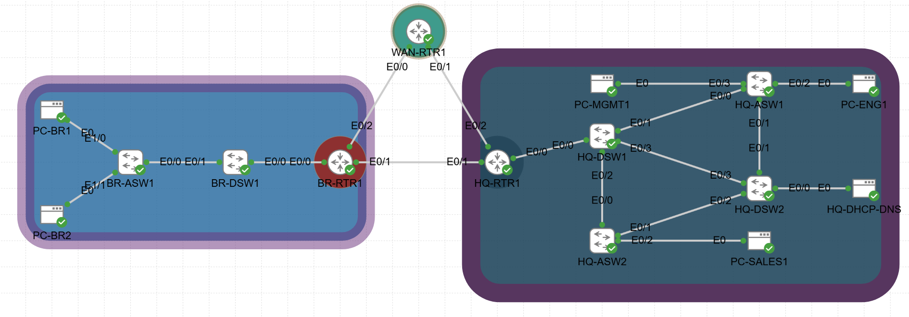
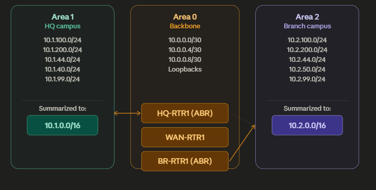
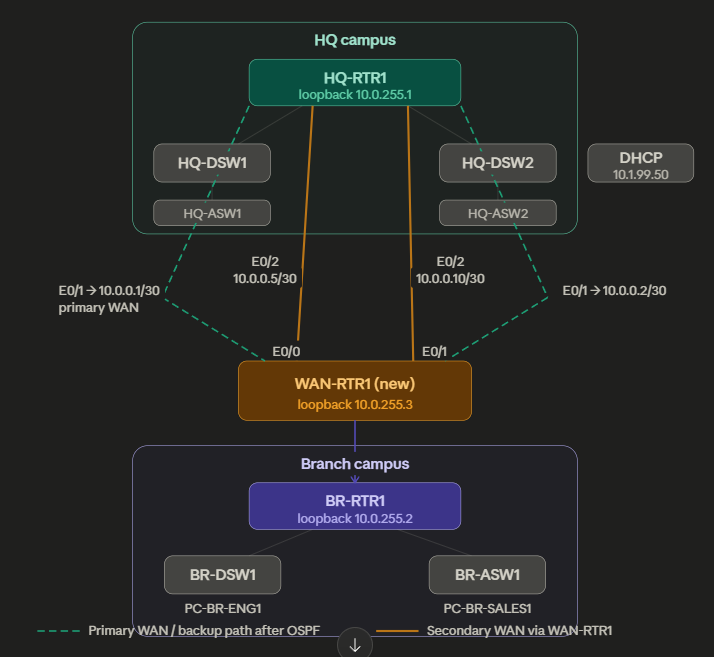

# Project 03 — Dynamic Routing with OSPF
### Enterprise Network Lab Series | CML 2.9 | IOL Routers

---

## STAR Summary

**Situation:**
After completing Projects 01 and 02, the two-site network (HQ and Branch) relied entirely
on manually configured static routes. Every subnet had to be explicitly listed on every
router. There was no automatic failover — if a WAN link failed, traffic stopped. There
was no path redundancy, no authentication on routing updates, and no mechanism to detect
link failures faster than the default 40-second OSPF dead timer.

**Task:**
Migrate the entire network from static routing to multi-area OSPF. Add a second WAN path
through a new transit router (WAN-RTR1), authenticate all routing updates with MD5,
implement BFD for sub-second link failure detection, add IP SLA tracked floating static
routes as a belt-and-suspenders backup layer, and replace IPv6 static routes with OSPFv3.

**Action:**
- Deployed WAN-RTR1 as a second WAN path between HQ and Branch
- Migrated from static routing to single-area OSPF, then restructured into 3-area design
- Configured MD5 authentication on all WAN-facing OSPF interfaces
- Tuned OSPF costs to make WAN-RTR1 the preferred path (cost 20) and the direct HQ↔BR
  link the backup (cost 100)
- Ran a full link failure and reconvergence test — confirmed failover and restoration
- Deployed BFD on all WAN interfaces, binding it to OSPF for sub-second detection
- Configured IP SLA ICMP probes on directly connected backup links with object tracking
  and floating static routes (AD 250) as the last-resort backup layer
- Replaced IPv6 static routes with OSPFv3 multi-area, corrected network type to
  point-to-point on WAN links
- Diagnosed and resolved 5 real troubleshooting scenarios throughout the build

**Result:**
Can design, implement, and troubleshoot multi-area OSPF with redundancy, MD5
authentication, BFD, IP SLA tracking, cost-based traffic engineering, and OSPFv3.
The network now fails over in under 1 second (BFD) and has three layers of redundancy:
preferred OSPF path, backup OSPF path, and tracked floating static last resort.

---

## The Engineering Problem This Project Solves

Static routing does not scale and does not self-heal. In a two-site enterprise:

- A WAN link failure means total loss of inter-site connectivity — no automatic rerouting
- Every new subnet requires manual route entries on every router
- There is no authentication — any device can advertise false routes
- Convergence after a failure depends on dead timers (40 seconds by default)

OSPF solves all of these. Multi-area OSPF adds summarization to keep route tables lean.
BFD collapses failure detection from 40 seconds to under 1 second. IP SLA tracking
provides a last-resort failsafe even if the routing protocol itself fails.

---

## Topology



> CML lab topology — 15 nodes running in Cisco CML 2.9 with IOL routers and IOL-L2 switches.

---

### OSPF Area Design



This diagram shows how the network is carved into three OSPF areas. The key concept is that not every router needs to know about every subnet — areas contain the flooding and ABRs summarize across boundaries.

**Area 1** on the left is the HQ campus. Every VLAN subnet at HQ (Engineering, Sales, Guest, Servers, Management) lives here. Instead of advertising all five /24s into the backbone, HQ-RTR1 summarizes them into a single `10.1.0.0/16` — one route instead of five.

**Area 0** in the center is the backbone. All WAN point-to-point links and router loopbacks live here. This is the only area that all inter-area traffic must cross. WAN-RTR1 lives exclusively in Area 0 — it's not an ABR, just a backbone router providing the second path.

**Area 2** on the right mirrors Area 1 but for the Branch campus. All Branch VLANs live here, summarized by BR-RTR1 into `10.2.0.0/16` before being injected into the backbone.

HQ-RTR1 and BR-RTR1 are the ABRs — they each have one foot in Area 0 and one foot in their campus area, maintaining two separate LSDB tables and translating between them.

---

### Physical Layout (15 Nodes)



This diagram shows how the 15 actual nodes connect and where every interface IP lands.

At the top, **HQ campus** has HQ-RTR1 as the gateway, with HQ-DSW1 and HQ-DSW2 hanging off it downward into the access layer. HQ-RTR1 has three WAN-facing interfaces: E0/0 faces the campus, E0/1 is the direct WAN link to BR-RTR1 (`10.0.0.1/30 ↔ 10.0.0.2/30`), and E0/2 is the new link down to WAN-RTR1 (`10.0.0.5/30`).

**WAN-RTR1** in the middle is the new node added in Project 3. It connects to HQ-RTR1 on E0/0 (`10.0.0.6/30`) and to BR-RTR1 on E0/1 (`10.0.0.9/30`). It creates the second WAN path — traffic can now reach Branch either directly (the dashed green line) or via WAN-RTR1 (the amber lines). OSPF cost tuning in Phase 4 decides which path wins.

At the bottom, **Branch campus** mirrors HQ — BR-RTR1 as the gateway, BR-DSW1 and BR-ASW1 below it, endpoints at the bottom. BR-RTR1's E0/2 connects up to WAN-RTR1 to complete the triangle.

### New Connections Added in Project 03

| Side A | Interface | Side B | Interface | Subnet |
|--------|-----------|--------|-----------|--------|
| HQ-RTR1 | Ethernet0/2 | WAN-RTR1 | Ethernet0/1 | 10.0.0.4/30 |
| WAN-RTR1 | Ethernet0/0 | BR-RTR1 | Ethernet0/2 | 10.0.0.8/30 |

> **Note:** In CML, the actual cable connections ended up reversed from the initial plan.
> CDP verification (`show cdp neighbors`) caught this before any misconfiguration could
> propagate. Always run CDP before assigning IPs.

---

## IP Addressing

### WAN Links (Point-to-Point /30)

| Link | Router A | IP | Router B | IP |
|------|----------|----|----------|----|
| Primary WAN | HQ-RTR1 E0/1 | 10.0.0.1/30 | BR-RTR1 E0/1 | 10.0.0.2/30 |
| HQ → WAN-RTR1 | HQ-RTR1 E0/2 | 10.0.0.5/30 | WAN-RTR1 E0/1 | 10.0.0.6/30 |
| BR → WAN-RTR1 | BR-RTR1 E0/2 | 10.0.0.10/30 | WAN-RTR1 E0/0 | 10.0.0.9/30 |

### Loopbacks (Router IDs)

| Router | Loopback0 |
|--------|-----------|
| HQ-RTR1 | 10.0.255.1/32 |
| BR-RTR1 | 10.0.255.2/32 |
| WAN-RTR1 | 10.0.255.3/32 |

### HQ Campus VLANs (Area 1)

| VLAN | Name | Subnet | Gateway |
|------|------|--------|---------|
| 100 | Engineering | 10.1.100.0/24 | 10.1.100.1 (HQ-RTR1) |
| 200 | Sales | 10.1.200.0/24 | 10.1.200.1 |
| 300 | Guest | 10.1.44.0/24 | 10.1.44.1 |
| 400 | Server | 10.1.40.0/24 | 10.1.40.1 |
| 999 | Management | 10.1.99.0/24 | 10.1.99.1 |

### Branch Campus VLANs (Area 2)

| VLAN | Name | Subnet | Gateway |
|------|------|--------|---------|
| 100 | Engineering | 10.2.100.0/24 | 10.2.100.1 (BR-RTR1) |
| 200 | Sales | 10.2.200.0/24 | 10.2.200.1 |
| 300 | Guest | 10.2.44.0/24 | 10.2.44.1 |
| 500 | Wireless | 10.2.50.0/24 | 10.2.50.1 |
| 999 | Management | 10.2.99.0/24 | 10.2.99.1 |

---

## Pre-Work: Before Any Configuration

Before touching OSPF, verify the physical layer. Run on every router after
adding WAN-RTR1 to the topology:

```
show cdp neighbors
show ip interface brief
```

**Why this matters:** In this build, the CML cables for WAN-RTR1 were connected
to the opposite interfaces from what was planned. Without CDP verification, IPs
would have been assigned to the wrong interfaces and pings would have failed with
no obvious reason. CDP caught it immediately.

**Expected CDP output on WAN-RTR1 after cabling:**
```
Device ID        Local Intrfce     Holdtme    Capability  Platform  Port ID
HQ-RTR1          Eth 0/1           131        R           Linux Uni Eth 0/2
BR-RTR1          Eth 0/0           135        R           Linux Uni Eth 0/2
```

---

## Phase 1 — Single-Area OSPF Migration

### Goal
Remove all static routes. Replace with OSPF Area 0 on all three routers.
Use `passive-interface default` so OSPF hellos only exit on WAN interfaces.
Configure loopbacks for stable router IDs. Set WAN interfaces to point-to-point
network type (eliminates unnecessary DR/BDR election on /30 links).

### Step 1: Configure WAN-RTR1 (new device)

```
! DEVICE: WAN-RTR1 — Base config + Loopback + WAN interfaces
hostname WAN-RTR1

interface Loopback0
 description ROUTER-ID-LOOPBACK
 ip address 10.0.255.3 255.255.255.255
 no shutdown

interface Ethernet0/1
 description WAN-TO-HQ-RTR1-E0/2
 ip address 10.0.0.6 255.255.255.252
 no shutdown

interface Ethernet0/0
 description WAN-TO-BR-RTR1-E0/2
 ip address 10.0.0.9 255.255.255.252
 no shutdown

lldp run
```

### Step 2: Add Loopback and New WAN Interface to HQ-RTR1

```
! DEVICE: HQ-RTR1
interface Loopback0
 description ROUTER-ID-LOOPBACK
 ip address 10.0.255.1 255.255.255.255
 no shutdown

interface Ethernet0/2
 description WAN-TO-WAN-RTR1-E0/1
 ip address 10.0.0.5 255.255.255.252
 no shutdown
```

### Step 3: Add Loopback and New WAN Interface to BR-RTR1

```
! DEVICE: BR-RTR1
interface Loopback0
 description ROUTER-ID-LOOPBACK
 ip address 10.0.255.2 255.255.255.255
 no shutdown

interface Ethernet0/2
 description WAN-TO-WAN-RTR1-E0/0
 ip address 10.0.0.10 255.255.255.252
 no shutdown
```

### Step 4: Check Existing Static Routes Before Removing Them

```
! Run on HQ-RTR1 and BR-RTR1 before configuring OSPF
show running-config | include ip route
```

HQ-RTR1 had:
```
ip route 10.2.44.0 255.255.255.0 10.0.0.2
ip route 10.2.50.0 255.255.255.0 10.0.0.2
ip route 10.2.99.0 255.255.255.0 10.0.0.2
ip route 10.2.100.0 255.255.255.0 10.0.0.2
ip route 10.2.200.0 255.255.255.0 10.0.0.2
```

BR-RTR1 had:
```
ip route 10.1.40.0 255.255.255.0 10.0.0.1
ip route 10.1.44.0 255.255.255.0 10.0.0.1
ip route 10.1.50.0 255.255.255.0 10.0.0.1
ip route 10.1.99.0 255.255.255.0 10.0.0.1
ip route 10.1.100.0 255.255.255.0 10.0.0.1
ip route 10.1.200.0 255.255.255.0 10.0.0.1
```

### Step 5: Configure OSPF — Configure First, Then Remove Statics

> **Critical sequence:** Configure OSPF on a router BEFORE removing its static routes.
> OSPF will form adjacencies immediately. Once neighbours are FULL, then remove statics.
> This prevents any outage during the cutover.

**WAN-RTR1 (no statics to remove — start here):**

```
router ospf 1
 router-id 10.0.255.3
 log-adjacency-changes detail
 passive-interface default
 no passive-interface Ethernet0/0
 no passive-interface Ethernet0/1
 network 10.0.255.3 0.0.0.0 area 0
 network 10.0.0.4 0.0.0.3 area 0
 network 10.0.0.8 0.0.0.3 area 0
```

**HQ-RTR1:**

```
router ospf 1
 router-id 10.0.255.1
 log-adjacency-changes detail
 passive-interface default
 no passive-interface Ethernet0/1
 no passive-interface Ethernet0/2
 network 10.0.255.1 0.0.0.0 area 0
 network 10.0.0.0 0.0.0.3 area 0
 network 10.0.0.4 0.0.0.3 area 0
 network 10.1.100.0 0.0.0.255 area 0
 network 10.1.200.0 0.0.0.255 area 0
 network 10.1.44.0 0.0.0.255 area 0
 network 10.1.40.0 0.0.0.255 area 0
 network 10.1.99.0 0.0.0.255 area 0

! Remove statics AFTER OSPF configured
no ip route 10.2.44.0 255.255.255.0 10.0.0.2
no ip route 10.2.50.0 255.255.255.0 10.0.0.2
no ip route 10.2.99.0 255.255.255.0 10.0.0.2
no ip route 10.2.100.0 255.255.255.0 10.0.0.2
no ip route 10.2.200.0 255.255.255.0 10.0.0.2
```

**BR-RTR1:**

```
router ospf 1
 router-id 10.0.255.2
 log-adjacency-changes detail
 passive-interface default
 no passive-interface Ethernet0/1
 no passive-interface Ethernet0/2
 network 10.0.255.2 0.0.0.0 area 0
 network 10.0.0.0 0.0.0.3 area 0
 network 10.0.0.8 0.0.0.3 area 0
 network 10.2.100.0 0.0.0.255 area 0
 network 10.2.200.0 0.0.0.255 area 0
 network 10.2.44.0 0.0.0.255 area 0
 network 10.2.50.0 0.0.0.255 area 0
 network 10.2.99.0 0.0.0.255 area 0

no ip route 10.1.40.0 255.255.255.0 10.0.0.1
no ip route 10.1.44.0 255.255.255.0 10.0.0.1
no ip route 10.1.50.0 255.255.255.0 10.0.0.1
no ip route 10.1.99.0 255.255.255.0 10.0.0.1
no ip route 10.1.100.0 255.255.255.0 10.0.0.1
no ip route 10.1.200.0 255.255.255.0 10.0.0.1
```

### Step 6: Fix DR/BDR Election on WAN Links

After OSPF came up, `show ip ospf neighbor` showed `FULL/DR` and `FULL/BDR` on
point-to-point /30 WAN links. IOL Ethernet interfaces default to BROADCAST network
type, which triggers an unnecessary DR/BDR election. Apply on all WAN interfaces
across all 3 routers:

```
! HQ-RTR1
interface Ethernet0/1
 ip ospf network point-to-point
interface Ethernet0/2
 ip ospf network point-to-point

! BR-RTR1
interface Ethernet0/1
 ip ospf network point-to-point
interface Ethernet0/2
 ip ospf network point-to-point

! WAN-RTR1
interface Ethernet0/0
 ip ospf network point-to-point
interface Ethernet0/1
 ip ospf network point-to-point
```

### Phase 1 Verification

```
show ip ospf neighbor        ! Look for FULL/ - with Pri=0 on all routers
show ip route ospf           ! Look for O routes, no S routes remaining
show running-config | include ip route  ! Should return nothing
ping 10.2.100.1 source 10.1.100.1      ! End-to-end test
```

**Expected on HQ-RTR1:**
```
Neighbor ID     Pri   State     Dead Time   Address    Interface
10.0.255.3        0   FULL/ -   00:00:33    10.0.0.6   Ethernet0/2
10.0.255.2        0   FULL/ -   00:00:32    10.0.0.2   Ethernet0/1
```

> 📸 **Screenshot:** `P03-Ph1-ospf-neighbors-full.png`
> Command: `show ip ospf neighbor` on HQ-RTR1

---

## Phase 2 — Multi-Area OSPF Design

### Goal
Split the single Area 0 into three areas. HQ-RTR1 and BR-RTR1 become ABRs.
Summarization at ABRs reduces the LSA database size — WAN-RTR1 sees one summary
route per site instead of 5 individual /24 routes.

### HQ-RTR1 — Move Campus VLANs from Area 0 to Area 1

```
router ospf 1
 ! Remove from Area 0
 no network 10.1.100.0 0.0.0.255 area 0
 no network 10.1.200.0 0.0.0.255 area 0
 no network 10.1.44.0 0.0.0.255 area 0
 no network 10.1.40.0 0.0.0.255 area 0
 no network 10.1.99.0 0.0.0.255 area 0

 ! Add to Area 1
 network 10.1.100.0 0.0.0.255 area 1
 network 10.1.200.0 0.0.0.255 area 1
 network 10.1.44.0 0.0.0.255 area 1
 network 10.1.40.0 0.0.0.255 area 1
 network 10.1.99.0 0.0.0.255 area 1

 ! Summarize Area 1 into Area 0
 area 1 range 10.1.0.0 255.255.0.0
```

### BR-RTR1 — Move Campus VLANs from Area 0 to Area 2

```
router ospf 1
 ! Remove from Area 0
 no network 10.2.100.0 0.0.0.255 area 0
 no network 10.2.200.0 0.0.0.255 area 0
 no network 10.2.44.0 0.0.0.255 area 0
 no network 10.2.50.0 0.0.0.255 area 0
 no network 10.2.99.0 0.0.0.255 area 0

 ! Add to Area 2
 network 10.2.100.0 0.0.0.255 area 2
 network 10.2.200.0 0.0.0.255 area 2
 network 10.2.44.0 0.0.0.255 area 2
 network 10.2.50.0 0.0.0.255 area 2
 network 10.2.99.0 0.0.0.255 area 2

 ! Summarize Area 2 into Area 0
 area 2 range 10.2.0.0 255.255.0.0
```

### Phase 2 Verification

```
show ip route ospf           ! Look for O IA routes (inter-area)
show ip ospf database summary ! Confirm summaries being advertised
ping 10.2.100.1 source 10.1.100.1
```

**Expected on WAN-RTR1** (cleanest view of summarization):
```
O IA  10.1.0.0/16  [110/20] via 10.0.0.5  ← one HQ summary, not 5 routes
O IA  10.2.0.0/16  [110/20] via 10.0.0.10 ← one Branch summary, not 5 routes
```

**Note on Null0 routes:** HQ-RTR1 and BR-RTR1 will show:
```
O  10.1.0.0/16 is a summary, 00:02:06, Null0
O  10.2.0.0/16 is a summary, 00:04:23, Null0
```
This is correct and expected. IOS automatically creates a discard route (Null0)
to prevent routing loops when summarization is configured at an ABR.

> 📸 **Screenshot:** `P03-Ph2-wan-rtr1-ospf-routes.png`
> Command: `show ip route ospf` on WAN-RTR1 — shows O IA summaries

---

## Phase 3 — OSPF MD5 Authentication

### Goal
Authenticate all OSPF routing updates on WAN interfaces. Without authentication,
any device plugged into a WAN link can send OSPF hellos and inject fake routes.
MD5 authentication means packets without the correct key are silently dropped.

### Rule
Both sides of every WAN link must use the **same key ID (1) and same password**.
A mismatch causes the adjacency to drop immediately.

### Configuration — Apply on All WAN Interfaces on All 3 Routers

```
! HQ-RTR1
interface Ethernet0/1
 ip ospf message-digest-key 1 md5 OSPF-WAN-KEY
 ip ospf authentication message-digest
interface Ethernet0/2
 ip ospf message-digest-key 1 md5 OSPF-WAN-KEY
 ip ospf authentication message-digest

! BR-RTR1
interface Ethernet0/1
 ip ospf message-digest-key 1 md5 OSPF-WAN-KEY
 ip ospf authentication message-digest
interface Ethernet0/2
 ip ospf message-digest-key 1 md5 OSPF-WAN-KEY
 ip ospf authentication message-digest

! WAN-RTR1
interface Ethernet0/0
 ip ospf message-digest-key 1 md5 OSPF-WAN-KEY
 ip ospf authentication message-digest
interface Ethernet0/1
 ip ospf message-digest-key 1 md5 OSPF-WAN-KEY
 ip ospf authentication message-digest
```

### Phase 3 Verification

```
show running-config interface Ethernet0/1
! Look for:
!   ip ospf authentication message-digest
!   ip ospf message-digest-key 1 md5 7 [encrypted-key]

show ip ospf neighbor
! All neighbors should still be FULL/ -
```

**Note:** `show ip ospf interface` on IOL does not always display the authentication
line even when MD5 is active. Trust `show running-config` as the source of truth,
and trust that neighbors remaining FULL proves authentication is working on both sides.

---

## Phase 4 — OSPF Cost Manipulation

### Goal
Make traffic path selection deterministic and deliberate:
- **Preferred path:** Via WAN-RTR1 (total cost = 10 + 10 = **20**)
- **Backup path:** Direct HQ-RTR1 ↔ BR-RTR1 link (cost = **100**)

### Configuration

```
! HQ-RTR1
interface Ethernet0/1
 description WAN-TO-BR-RTR1-E0/1
 ip ospf cost 100    ← direct backup link — higher cost = less preferred

interface Ethernet0/2
 description WAN-TO-WAN-RTR1-E0/0
 ip ospf cost 10     ← WAN-RTR1 path — lower cost = preferred

! BR-RTR1
interface Ethernet0/1
 description WAN-TO-HQ-RTR1-E0/1
 ip ospf cost 100

interface Ethernet0/2
 description WAN-TO-WAN-RTR1-E0/1
 ip ospf cost 10

! WAN-RTR1 — both links cost 10 (transit router)
interface Ethernet0/0
 description WAN-TO-BR-RTR1-E0/2
 ip ospf cost 10

interface Ethernet0/1
 description WAN-TO-HQ-RTR1-E0/2
 ip ospf cost 10
```

### Cost Math

```
Path via WAN-RTR1:   HQ-RTR1 E0/2 (10) + WAN-RTR1 (10) = 20  ← PREFERRED
Direct HQ↔BR path:  HQ-RTR1 E0/1 (100)                = 100 ← BACKUP
```

### Phase 4 Verification

```
! On HQ-RTR1
show ip ospf interface Ethernet0/1    ! Cost: 100
show ip ospf interface Ethernet0/2    ! Cost: 10
show ip route 10.2.100.1             ! Next hop should be 10.0.0.6 (WAN-RTR1)
traceroute 10.2.100.1 source 10.1.100.1
```

**Expected traceroute:**
```
1  10.0.0.6  (WAN-RTR1 E0/1)
2  10.0.0.10 (BR-RTR1 E0/2)
```

> 📸 **Screenshot:** `P03-Ph4-traceroute-preferred-path.png`
> Command: `traceroute 10.2.100.1 source 10.1.100.1` on HQ-RTR1

---

## Phase 5 — Link Failure and Convergence Testing

### Goal
Prove the backup path works automatically. Shut the preferred WAN-RTR1 link,
confirm OSPF reconverges to the direct backup, bring it back, confirm traffic
returns to the preferred path.

### Test Sequence

**Step 1 — Baseline:**
```
show ip ospf neighbor           ! Both neighbors up
show ip route 10.2.100.1        ! Via 10.0.0.6 on E0/2
traceroute 10.2.100.1 source 10.1.100.1  ! Goes through WAN-RTR1
```

**Step 2 — Simulate failure on HQ-RTR1:**
```
configure terminal
 interface Ethernet0/2
  shutdown
end
```

**Step 3 — Verify failover:**
```
show ip ospf neighbor           ! WAN-RTR1 neighbor gone
show ip route 10.2.100.1        ! Now via 10.0.0.2 on E0/1 (backup)
traceroute 10.2.100.1 source 10.1.100.1  ! Goes direct
```

**Step 4 — Restore:**
```
configure terminal
 interface Ethernet0/2
  no shutdown
end

show ip route 10.2.100.1        ! Returns to 10.0.0.6 via E0/2
```

### Failover Results

| State | Next Hop | Metric | Interface |
|-------|----------|--------|-----------|
| Normal | 10.0.0.6 | 30 | Ethernet0/2 (via WAN-RTR1) |
| E0/2 shutdown | 10.0.0.2 | 110 | Ethernet0/1 (direct backup) |
| Restored | 10.0.0.6 | 30 | Ethernet0/2 (preferred returns) |

> 📸 **Screenshot:** `P03-Ph5-failover-route-change.png`
> Command: `show ip route 10.2.100.1` on HQ-RTR1 AFTER shutting E0/2
> Should show: `Known via "ospf 1"... via 10.0.0.2 on Ethernet0/1`

---

## Phase 6 — BFD for Sub-Second Failover

### Goal
OSPF's default dead timer is 40 seconds. That means a link failure can take up
to 40 seconds to trigger reconvergence. BFD (Bidirectional Forwarding Detection)
runs independently of OSPF and detects link failures in milliseconds. When BFD
detects a failure, it immediately notifies OSPF — eliminating the dead timer wait.

### Configuration — All WAN Interfaces on All 3 Routers

```
! HQ-RTR1
interface Ethernet0/1
 bfd interval 300 min_rx 300 multiplier 3
 ip ospf bfd
interface Ethernet0/2
 bfd interval 300 min_rx 300 multiplier 3
 ip ospf bfd

! BR-RTR1
interface Ethernet0/1
 bfd interval 300 min_rx 300 multiplier 3
 ip ospf bfd
interface Ethernet0/2
 bfd interval 300 min_rx 300 multiplier 3
 ip ospf bfd

! WAN-RTR1
interface Ethernet0/0
 bfd interval 300 min_rx 300 multiplier 3
 ip ospf bfd
interface Ethernet0/1
 bfd interval 300 min_rx 300 multiplier 3
 ip ospf bfd
```

**BFD Timer Math:**
- Interval 300ms, multiplier 3 = failure detected after 900ms maximum
- Compare to OSPF dead timer: 40,000ms — BFD is 44x faster

### Phase 6 Verification

```
show bfd neighbors          ! All sessions should show Up/Up
show ip ospf neighbor       ! All OSPF neighbors should still be FULL/ -
```

**Expected on HQ-RTR1:**
```
NeighAddr      LD/RD    RH/RS  State  Int
10.0.0.2       1/1      Up     Up     Et0/1
10.0.0.6       2/2      Up     Up     Et0/2
```

> 📸 **Screenshot:** `P03-Ph6-bfd-neighbors-up.png`
> Command: `show bfd neighbors` on HQ-RTR1

---

## Phase 7 — IP SLA + Tracked Floating Static Route

### Goal
Add a third layer of redundancy. If OSPF itself fails (not just a link, but the
routing process), the network should still forward traffic via a static route.
A tracked floating static route (AD 250) sits below OSPF (AD 110) and only
becomes active when the tracked condition is met.

### Critical Design Lesson

The IP SLA probe target **must be reachable independently** of the routing protocol
it backs up. Initially, the probe targeted the WAN-RTR1 loopback (10.0.255.3) —
reachable only via OSPF routes. When OSPF was shut down, the probe lost its path,
the track went Down, and the floating static never installed.

**The fix:** Probe the **directly connected IP** on the backup link. No routing
required — just ARP and Layer 2 on the /30.

### Configuration

**HQ-RTR1:**
```
ip sla 10
 icmp-echo 10.0.0.2 source-ip 10.0.0.1   ! Probe BR-RTR1 E0/1 — directly connected
 timeout 1000
 threshold 1000                            ! threshold must be <= timeout
 frequency 5
exit

ip sla schedule 10 life forever start-time now

track 10 ip sla 10 reachability

! Floating static — AD 250 keeps it invisible while OSPF (AD 110) is healthy
ip route 10.2.0.0 255.255.0.0 10.0.0.2 250 track 10
```

**BR-RTR1:**
```
ip sla 10
 icmp-echo 10.0.0.1 source-ip 10.0.0.2   ! Probe HQ-RTR1 E0/1 — directly connected
 timeout 1000
 threshold 1000
 frequency 5
exit

ip sla schedule 10 life forever start-time now

track 10 ip sla 10 reachability

ip route 10.1.0.0 255.255.0.0 10.0.0.1 250 track 10
```

### Phase 7 Failure Test

To prove the backup works, OSPF was shut down on BR-RTR1:

```
configure terminal
 router ospf 1
  shutdown
end

show ip route 10.1.100.1   ! Should show S [250/0] via 10.0.0.1
show ip route static       ! Floating static should now be active
show track                 ! Reachability should remain Up
ping 10.1.100.1 source 10.2.100.1   ! Should succeed via direct link
```

**Results:**
```
S   10.1.0.0/16 [250/0] via 10.0.0.1          ✅ floating static active
show track → Reachability is Up                 ✅ probe still works (directly connected)
ping 10.1.100.1 → !!!!!  100%                  ✅ network never went dark
```

After restoring OSPF (`no shutdown` under `router ospf 1`):
```
O IA 10.1.0.0/16 [110/30] via 10.0.0.9       ✅ OSPF preferred again
show ip route static → empty                   ✅ floating static suppressed
```

### Phase 7 Verification

```
show ip sla statistics     ! Real success counters, not Unknown
show track                 ! Reachability is Up, return code: OK
show ip route static       ! Empty during normal operation (OSPF preferred)
show running-config | include ip route   ! Confirms floating static is configured
```

> 📸 **Screenshot:** `P03-Ph7-floating-static-active.png`
> Command: `show ip route static` on BR-RTR1 AFTER shutting `router ospf 1`
> Should show: `S 10.1.0.0/16 [250/0] via 10.0.0.1`

---

## Phase 8 — OSPFv3 for IPv6

### Goal
Replace the IPv6 static routes from Project 02 with OSPFv3 multi-area dynamic
routing. IPv6 was only configured on the direct HQ↔BR WAN link (E0/1) and
VLAN 100 subinterfaces during Project 02.

### IPv6 Baseline from Project 02

| Router | Interface | IPv6 Address |
|--------|-----------|--------------|
| HQ-RTR1 | E0/1 | 2001:DB8:0:1::1/126 |
| HQ-RTR1 | E0/0.100 | 2001:DB8:1:100::1/64 |
| BR-RTR1 | E0/1 | 2001:DB8:0:1::2/126 |
| BR-RTR1 | E0/0.100 | 2001:DB8:2:100::1/64 |

### Configuration

**HQ-RTR1:**
```
! Remove old static route
no ipv6 route 2001:DB8:2:100::/64 2001:DB8:0:1::2

ipv6 unicast-routing

ipv6 router ospf 10
 router-id 10.0.255.1

interface Ethernet0/1
 ipv6 ospf 10 area 0         ! WAN link = backbone area
 ipv6 ospf network point-to-point

interface Ethernet0/0.100
 ipv6 ospf 10 area 1         ! HQ campus VLAN = Area 1
```

**BR-RTR1:**
```
! Remove old static route
no ipv6 route 2001:DB8:1:100::/64 2001:DB8:0:1::1

ipv6 unicast-routing

ipv6 router ospf 10
 router-id 10.0.255.2

interface Ethernet0/1
 ipv6 ospf 10 area 0         ! WAN link = backbone area
 ipv6 ospf network point-to-point

interface Ethernet0/0.100
 ipv6 ospf 10 area 2         ! Branch campus VLAN = Area 2
```

### Phase 8 Verification

```
show ospfv3 neighbor
show ipv6 route ospf
show ipv6 protocols
ping 2001:DB8:2:100::1 source 2001:DB8:1:100::1   ! From HQ-RTR1
ping 2001:DB8:1:100::1 source 2001:DB8:2:100::1   ! From BR-RTR1
```

**Expected:**
```
OSPFv3 10 address-family ipv6 (router-id 10.0.255.1)
Neighbor ID     Pri   State     Dead Time   Interface
10.0.255.2        0   FULL/ -   00:00:33    Ethernet0/1

OI  2001:DB8:2:100::/64  [110/110] via FE80::..., Ethernet0/1
```

**IPv6 ping results:**
```
HQ-RTR1 → Branch VLAN 100:  !!!!!  100%
BR-RTR1 → HQ VLAN 100:      !!!!!  100%
```

**Note on `ipv6 ospf network point-to-point`:** Apply on both routers. If only one
side is changed, OSPFv3 will report NET_TYPE_MISMATCH briefly, then recover once
the second router is updated. This is expected behavior during the transition.

> 📸 **Screenshot:** `P03-Ph8-ospfv3-neighbor-full.png`
> Command: `show ospfv3 neighbor` on HQ-RTR1 — should show `FULL/ -`

---

## Complete Project 03 Verification Checklist

Run all of these at the end. Every line should pass before declaring complete.

```
! ── OSPF ──────────────────────────────────────────────
show ip ospf neighbor                   ! All FULL/ - with Pri=0
show ip route ospf                      ! O and O IA routes present, no S routes
show ip ospf interface Ethernet0/1      ! Cost: 100, network type: POINT_TO_POINT
show ip ospf interface Ethernet0/2      ! Cost: 10, network type: POINT_TO_POINT

! ── MD5 Auth ───────────────────────────────────────────
show running-config interface Ethernet0/1 | include ospf
! Should show: ip ospf authentication message-digest
!              ip ospf message-digest-key 1 md5 7 [key]

! ── BFD ────────────────────────────────────────────────
show bfd neighbors                      ! All sessions Up/Up

! ── IP SLA + Tracking ──────────────────────────────────
show ip sla statistics                  ! Successes incrementing, return code: OK
show track                              ! Reachability is Up

! ── IPv6 ────────────────────────────────────────────────
show ospfv3 neighbor                    ! FULL/ -
show ipv6 route ospf                    ! OI routes present

! ── End-to-End Connectivity ────────────────────────────
ping 10.2.100.1 source 10.1.100.1      ! HQ → Branch IPv4: !!!!!
ping 10.1.100.1 source 10.2.100.1      ! Branch → HQ IPv4: !!!!!
ping 2001:DB8:2:100::1 source 2001:DB8:1:100::1  ! HQ → Branch IPv6: !!!!!
ping 2001:DB8:1:100::1 source 2001:DB8:2:100::1  ! Branch → HQ IPv6: !!!!!
```

---

## Screenshots Required

| Filename | Router | Command | What to Show |
|----------|--------|---------|--------------|
| `P03-Ph1-cdp-neighbors-wan-rtr1.png` | WAN-RTR1 | `show cdp neighbors` | Both HQ-RTR1 and BR-RTR1 visible |
| `P03-Ph1-ospf-neighbors-full.png` | HQ-RTR1 | `show ip ospf neighbor` | FULL/ - with Pri=0 on both neighbors |
| `P03-Ph1-route-table-ospf.png` | HQ-RTR1 | `show ip route ospf` | O routes, no S routes |
| `P03-Ph2-wan-rtr1-ospf-routes.png` | WAN-RTR1 | `show ip route ospf` | O IA 10.1.0.0/16 and O IA 10.2.0.0/16 |
| `P03-Ph4-traceroute-preferred-path.png` | HQ-RTR1 | `traceroute 10.2.100.1 source 10.1.100.1` | Hops via WAN-RTR1 (10.0.0.6 then 10.0.0.10) |
| `P03-Ph5-failover-route-change.png` | HQ-RTR1 | `show ip route 10.2.100.1` after E0/2 shutdown | Route via 10.0.0.2 on E0/1 (backup path) |
| `P03-Ph5-route-restored.png` | HQ-RTR1 | `show ip route 10.2.100.1` after E0/2 restored | Route back via 10.0.0.6 on E0/2 |
| `P03-Ph6-bfd-neighbors-up.png` | HQ-RTR1 | `show bfd neighbors` | All sessions Up/Up |
| `P03-Ph7-track-up-sla-running.png` | HQ-RTR1 | `show track` + `show ip sla statistics` | Reachability Up, return code OK |
| `P03-Ph7-floating-static-active.png` | BR-RTR1 | `show ip route static` (OSPF shut down) | S 10.1.0.0/16 [250/0] visible |
| `P03-Ph8-ospfv3-neighbor-full.png` | HQ-RTR1 | `show ospfv3 neighbor` | FULL/ - with Pri=0 |
| `P03-Ph8-ipv6-ping-success.png` | HQ-RTR1 | `ping 2001:DB8:2:100::1 source 2001:DB8:1:100::1` | !!!!! 100% |

---

## Key Lessons From This Build

1. **Always run `show cdp neighbors` before assigning IPs.** Cables in CML are often
   connected to different interfaces than planned. CDP tells you the truth.

2. **Set `ip ospf network point-to-point` on all /30 WAN interfaces.** IOL defaults
   to BROADCAST — which triggers a DR/BDR election that serves no purpose on a
   two-router WAN link and slows convergence.

3. **Configure OSPF before removing static routes, not after.** Remove statics only
   after OSPF neighbors reach FULL state. This ensures zero downtime during cutover.

4. **IP SLA probe targets must be directly connected.** Probing a loopback reachable
   only via OSPF means the probe fails when OSPF fails — defeating the entire purpose.
   Always probe the adjacent router's directly connected interface IP.

5. **IP SLA threshold must be ≤ timeout.** IOS rejects the schedule command if
   threshold > timeout. The probe stays in `notInService` and never starts. Set both
   to the same value (e.g., 1000ms each).

6. **The Null0 route from area summarization is correct behavior.** When an ABR
   summarizes a range, IOS installs a local discard route to Null0. This prevents
   routing loops when no specific route exists within the summary range.

7. **OSPFv3 needs the same point-to-point treatment as OSPFv2.** Apply
   `ipv6 ospf network point-to-point` on IPv6 WAN interfaces. Change both sides
   before checking — a one-sided change causes a transient NET_TYPE_MISMATCH.

---

## Project Status

| Phase | Description | Status |
|-------|-------------|--------|
| 1 | Single-area OSPF migration | ✅ Complete |
| 2 | Multi-area OSPF (ABR + summarization) | ✅ Complete |
| 3 | OSPF MD5 authentication | ✅ Complete |
| 4 | Cost manipulation (preferred/backup paths) | ✅ Complete |
| 5 | Link failure and convergence testing | ✅ Complete |
| 6 | BFD sub-second failover | ✅ Complete |
| 7 | IP SLA + tracked floating static | ✅ Complete |
| 8 | OSPFv3 for IPv6 | ✅ Complete |

**Build date:** 2026-04-12
**Platform:** Cisco IOL in CML 2.9
**Nodes used:** 15 (adds WAN-RTR1 to Project 02 topology)
