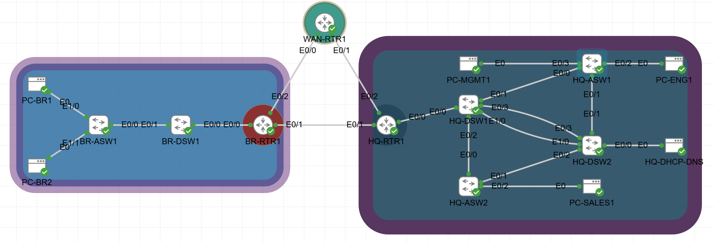
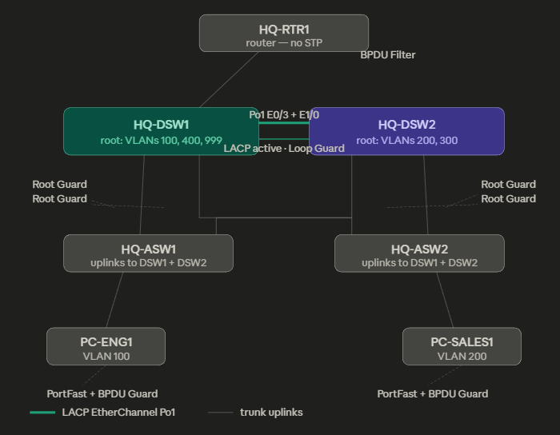
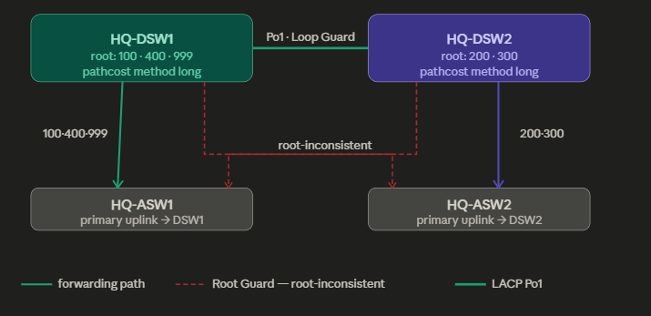
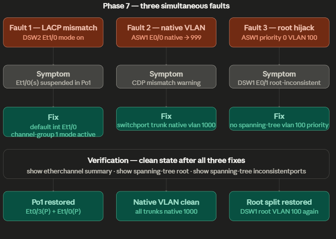
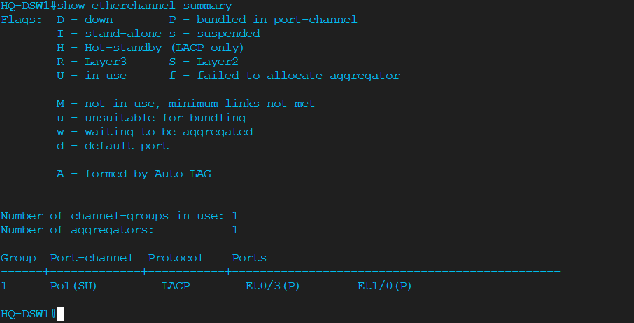
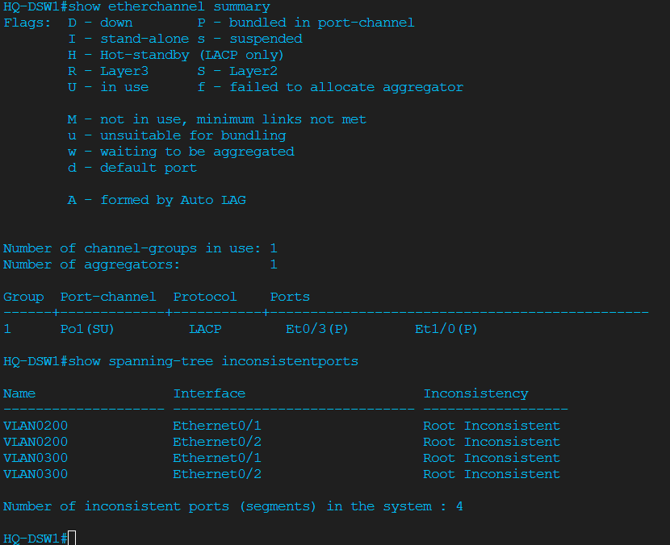
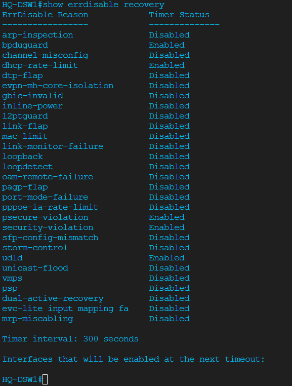
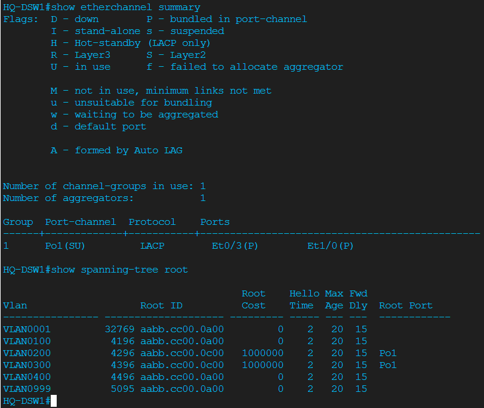

# Project 04 — Switching Layer Stability

**Series:** Enterprise Network Labs | **Platform:** Cisco CML 2.9 (IOL-L2)
**Build Date:** 2026-04-13 | **Status:** ✅ Complete

---

## STAR Summary

**Situation:** The HQ switching layer (two distribution switches, two access switches) was functional from Projects 01–03 but relied on default STP behavior with a single inter-distribution trunk link, no loop protection, no fast failure detection, and no port-level security. A rogue switch or a cable event could silently break the network.

**Task:** Harden the Layer 2 switching infrastructure: replace the single inter-distribution link with a bonded LACP EtherChannel, add deterministic STP controls, enable fast link-failure detection (UDLD), configure automatic errdisable recovery, run a controlled VTP v3 propagation exercise, trace the MAC forwarding path end-to-end, add access-port and router-port STP protections, and prove the design survives three simultaneous L2 faults.

**Action:** Seven structured phases — LACP EtherChannel → advanced STP controls → UDLD + errdisable recovery → VTP v3 learning lab → MAC address table path analysis → access-port protection → three-fault break/fix exercise.

**Result:** HQ distribution layer now uses a two-member LACP EtherChannel (Po1) between DSW1 and DSW2 with Loop Guard. Root Guard prevents access switches from hijacking root bridges. UDLD and errdisable recovery are configured on all inter-switch links. All three injected faults (LACP mismatch, native VLAN mismatch, STP root hijack) were diagnosed with show commands only and corrected.

---

## Topology


> HQ switching layer with LACP EtherChannel (Po1) between HQ-DSW1 and HQ-DSW2. Two physical links bundled: Ethernet0/3 and Ethernet1/0 on each distribution switch.

---

### L2 Protection Map



This is the reference map for where every L2 protection feature was placed in Project 4. The green double line between HQ-DSW1 and HQ-DSW2 is the LACP EtherChannel Po1 — two physical links bundled into one logical trunk, giving STP a single clean path to work with instead of two separate links it would have to block one of. Loop Guard sits on Po1 because that's the inter-distribution path where a unidirectional failure would be most dangerous. Moving down, both distribution switches have Root Guard on their downlinks toward the access layer — this is the boundary that says "access switches are not allowed to influence root placement." At the bottom, the access ports on ASW1 and ASW2 have PortFast plus BPDU Guard, which means they skip the STP listening/learning delay for normal hosts but immediately shut down if something starts sending BPDUs — like a rogue switch being plugged into a user port. Finally, the router-facing uplink on HQ-DSW1 E0/0 has BPDU Filter, not BPDU Guard, because the router doesn't speak STP at all and you never want an STP shutdown on the uplink to your gateway.

---

### STP Split-Root Design



This shows the deliberate design decision behind Project 4's STP topology. Rather than letting one switch own all VLANs as root (which wastes the second distribution switch as pure standby), the root role is split: HQ-DSW1 is root for VLANs 100, 400, and 999, and HQ-DSW2 is root for VLANs 200 and 300. The solid colored arrows show the active forwarding paths — each VLAN flows toward its designated root. The red dashed arrows are where Root Guard fires: when DSW2 advertises a BPDU on a downlink for a VLAN where DSW1 is supposed to be root, Root Guard puts that port into root-inconsistent state and blocks it. This is what the live output confirmed — and it's the correct, expected behavior of the design, not an error. The EtherChannel Po1 across the middle carries inter-distribution traffic for VLANs that need to cross the boundary, with Loop Guard protecting against a silent link failure on that path.

---

### Phase 7 — Break/Fix Arc



This maps the full arc of the three-fault exercise — what was broken, what it looked like, and how it was fixed. Fault 1 was the LACP mismatch: one member of Po1 on HQ-DSW2 was forced to mode on while the other side stayed mode active, causing Et1/0 to show as suspended in show etherchannel summary. The fix was a clean default interface followed by re-applying channel-group 1 mode active. Fault 2 was the native VLAN mismatch: ASW1's uplink was set to native VLAN 999 while DSW1 expected 1000, which CDP immediately flagged. One command fixed it. Fault 3 was the root hijack attempt: ASW1 was given spanning-tree vlan 100 priority 0, which would normally steal the root role — but Root Guard on DSW1's downlink put the port into root-inconsistent state and contained the damage. Removing the rogue priority and letting Root Guard recover restored the clean split-root state. The bottom row shows what verified success looked like after all three fixes landed.

---

## Network Design

### HQ Switching — Physical Port Map (CDP-verified)

| Device | Port | Neighbor | Neighbor Port | Role |
|--------|------|----------|---------------|------|
| HQ-DSW1 | Et0/0 | HQ-RTR1 | Et0/0 | Router trunk (BPDU Filter) |
| HQ-DSW1 | Et0/1 | HQ-ASW1 | Et0/0 | Access uplink (Root Guard) |
| HQ-DSW1 | Et0/2 | HQ-ASW2 | Et0/0 | Access uplink (Root Guard) |
| HQ-DSW1 | Et0/3 | HQ-DSW2 | Et0/3 | LACP member → Po1 (Loop Guard) |
| HQ-DSW1 | Et1/0 | HQ-DSW2 | Et1/0 | LACP member → Po1 (Loop Guard) |
| HQ-DSW2 | Et0/0 | HQ-DHCP-DNS | — | Server access (VLAN 999, PortFast, BPDU Guard) |
| HQ-DSW2 | Et0/1 | HQ-ASW1 | Et0/1 | Access uplink (Root Guard) |
| HQ-DSW2 | Et0/2 | HQ-ASW2 | Et0/1 | Access uplink (Root Guard) |
| HQ-DSW2 | Et0/3 | HQ-DSW1 | Et0/3 | LACP member → Po1 (Loop Guard) |
| HQ-DSW2 | Et1/0 | HQ-DSW1 | Et1/0 | LACP member → Po1 (Loop Guard) |
| HQ-ASW1 | Et0/0 | HQ-DSW1 | Et0/1 | Distribution uplink |
| HQ-ASW1 | Et0/1 | HQ-DSW2 | Et0/1 | Distribution uplink (redundant) |
| HQ-ASW1 | Et0/2 | PC-ENG1 | — | Access (VLAN 100, PortFast, BPDU Guard) |
| HQ-ASW1 | Et0/3 | PC-MGMT1 | — | Access (VLAN 999, PortFast, BPDU Guard) |
| HQ-ASW2 | Et0/0 | HQ-DSW1 | Et0/2 | Distribution uplink |
| HQ-ASW2 | Et0/1 | HQ-DSW2 | Et0/2 | Distribution uplink (redundant) |
| HQ-ASW2 | Et0/2 | PC-SALES1 | — | Access (VLAN 200, PortFast, BPDU Guard) |

### VLAN Design (unchanged from Project 03)

| VLAN | Name | Subnet | Notes |
|------|------|--------|-------|
| 100 | Engineering | 10.1.100.0/24 | DSW1 root |
| 200 | Sales | 10.1.200.0/24 | DSW2 root |
| 300 | Guest | 10.1.44.0/24 | DSW2 root |
| 400 | Servers | 10.1.40.0/24 | DSW1 root |
| 999 | Management | 10.1.99.0/24 | DSW1 root |
| 1000 | NATIVE-UNUSED | — | Native VLAN (security hardening) |

### STP Root Design

| VLAN | Root Bridge | Priority | Backup Root | Backup Priority |
|------|-------------|----------|-------------|------------------|
| 100 | HQ-DSW1 | 4196 | HQ-DSW2 | 8292 |
| 200 | HQ-DSW2 | 4296 | HQ-DSW1 | 8292 |
| 300 | HQ-DSW2 | 4396 | HQ-DSW1 | 8292 |
| 400 | HQ-DSW1 | 4496 | HQ-DSW2 | 8492 |
| 999 | HQ-DSW1 | 5095 | HQ-DSW2 | 9095 |

---

## Pre-Work Checklist

Before starting Project 04, verify the Project 03 baseline is intact:

```
! On HQ-DSW1 and HQ-DSW2
show cdp neighbors
show interfaces trunk
show spanning-tree root
show vlan brief
ping 10.1.99.12   ! DSW1 → DSW2
ping 10.1.99.11   ! DSW2 → DSW1
ping 10.1.99.1    ! both switches → gateway
```

**Expected baseline:**
- CDP shows correct physical neighbors per the port map above
- Trunks up, native VLAN 1000, allowed 100,200,300,400,999
- DSW1 root for VLANs 100, 400, 999; DSW2 root for 200, 300
- Management SVIs reachable

**New physical link needed:**
This project adds a second inter-distribution cable:
- HQ-DSW1 **Ethernet1/0** ↔ HQ-DSW2 **Ethernet1/0**

Verify it is cabled before configuring EtherChannel:
```
show cdp neighbors
! Expect to see HQ-DSW2 on BOTH Et0/3 AND Et1/0 from HQ-DSW1
```

---

## Phase 1 — LACP EtherChannel

### Why This Phase Exists

Without EtherChannel, the two physical links between HQ-DSW1 and HQ-DSW2 cannot both forward — STP must block one to prevent a loop. That means you pay for two cables but only use one. Worse: the backup link may take 30–50 seconds to unblock after the active link fails.

EtherChannel solves both problems:
- STP sees one logical link instead of two physical links → no blocking
- Both links carry traffic simultaneously → double bandwidth
- If one member fails, the port-channel stays up (just degraded) → no STP reconvergence

**LACP** (802.3ad) is the right choice over PAgP because LACP is a standards-based protocol that works across any vendor. PAgP is Cisco-proprietary.

`mode active` means this switch actively sends LACP PDUs. Both sides should be `active` for best practice. One side could be `passive` (waits for LACP), but never `on` vs `active` — that is a mismatch.

### Configuration — HQ-DSW1

```cisco
enable
configure terminal

! WHY: EtherChannel member links must have trunk settings
!      configured BEFORE joining the channel-group.
!      Configure on the Port-channel interface, not on each member.
interface range Ethernet0/3 , Ethernet1/0
 description LACP-MEMBER-TO-HQ-DSW2
 switchport trunk encapsulation dot1q
 channel-group 1 mode active
 no shutdown

! WHY: All trunk parameters belong on Port-channel1.
!      Member interfaces inherit settings from the port-channel.
interface Port-channel1
 description PORT-CHANNEL-TO-HQ-DSW2
 switchport trunk encapsulation dot1q
 switchport mode trunk
 switchport trunk native vlan 1000
 switchport trunk allowed vlan 100,200,300,400,999
 switchport nonegotiate
 no shutdown

end
write memory
```

### Configuration — HQ-DSW2

```cisco
enable
configure terminal

interface range Ethernet0/3 , Ethernet1/0
 description LACP-MEMBER-TO-HQ-DSW1
 switchport trunk encapsulation dot1q
 channel-group 1 mode active
 no shutdown

interface Port-channel1
 description PORT-CHANNEL-TO-HQ-DSW1
 switchport trunk encapsulation dot1q
 switchport mode trunk
 switchport trunk native vlan 1000
 switchport trunk allowed vlan 100,200,300,400,999
 switchport nonegotiate
 no shutdown

end
write memory
```

### Verification

```
show etherchannel summary
show interfaces trunk
show spanning-tree root
```

**Expected output — `show etherchannel summary`:**
```
Group  Port-channel  Protocol    Ports
------+-------------+-----------+-----------------------------------------------
1      Po1(SU)         LACP        Et0/3(P)        Et1/0(P)
```

- `SU` = Layer 2 (S) and in-use (U)
- `P` = bundled/active member
- Both `Et0/3(P)` and `Et1/0(P)` must show `P` — not `s` (suspended) or `I` (standalone)

**Expected output — `show interfaces trunk`:**
```
Po1            on               802.1q         trunking      1000
```

**Expected output — `show spanning-tree root`:**
STP root split must remain intact with DSW1 and DSW2 keeping their assigned root roles.



---

## Phase 2 — Advanced STP Controls

### Why This Phase Exists

STP works automatically, but by default it allows any switch to potentially influence root bridge placement. Three features correct this:

**Root Guard:** Forces root bridge placement to stay where you designed it. If a switch receives a superior BPDU on a Root Guard protected port, that port enters `Root Inconsistent` state instead of allowing the election to change. Applied to distribution→access downlinks.

**Loop Guard:** Protects against unidirectional link failures on redundant paths. If BPDUs stop arriving on a blocked/alternate port (e.g., because of a one-way fiber failure), Loop Guard puts that port into `Loop Inconsistent` instead of forwarding. Without it, that port would slowly transition to forwarding and create a loop. Applied to the inter-distribution EtherChannel.

**Pathcost method long:** The default pathcost method uses 16-bit values designed for speeds up to ~100Mbps. The `long` method uses 32-bit values scaled for modern speeds. Best practice on any modern switch.

### Configuration — HQ-DSW1

```cisco
enable
configure terminal

spanning-tree pathcost method long

! WHY: Root Guard on downlinks to access switches.
!      Prevents HQ-ASW1 or HQ-ASW2 from ever influencing root placement.
interface Ethernet0/1
 spanning-tree guard root

interface Ethernet0/2
 spanning-tree guard root

! WHY: Loop Guard on the inter-distribution EtherChannel.
!      If BPDUs stop arriving on Po1, put port into loop-inconsistent
!      instead of transitioning to forwarding.
interface Port-channel1
 spanning-tree guard loop

end
write memory
```

### Configuration — HQ-DSW2

```cisco
enable
configure terminal

spanning-tree pathcost method long

interface Ethernet0/1
 spanning-tree guard root

interface Ethernet0/2
 spanning-tree guard root

interface Port-channel1
 spanning-tree guard loop

end
write memory
```

### Verification

```
show spanning-tree summary
show spanning-tree inconsistentports
show spanning-tree interface port-channel1 detail
show spanning-tree interface Ethernet0/1 detail
```

**Expected behavior:**

`show spanning-tree summary` should show:
- pathcost method: long
- EtherChannel misconfig guard: enabled

`show spanning-tree inconsistentports`: In this split-root design, Root Guard on access-facing downlinks will show Root Inconsistent for VLANs where that switch is NOT the root. This is **expected and correct**:
- On HQ-DSW1: Et0/1 and Et0/2 will be Root Inconsistent for VLANs 200 and 300 (DSW2 is root)
- On HQ-DSW2: Et0/1 and Et0/2 will be Root Inconsistent for VLANs 100 and 999 (DSW1 is root)

**This is not a problem — it is proof Root Guard is working correctly.** The access switches are trying to advertise paths for those VLANs, but Root Guard is blocking them from influencing the root election.



---

## Phase 3 — UDLD and Errdisable Recovery

### Why This Phase Exists

**UDLD (Unidirectional Link Detection):** A Cisco protocol that detects one-way link failures — scenarios where one side can transmit but not receive (e.g., a broken RX fiber). Standard STP and CDP cannot detect this. Without UDLD, a one-way link would cause a port to think it is still up (because it is still transmitting), potentially creating a forwarding loop.

**Errdisable recovery:** When a switch detects a fault (BPDU Guard triggered, DHCP rate exceeded, security violation, UDLD failure), it error-disables the port. Without recovery timers, that port stays down until an administrator manually shuts and no-shuts it. With `errdisable recovery`, the switch automatically retries after a configurable interval.

**Why 300 seconds?** Long enough to prevent rapid-flap, short enough to recover automatically without operator intervention in most cases.

### Configuration — HQ-DSW1

```cisco
enable
configure terminal

! WHY: Enable UDLD globally and on all inter-switch physical links.
!      Do NOT enable on the router-facing uplink (HQ-RTR1 is a router,
!      not a switch — it does not participate in UDLD).
udld enable

interface Ethernet0/1
 udld port
interface Ethernet0/2
 udld port
interface Ethernet0/3
 udld port
interface Ethernet1/0
 udld port

! WHY: errdisable recovery — automatic port recovery after fault events.
!      Without this, every BPDU Guard or UDLD event requires manual 
!      shut/no-shut from an operator.
errdisable recovery cause bpduguard
errdisable recovery cause dhcp-rate-limit
errdisable recovery cause udld
errdisable recovery cause security-violation
errdisable recovery cause psecure-violation
errdisable recovery interval 300

end
write memory
```

### Configuration — HQ-DSW2

```cisco
enable
configure terminal

udld enable

interface Ethernet0/1
 udld port
interface Ethernet0/2
 udld port
interface Ethernet0/3
 udld port
interface Ethernet1/0
 udld port

errdisable recovery cause bpduguard
errdisable recovery cause dhcp-rate-limit
errdisable recovery cause udld
errdisable recovery cause security-violation
errdisable recovery cause psecure-violation
errdisable recovery interval 300

end
write memory
```

### Verification

```
show udld
show errdisable recovery
show interfaces status err-disabled
```

**Expected output — `show errdisable recovery`:**
```
ErrDisable Reason            Timer Status
bpduguard                    Enabled
dhcp-rate-limit              Enabled
udld                         Enabled
security-violation           Enabled
psecure-violation            Enabled

Timer interval: 300 seconds
```

**Platform note:** The IOL-L2 image in CML does not support `show udld interface` or UDLD per-interface on logical Port-channel interfaces. `show udld` on physical interfaces shows the protocol running in Advertisement state. This is a CML platform limitation, not a configuration error.



---

## Phase 4 — VTP Version 3 Learning Lab

### Why This Phase Exists

VTP (VLAN Trunking Protocol) can propagate VLAN database changes to all switches automatically. It is powerful and dangerous: a switch with a higher configuration revision number can overwrite the entire VLAN database of the network. VTP v3 adds primary-server control to prevent accidental propagation.

**This is a learning exercise only.** After proving propagation works, all switches return to VTP transparent mode — the safest production setting. In transparent mode, each switch manages its own VLAN database independently.

**Why VTP transparent is better for production:**
- No risk of accidental VLAN wipe
- Each switch controls its own VLAN database
- No dependency on a single VTP server being available
- Easier to troubleshoot

**Why learn VTP v3 anyway?**
You will encounter VTP in production networks. Understanding how propagation works — and why it can be dangerous — is essential for working in any existing switched network.

### Configuration — HQ-DSW1 (VTP v3 Primary Server)

```cisco
enable
configure terminal

vtp domain LAB
vtp version 3
vtp mode server
vtp password CMLlabVTP!

end
write memory

! Make this switch the authoritative primary server
vtp primary
! Confirm when prompted
```

### Configuration — HQ-DSW2, HQ-ASW1, HQ-ASW2 (VTP Clients)

```cisco
enable
configure terminal

vtp domain LAB
vtp version 3
vtp mode client
vtp password CMLlabVTP!

end
write memory
```

### Create the test VLAN on HQ-DSW1 only

```cisco
enable
configure terminal

vlan 600
 name VTP-Test

end
write memory
```

### Verify propagation

```
! On all four switches
show vtp status
show vlan brief
```

**Expected on VTP clients:**
- `VTP Operating Mode: Client`
- `VLAN 600 VTP-Test` appears in `show vlan brief`
- `Primary Description: HQ-DSW1`

### Return all switches to transparent mode

```cisco
! On HQ-DSW1 — delete the test VLAN first
enable
configure terminal
no vlan 600
vtp mode transparent
end
write memory

! On HQ-DSW2, HQ-ASW1, HQ-ASW2
enable
configure terminal
vtp mode transparent
end
write memory
```

**Important lesson:** When a client switch returns to transparent mode, it does NOT automatically delete VLANs it learned from VTP. VLAN 600 must be removed manually with `no vlan 600` on each switch.

```cisco
! Cleanup on DSW2, ASW1, ASW2 after returning to transparent
enable
configure terminal
no vlan 600
end
write memory
```

**Final verification:**
```
show vtp status   ! Mode: Transparent, Version: 3
show vlan brief   ! VLAN 600 gone, normal VLANs remain
```


---

## Phase 5 — MAC Address Table Path Analysis

### Why This Phase Exists

Every switching troubleshooting scenario eventually requires understanding which port a device's MAC address was learned on, and why traffic takes a specific path. This phase builds that skill by tracing a known endpoint's MAC from the access switch all the way through both distribution switches.

The key insight in this phase:
- The access switch learns the MAC on the **user-facing port**
- The distribution switch learns the MAC on the **uplink toward that access switch**
- The **other** distribution switch may learn the MAC on the **EtherChannel** (through the inter-distribution link) instead of on an access-facing uplink
- Why? Because in the split-root STP design, Root Guard is blocking access-facing links on the non-root switch for certain VLANs. The only valid forwarding path goes through Po1.

### Test endpoint: PC-ENG1

| Detail | Value |
|--------|-------|
| MAC Address | 5254.00d7.cbbc |
| VLAN | 100 (Engineering) |
| Connected to | HQ-ASW1 Ethernet0/2 |

### Generate traffic from PC-ENG1

```bash
ping -c 5 10.1.100.1   # Force MAC into switch table
```

### Trace the MAC — HQ-ASW1

```
show mac address-table address 5254.00d7.cbbc
```

**Expected:**
```
Vlan    Mac Address       Type        Ports
 100    5254.00d7.cbbc    DYNAMIC     Et0/2
```

PC-ENG1 is directly connected to Et0/2. The access switch is the first hop.

### Trace the MAC — HQ-DSW1

```
show mac address-table address 5254.00d7.cbbc
show mac address-table dynamic vlan 100
```

**Expected:**
```
Vlan    Mac Address       Type        Ports
 100    5254.00d7.cbbc    DYNAMIC     Et0/1
```

HQ-DSW1 learned the Engineering host via Et0/1 — the uplink toward HQ-ASW1. Traffic flows: PC-ENG1 → ASW1 → DSW1.

### Trace the MAC — HQ-DSW2

```
show mac address-table address 5254.00d7.cbbc
```

**Expected: No entry** (or entry via Po1 if traffic has crossed the port-channel)

**Why:** HQ-DSW2's access-facing ports (Et0/1 and Et0/2) are Root Inconsistent for VLAN 100 due to Root Guard. Those ports are not forwarding for VLAN 100. So PC-ENG1's frames never enter HQ-DSW2 from the access side. If HQ-DSW2 learns the MAC at all, it will be on Po1 (because frames from DSW1 to the router cross the EtherChannel). But for strictly local access traffic, DSW2 stays quiet.

**This is the intended behavior** — it proves Root Guard and STP split-root design are working correctly.


---

## Phase 6 — Access Port Protection

### Why This Phase Exists

Access ports face the untrusted user side of the network. Three protections apply:

**PortFast:** Skips the STP Listening and Learning states (30 seconds total) when a port comes up. Safe on ports connected to end devices only — never on ports connected to switches. Reason: end devices don't send BPDUs, so there's no loop risk. Without PortFast, every device reboot causes a 30-second connectivity outage.

**BPDU Guard:** If a BPDU arrives on a PortFast-enabled access port, immediately error-disable that port. This prevents a rogue switch from being plugged into a user port and attempting to influence STP. Without BPDU Guard, a rogue switch with a low bridge priority could try to become root bridge.

**BPDU Filter (on router-facing uplink):** Routers don't participate in STP. The router-facing trunk should never send or receive BPDUs. BPDU Filter stops STP from sending BPDUs out the router-facing port and ignores any BPDUs that arrive. This prevents STP state machine confusion when the router sends unexpected frames.

**Storm Control (planned, platform limitation):** storm-control broadcast/multicast was planned for access ports but is not supported on the CML IOL-L2 image. The `storm-control` command is rejected at the parser level. This is a known CML IOL-L2 limitation.

### Configuration — HQ-ASW1 (access ports)

```cisco
enable
configure terminal

interface range Ethernet0/2 - 3
 spanning-tree portfast
 spanning-tree bpduguard enable

end
write memory
```

### Configuration — HQ-ASW2 (access ports)

```cisco
enable
configure terminal

interface Ethernet0/2
 spanning-tree portfast
 spanning-tree bpduguard enable

end
write memory
```

### Configuration — HQ-DSW1 (router-facing uplink)

```cisco
enable
configure terminal

! WHY: Router-facing port should never participate in STP.
!      BPDU Filter stops this switch from sending BPDUs toward the router
!      and drops any BPDUs that arrive from the router side.
interface Ethernet0/0
 spanning-tree bpdufilter enable

end
write memory
```

### Verification

```
! On HQ-ASW1
show running-config interface Ethernet0/2
show running-config interface Ethernet0/3

! On HQ-ASW2
show running-config interface Ethernet0/2

! On HQ-DSW1
show running-config interface Ethernet0/0
```


---

## Phase 7 — Three-Fault Break/Fix Exercise

### Why This Phase Exists

Real network problems rarely announce themselves. The goal is to build the diagnostic habit: use show commands, read the output, reason about cause, apply targeted fix. Three simultaneous L2 faults stress the network in different ways.

### Fault Injection

#### Fault 1 — LACP Mismatch

On HQ-DSW2, break one EtherChannel member by removing it from LACP and setting it to static mode (mode on). This creates a protocol mismatch — one side is LACP active, the other is static.

```cisco
! On HQ-DSW2
interface Ethernet1/0
 no channel-group 1
 channel-group 1 mode on
```

**What breaks:** Et1/0 can no longer join the LACP bundle. Po1 degrades to one member (Et0/3 only). No outright link failure — the port still carries traffic — but EtherChannel is degraded and traffic balancing is broken.

#### Fault 2 — Native VLAN Mismatch

On HQ-ASW1, change the native VLAN on the uplink to HQ-DSW1:

```cisco
! On HQ-ASW1
interface Ethernet0/0
 switchport trunk native vlan 999
```

**What breaks:** HQ-DSW1 Et0/1 expects native VLAN 1000; HQ-ASW1 Et0/0 now says native VLAN 999. CDP reports a native VLAN mismatch warning. Untagged frames will end up in the wrong VLAN.

#### Fault 3 — STP Root Hijack Attempt

On HQ-ASW1, try to take over root bridge for VLAN 100:

```cisco
! On HQ-ASW1
spanning-tree vlan 100 priority 0
```

**What happens:** HQ-ASW1 advertises a superior BPDU on VLAN 100. HQ-DSW1's Root Guard on its downlink to HQ-ASW1 (Et0/1) detects this and puts that port into Root Inconsistent state for VLAN 100.

### Diagnosis (show commands only)

```
! On HQ-DSW1
show etherchannel summary          ! Look for suspended/standalone member
show cdp neighbors                  ! CDP will report native VLAN mismatch
show spanning-tree inconsistentports ! Shows Root Inconsistent ports
show spanning-tree root             ! Which switch is actually root for each VLAN?

! On HQ-DSW2
show etherchannel summary

! On HQ-ASW1
show interfaces trunk               ! Native VLAN on Et0/0 will show 999
show spanning-tree vlan 100         ! ASW1 shows itself as root
```

**Diagnosis results:**
- EtherChannel: `show etherchannel summary` shows Et1/0 as `s` (suspended) or `I` (standalone) on DSW2; Po1 has only one `P` member
- Native VLAN mismatch: CDP on DSW1 reports `%CDP-4-NATIVE_VLAN_MISMATCH` on Ethernet0/1; `show interfaces trunk` on ASW1 shows native VLAN 999 instead of 1000
- Root hijack: `show spanning-tree inconsistentports` on DSW1 shows VLAN0100 Ethernet0/1 in Root Inconsistent; ASW1 `show spanning-tree vlan 100` shows it as root with priority 100

### Fixes

#### Fix 1 — Restore LACP

```cisco
! On HQ-DSW2
enable
configure terminal

default interface Ethernet1/0
interface Ethernet1/0
 description LACP-MEMBER-TO-HQ-DSW1
 switchport trunk encapsulation dot1q
 switchport mode trunk
 switchport trunk native vlan 1000
 switchport trunk allowed vlan 100,200,300,400,999
 switchport nonegotiate
 channel-group 1 mode active
 udld port
 no shutdown

end
write memory
```

#### Fix 2 — Restore native VLAN

```cisco
! On HQ-ASW1
enable
configure terminal

interface Ethernet0/0
 switchport trunk native vlan 1000

end
write memory
```

#### Fix 3 — Remove root hijack

```cisco
! On HQ-ASW1
enable
configure terminal

no spanning-tree vlan 100 priority 0
! OR if rejected: spanning-tree vlan 100 priority 32768

end
write memory
```

### Post-Fix Verification

```
! On HQ-DSW1
show etherchannel summary               ! Et0/3(P) Et1/0(P)
show spanning-tree inconsistentports    ! Back to normal baseline only
show spanning-tree root                 ! DSW1 root for 100, 400, 999

! On HQ-DSW2
show etherchannel summary               ! Et0/3(P) Et1/0(P)
show interfaces trunk                   ! Po1 native 1000

! On HQ-ASW1
show spanning-tree root                 ! VLAN 100 root is DSW1, not ASW1
show interfaces trunk                   ! Et0/0 native VLAN 1000
```

**Log message confirming Root Guard unblocked:**
```
%SPANTREE-2-ROOTGUARD_UNBLOCK: Root guard unblocking port Ethernet0/1 on VLAN0100
```




---

## Verification Summary

| Test | Command | Expected Result |
|------|---------|------------------|
| EtherChannel | `show etherchannel summary` | Po1(SU), Et0/3(P), Et1/0(P) on both DSWs |
| Trunk health | `show interfaces trunk` | Po1 trunking, native 1000, allowed 100,200,300,400,999 |
| STP root | `show spanning-tree root` | DSW1 root for 100/400/999; DSW2 root for 200/300 |
| Root Guard | `show spanning-tree inconsistentports` | Only expected baseline entries |
| Errdisable | `show errdisable recovery` | bpduguard, dhcp-rate-limit, udld, security-violation, psecure-violation Enabled; timer 300s |
| UDLD | `show udld` | Enabled on inter-switch physical ports |
| VTP | `show vtp status` | Mode: Transparent, Version: 3 |
| Access ports | `show run int Et0/2` (on ASWs) | portfast + bpduguard enable |
| Router port | `show run int Et0/0` (on DSW1) | bpdufilter enable |
| MAC trace | `show mac addr addr 5254.00d7.cbbc` | ASW1: Et0/2 / DSW1: Et0/1 |

---

## Troubleshooting Log

### P04-01 — Storm Control rejected on IOL-L2

**Symptom:** `storm-control broadcast level 1.00 0.50` and `storm-control action trap` rejected with `% Invalid input detected at '^' marker` on HQ-ASW1 and HQ-ASW2 access interfaces.

**Diagnosis:** Tested multiple syntax variants. The `storm-control` command is not present in the command parser on CML IOL-L2 switches at any interface level. The rejection occurs at the command keyword, not at a parameter.

**Root cause:** CML IOL-L2 is a software-based switch image. It does not implement storm control, which is typically an ASIC-level hardware feature on physical Catalyst switches.

**Fix:** Not applicable — platform limitation. Documented for lab context. The protections that are supported (PortFast, BPDU Guard, BPDU Filter) were applied successfully.

**Learning:** Always verify which features are available on your specific lab platform before building a phase around them. Check with `show ?` at the interface prompt.

---

### P04-02 — LACP member rejected with "mode on" during fault injection

**Symptom:** During Phase 7 fault injection, `channel-group 1 mode on` was rejected on HQ-DSW2 Et1/0 with `Command rejected: the interface can not be added to the channel group`.

**Diagnosis:** Et1/0 was already a member of group 1. The `no channel-group 1` removed it but the port retained internal LACP state. Attempting to re-add with mode `on` (static) while the other side (DSW1) was still active (LACP) triggered a protocol-state conflict.

**Root cause:** `channel-group 1 mode on` (static EtherChannel) is incompatible with an existing LACP active port-channel. The image enforced consistency at the channel-group level.

**Fix for fault injection:** The fault was still visible — Et1/0 was no longer bundled (Po1 showed only Et0/3 as a member), achieving the intended degraded-EtherChannel symptom for the exercise.

**Fix for recovery:** `default interface Ethernet1/0` to reset to clean state, then re-configure with `channel-group 1 mode active` to match the existing LACP configuration.

**Learning:** Use `default interface` as a clean reset before re-configuring a port that has been modified from its working state. Do not try to change mode while a port is in a mid-state.

---

### P04-03 — STP Root Inconsistent appeared on expected ports (not a fault)

**Symptom:** After enabling Root Guard on HQ-DSW1 Et0/1 and Et0/2, `show spanning-tree inconsistentports` showed those ports as Root Inconsistent for VLANs 200 and 300.

**Initial concern:** Were the access switches sending superior BPDUs?

**Diagnosis:** `show spanning-tree vlan 200` on HQ-DSW2 confirmed DSW2 is root for VLAN 200. HQ-ASW1 and HQ-ASW2 have dual uplinks to both DSW1 and DSW2. When STP runs on VLAN 200, the access switches naturally advertise the root path through their DSW2-side uplinks. DSW1 sees these as superior BPDUs arriving on Root Guard-protected ports.

**Root cause:** Split-root STP design + Root Guard = expected inconsistency on the non-root distribution switch's access-facing downlinks for each VLAN group.

**Fix:** None required. This is correct behavior. The inconsistency is healthy and expected in any dual-distribution design with split root bridge assignments.

**Learning:** In a split-root design, always verify that Root Inconsistent ports are the expected ones before treating them as faults. Use `show spanning-tree inconsistentports` and cross-reference with `show spanning-tree root` to confirm which switch owns each VLAN root.

---

### P04-04 — VTP client did not immediately receive VLAN 600

**Symptom:** After setting HQ-ASW1 to VTP v3 client mode, `show vlan brief` still did not show VLAN 600 immediately.

**Diagnosis:** `show vtp status` showed `Configuration Revision: 0` and `Primary ID: 0000.0000.0000` — the switch had not yet synced with the primary server.

**Root cause:** VTP sync requires the trunk link to be fully active and the primary server to have sent an update. The first sync may take a few seconds after mode change.

**Fix:** Wait a few seconds, then re-run `show vlan brief`. VLAN 600 appeared after one sync cycle.

**Learning:** After changing VTP mode, wait 5–10 seconds before checking `show vlan brief`. VTP is event-driven — updates propagate when triggered, not instantaneously on mode change.

---

### P04-05 — VLAN 600 remained after returning to VTP transparent mode

**Symptom:** After all switches returned to `vtp mode transparent`, VLAN 600 (VTP-Test) was still present in `show vlan brief` on HQ-DSW2, HQ-ASW1, and HQ-ASW2.

**Diagnosis:** Changing from VTP client to transparent mode does not delete VLANs that were learned from VTP. Those VLANs become locally owned once the switch goes transparent.

**Root cause:** This is expected VTP behavior. The VLAN database is not cleared on mode change — only VTP propagation stops.

**Fix:** Manually remove VLAN 600 on each switch: `configure terminal → no vlan 600 → end → write memory`.

**Learning:** VTP transparent mode is not a "clean slate." Any VLANs in the database at the time of mode change persist. Always clean up test VLANs explicitly after a VTP learning exercise.

---

## Key Technologies

| Technology | Command | Purpose |
|-----------|---------|----------|
| LACP EtherChannel | `channel-group 1 mode active` | Bundle two physical links into one logical link |
| Root Guard | `spanning-tree guard root` | Prevent access switches from winning root election |
| Loop Guard | `spanning-tree guard loop` | Detect unidirectional link failure on redundant ports |
| Pathcost method long | `spanning-tree pathcost method long` | Use 32-bit STP costs for modern speeds |
| UDLD | `udld enable` + `udld port` | Detect one-way link failures |
| Errdisable recovery | `errdisable recovery cause ...` | Auto-recover ports from error-disabled state |
| VTP v3 | `vtp version 3` + `vtp primary` | VLAN database propagation (learning exercise) |
| BPDU Guard | `spanning-tree bpduguard enable` | Error-disable port if BPDU received on access port |
| BPDU Filter | `spanning-tree bpdufilter enable` | Stop STP interaction on router-facing port |
| PortFast | `spanning-tree portfast` | Skip STP listening/learning on access ports |
