# Project 05 — Internet Access and NAT

**Series:** Enterprise Network Labs | **Platform:** Cisco CML 2.9 (IOL, IOL-L2, Nginx)
**Build Date:** 2026-05-02 | **Status:** ✅ Build Verified; Break/Fix documented

---

## STAR Summary

**Situation:** Projects 01–04 built a stable multi-site enterprise network, but HQ and Branch were still isolated private networks. Branch learned internal routes through OSPF, but no site had realistic internet access, no edge NAT boundary existed, and no internal server could be published to an outside network.

**Task:** Add a simulated ISP, give HQ a public-facing edge, advertise a default route through OSPF, translate HQ and Branch user traffic with PAT, publish an internal HQ web server with static NAT, isolate Guest VLAN traffic from internal networks, and prove Branch internet access through HQ.

**Action:** Seven structured phases — ISP simulation → PAT overload → static NAT → object-group ACL refactor → Guest VLAN isolation → TCP MSS clamping → Branch internet verification. A controlled bad-NAT-ACL break/fix challenge was documented as the Project 05 troubleshooting drill.

**Result:** HQ-RTR1 now operates as the enterprise internet edge. HQ and Branch user subnets translate to 203.0.113.1 through PAT, HQ-SRV1 is published as 203.0.113.10 through static NAT, Guest VLAN 300 is blocked from internal 10.1.x.x and 10.2.x.x ranges while retaining internet access, and Branch endpoint traffic successfully reaches EXT-WEB1 through OSPF default routing and NAT.

---

## Topology

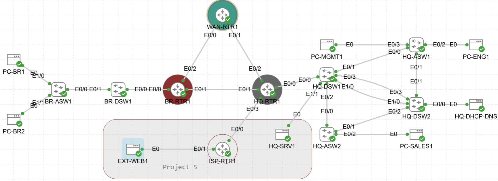
> Project 05 adds ISP-RTR1 on HQ-RTR1 Ethernet0/3 as the public edge, EXT-WEB1 on the simulated internet segment, and HQ-SRV1 on HQ-DSW1 Ethernet1/1 in VLAN 400.

---

## Topology Changes

Project 05 adds a simulated ISP edge and two Nginx web servers.

| Node | Image | Role |
|------|-------|------|
| ISP-RTR1 | IOL router | Simulated ISP router and outside test point |
| EXT-WEB1 | Nginx | External web server on the simulated internet segment |
| HQ-SRV1 | Nginx | Internal HQ web server published with static NAT |

### New Connections

| Local Device | Local Port | Remote Device | Remote Port | Purpose |
|--------------|------------|---------------|-------------|---------|
| HQ-RTR1 | Ethernet0/3 | ISP-RTR1 | Ethernet0/0 | ISP handoff / public edge |
| ISP-RTR1 | Ethernet0/1 | EXT-WEB1 | eth0 | Simulated internet segment |
| HQ-DSW1 | Ethernet1/1 | HQ-SRV1 | eth0 | Internal server access port, VLAN 400 |

**Why HQ-DSW1 Ethernet1/1 for HQ-SRV1:** Ethernet1/0 is already part of the LACP EtherChannel from Project 04. Ethernet1/1 is the next free port and keeps the Project 04 switching design intact.

---

## Network Design

### Addressing

| Segment | Device / Interface | IP Address | Notes |
|---------|--------------------|------------|-------|
| ISP handoff | HQ-RTR1 Ethernet0/3 | 203.0.113.1/30 | Customer/public edge side |
| ISP handoff | ISP-RTR1 Ethernet0/0 | 203.0.113.2/30 | ISP side |
| ISP internet segment | ISP-RTR1 Ethernet0/1 | 203.0.113.97/28 | Gateway for EXT-WEB1 |
| ISP internet segment | EXT-WEB1 eth0 | 203.0.113.100/28 | External web server |
| HQ server VLAN | HQ-RTR1 Ethernet0/0.400 | 10.1.40.1/24 | VLAN 400 gateway |
| HQ server VLAN | HQ-SRV1 eth0 | 10.1.40.10/24 | Static NAT target |
| Static NAT public IP | HQ-SRV1 public mapping | 203.0.113.10/32 | Routed by ISP to HQ-RTR1 |
| ISP loopback | ISP-RTR1 Loopback0 | 10.0.255.4/32 | Stable router ID and test target |

### NAT Policy

| Traffic Type | Translation | Why |
|--------------|-------------|-----|
| HQ/Branch user outbound traffic | PAT to 203.0.113.1 | Many private hosts share one public IP |
| HQ-SRV1 public hosting | Static NAT 10.1.40.10 ↔ 203.0.113.10 | Outside hosts can initiate inbound connections |
| Management VLANs | Excluded from NAT | Management networks should not browse the internet |
| Guest VLAN 300 | PAT allowed, internal destinations denied | Guests get internet only, not enterprise access |

---

## Pre-Work Checklist

Before configuring Project 05, verify the Project 04 baseline is stable and that the new cabling is correct.

```cisco
! On HQ-RTR1
show cdp neighbors
show ip interface brief
show ip route

! On HQ-DSW1
show cdp neighbors
show interfaces trunk
show etherchannel summary
```

**Expected baseline:**
- HQ-RTR1 has working WAN links to BR-RTR1 and WAN-RTR1
- HQ-DSW1 Ethernet1/1 is free for HQ-SRV1
- HQ-RTR1 Ethernet0/3 is free for the ISP handoff
- OSPF is stable before a default route is injected
- CDP confirms ISP-RTR1 is physically connected to HQ-RTR1 Ethernet0/3 before IP configuration

---

## Phase 1 — ISP Simulation

### Why This Phase Exists

The enterprise needs a realistic edge. HQ-RTR1 becomes the customer edge router, ISP-RTR1 represents the provider, and EXT-WEB1 gives the lab a reachable outside web target. The default route is originated from HQ into OSPF so all sites use one internet exit.

### ISP-RTR1 Base Configuration

```cisco
hostname ISP-RTR1
lldp run

interface Loopback0
 description ROUTER-ID-LOOPBACK
 ip address 10.0.255.4 255.255.255.255

interface Ethernet0/0
 description WAN-TO-HQ-RTR1-E0/3
 ip address 203.0.113.2 255.255.255.252
 no shutdown

interface Ethernet0/1
 description INTERNET-SEGMENT-EXT-WEB1
 ip address 203.0.113.97 255.255.255.240
 no shutdown
```

**Why 203.0.113.0/24:** This is an RFC 5737 documentation range, safe for lab use and never routed on the real internet.

**Why /30 on the ISP handoff:** A point-to-point handoff needs exactly two usable addresses. HQ uses .1, ISP uses .2.

**Why /28 on the internet segment:** The simulated internet segment needs room for EXT-WEB1 and future outside test hosts without overlapping the /30 handoff.

### EXT-WEB1 Boot Script

```sh
ip address add 203.0.113.100/28 dev eth0
ip link set dev eth0 up
ip route add default via 203.0.113.97
```

**Why the default gateway matters:** EXT-WEB1 can answer local 203.0.113.96/28 hosts without a gateway, but it needs 203.0.113.97 to return traffic toward HQ and Branch.

### HQ-DSW1 Server Port for HQ-SRV1

```cisco
interface Ethernet1/1
 description SERVER-HQ-SRV1-VLAN400
 switchport mode access
 switchport access vlan 400
 switchport nonegotiate
 spanning-tree portfast
 spanning-tree bpduguard enable
 no shutdown
```

**Why access mode:** HQ-SRV1 needs one untagged server VLAN. A trunk would add attack surface with no benefit.

### HQ-RTR1 ISP Edge and OSPF Default

```cisco
interface Ethernet0/3
 description ISP-TO-ISP-RTR1-E0/0
 ip address 203.0.113.1 255.255.255.252
 no shutdown

ip route 0.0.0.0 0.0.0.0 203.0.113.2

router ospf 1
 default-information originate
```

**Why not put E0/3 in OSPF:** ISP-RTR1 is not a trusted internal routing neighbor. HQ uses a static default route toward the ISP, then advertises only the default into the internal OSPF domain.

**Why no `always` keyword:** Without `always`, HQ stops advertising the default if the static default disappears. That avoids blackholing traffic during an edge failure.

### Verification

#### ISP Cabling and Edge Connectivity

| Test | Command | Result |
|------|---------|--------|
| ISP cabling | `show cdp neighbors` on HQ-RTR1 | ISP-RTR1 seen on Ethernet0/3 |
| HQ edge IP | `show ip interface brief` on HQ-RTR1 | E0/3 203.0.113.1 up/up |
| ISP handoff | `ping 203.0.113.2` from HQ-RTR1 | 100% success |
| ISP loopback | `ping 10.0.255.4` from HQ-RTR1 | 100% success |

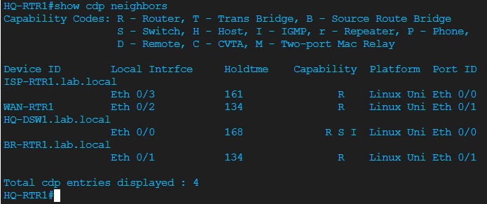
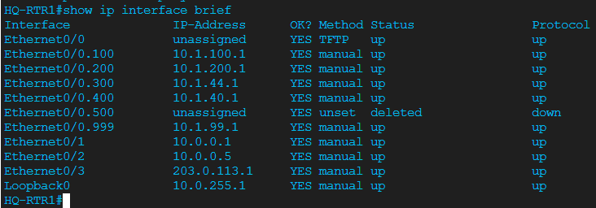

#### Default Route and OSPF Type-5 Propagation

| Test | Command | Result |
|------|---------|--------|
| HQ default route | `show ip route 0.0.0.0` on HQ-RTR1 | Static default via 203.0.113.2 |
| OSPF default LSA | `show ip ospf database external` on HQ-RTR1 | Type-5 0.0.0.0/0 from 10.0.255.1 |
| Branch learned default | `show ip route 0.0.0.0` on BR-RTR1 | O*E2 default route via OSPF |

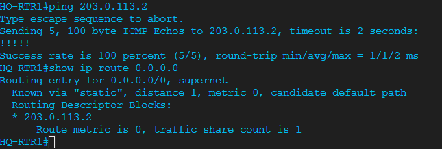
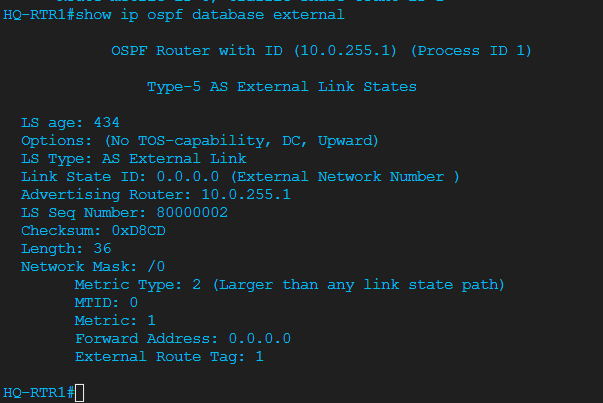

#### Branch Behavior Before NAT

**Important observation:** BR-RTR1 learned the default route, but pings from Branch to ISP failed before NAT. That was expected — the ISP had no return route to private 10.x.x.x addresses. This failure became the proof that Phase 2 PAT was required.

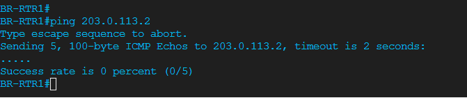

---

## Phase 2 — PAT / NAT Overload

### Why This Phase Exists

Private RFC 1918 addresses cannot be routed on the internet. PAT translates all permitted HQ and Branch user traffic to HQ-RTR1's public address, 203.0.113.1, and tracks each connection with unique source ports.

### NAT Interface Roles

```cisco
interface Ethernet0/0.100
 ip nat inside
interface Ethernet0/0.200
 ip nat inside
interface Ethernet0/0.300
 ip nat inside
interface Ethernet0/0.400
 ip nat inside
interface Ethernet0/1
 ip nat inside
interface Ethernet0/2
 ip nat inside
interface Ethernet0/3
 ip nat outside
```

**Why mark WAN links E0/1 and E0/2 as NAT inside:** Branch traffic enters HQ-RTR1 from those WAN links before exiting the ISP interface. If those ingress interfaces are not NAT inside, Branch traffic would be forwarded untranslated.

**Why Management is excluded:** Ethernet0/0.999 is deliberately not marked `ip nat inside`, and management subnets are absent from the NAT source list. Management traffic should not initiate internet sessions.

### PAT Source ACL and Overload Rule

```cisco
ip access-list extended NAT-PAT-SOURCES
 permit ip 10.1.100.0 0.0.0.255 any
 permit ip 10.1.200.0 0.0.0.255 any
 permit ip 10.1.44.0 0.0.0.255 any
 permit ip 10.1.40.0 0.0.0.255 any
 permit ip 10.2.100.0 0.0.0.255 any
 permit ip 10.2.200.0 0.0.0.255 any
 permit ip 10.2.44.0 0.0.0.255 any

ip nat inside source list NAT-PAT-SOURCES interface Ethernet0/3 overload
```

**Why `overload`:** This changes dynamic NAT into PAT. Multiple inside hosts can share 203.0.113.1 because IOS rewrites the source port for each session.

### Verification Proof

#### Management VLAN Excluded from NAT

`Ethernet0/0.999` was deliberately left without `ip nat inside`, and management subnets are absent from the NAT source list. Management traffic cannot initiate internet sessions.

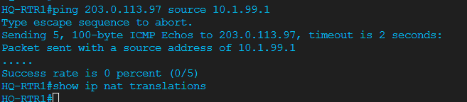

#### HTTP Test Through PAT

A successful HTTP request from PC-ENG1 to EXT-WEB1 proved full TCP translation — not just ICMP ping.

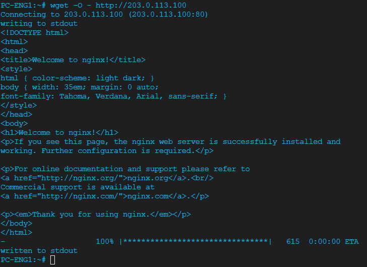

#### NAT Translation Table and Statistics

```text
tcp 203.0.113.1:4096   10.1.100.194:54156   203.0.113.100:80   203.0.113.100:80
```

| Field | Value | Meaning |
|-------|-------|---------|
| Protocol | tcp | Full TCP translation, not just ICMP |
| Inside local | 10.1.100.194:54156 | PC-ENG1 private address and source port |
| Inside global | 203.0.113.1:4096 | Public PAT address and rewritten port |
| Outside global | 203.0.113.100:80 | EXT-WEB1 HTTP service |

**Why this is the PAT proof:** The source port changed from 54156 to 4096. That unique port mapping is how many internal hosts share one outside address.

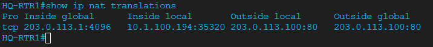
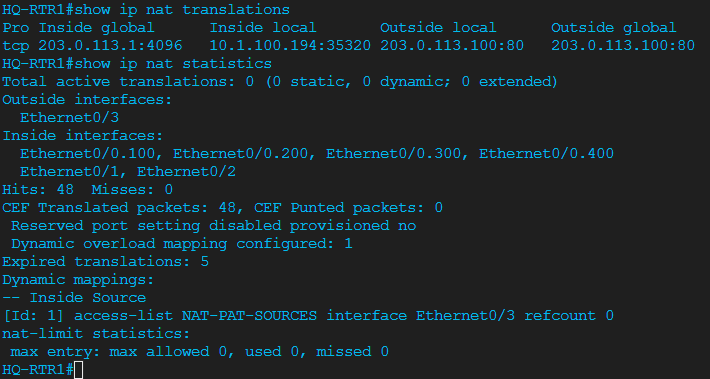

#### Branch Traffic Through PAT

Branch subnets (10.2.x.x) followed the OSPF default route to HQ-RTR1 and were translated through PAT to reach EXT-WEB1.

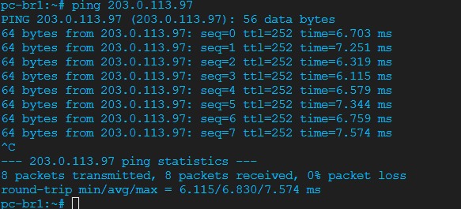
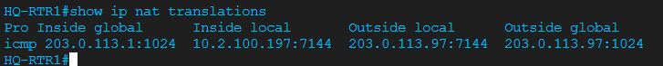

---

## Phase 3 — Static NAT for HQ-SRV1

### Why This Phase Exists

PAT handles inside-initiated traffic. Static NAT is needed when an outside host initiates traffic toward an internal server. HQ-SRV1 is mapped permanently from 10.1.40.10 to 203.0.113.10.

### HQ-SRV1 Boot Script

```sh
hostname HQ-SRV1
ip address add 10.1.40.10/24 dev eth0
ip link set dev eth0 up
ip route add default via 10.1.40.1
```

**Why 10.1.40.10:** Servers use stable addressing, and VLAN 400 is the HQ server VLAN.

### Static NAT and ISP Route

```cisco
! On HQ-RTR1
ip nat inside source static 10.1.40.10 203.0.113.10

! On ISP-RTR1
ip route 203.0.113.10 255.255.255.255 203.0.113.1
```

**Why the ISP route is required:** 203.0.113.10 is not in ISP-RTR1's connected /30 or /28. The /32 route tells ISP-RTR1 to forward that single public host address to HQ-RTR1.

**Why static NAT does not conflict with PAT:** IOS checks static mappings before dynamic PAT. HQ-SRV1 always appears outside as 203.0.113.10, while normal users overload to 203.0.113.1.

### Verification Proof

#### Inbound Access from ISP-RTR1

ISP-RTR1 pinged 203.0.113.10 to simulate an outside host reaching the published server. The first packet was lost to ARP resolution — not a NAT fault.

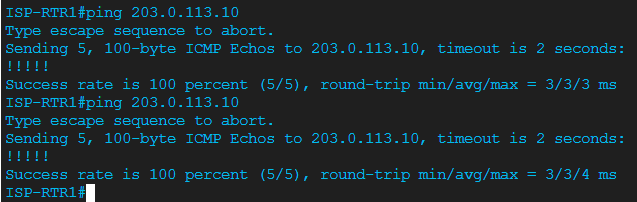

#### NAT Translation Table

```text
icmp 203.0.113.10:2    10.1.40.10:2       203.0.113.2:2      203.0.113.2:2
---  203.0.113.10      10.1.40.10         ---                ---
```

The `---` row is the permanent static NAT entry. The ICMP row is the active outside-to-inside session from ISP-RTR1.

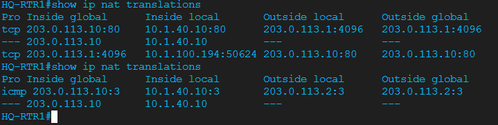
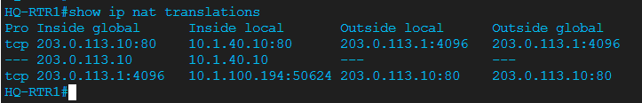

#### NAT Statistics

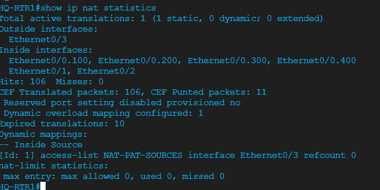

---

## Phase 4 — Object Groups for ACLs

### Why This Phase Exists

The Phase 2 NAT ACL worked, but seven individual permit lines do not scale. Object-groups let the NAT policy reference a named group of source networks.

### Final Object-Group NAT ACL

```cisco
object-group network INSIDE-NAT-SOURCES
 description All subnets permitted through PAT - Management excluded
 10.1.100.0 255.255.255.0
 10.1.200.0 255.255.255.0
 10.1.44.0 255.255.255.0
 10.1.40.0 255.255.255.0
 10.2.100.0 255.255.255.0
 10.2.200.0 255.255.255.0
 10.2.44.0 255.255.255.0

ip access-list extended NAT-PAT-SOURCES
 permit ip object-group INSIDE-NAT-SOURCES any
```

**Why subnet masks here:** This IOL object-group context expects subnet mask format. Wildcard masks are still used in flat extended ACL entries, but not inside this object-group.

### Verification Proof

```text
Extended IP access list NAT-PAT-SOURCES
    10 permit ip object-group INSIDE-NAT-SOURCES any
```

After PC-ENG1 generated HTTP traffic, NAT still worked through the refactored ACL:

```text
--- 203.0.113.10       10.1.40.10         ---                ---
tcp 203.0.113.1:4096   10.1.100.194:38650 203.0.113.100:80   203.0.113.100:80
```

**Platform note:** `show object-group INSIDE-NAT-SOURCES` was not supported on this IOL image. The working ACL reference plus live PAT translation proved the object-group was active.

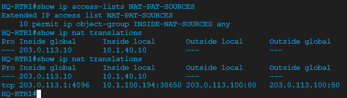

---

## Phase 5 — Guest VLAN 300 ACL Isolation

### Why This Phase Exists

Guest users should reach the internet but not internal enterprise subnets. The ACL is applied inbound on the Guest gateway subinterface so traffic is filtered as soon as it enters the router.

### Configuration

```cisco
ip access-list extended GUEST-RESTRICT
 remark Block Guest to all internal subnets
 deny   ip 10.1.44.0 0.0.0.255 10.1.0.0 0.0.255.255
 deny   ip 10.1.44.0 0.0.0.255 10.2.0.0 0.0.255.255
 remark Allow Guest to reach internet through PAT
 permit ip 10.1.44.0 0.0.0.255 any

interface Ethernet0/0.300
 ip access-group GUEST-RESTRICT in
```

**Why inbound on E0/0.300:** Inbound filtering catches Guest traffic before routing and NAT processing. That is cleaner and more efficient than filtering after it has already moved through the router.

### Verification Proof

#### ACL Configuration and Interface Binding

| Test | Result |
|------|--------|
| `show ip access-lists GUEST-RESTRICT` | ACL present with two denies and one permit |
| `show ip interface Ethernet0/0.300` | Inbound access list is GUEST-RESTRICT |

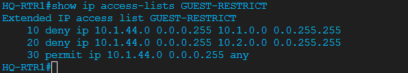
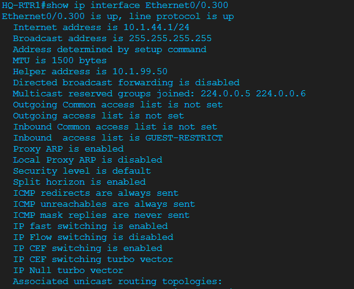

#### Traffic Testing — Internet Pass, Internal Block

| Test | Result |
|------|--------|
| `ping 203.0.113.100 source 10.1.44.1 repeat 5` | 100% — internet reachable |
| `ping 10.1.100.1 source 10.1.44.1 repeat 5` | 0% — Engineering blocked |
| `ping 10.1.200.1 source 10.1.44.1 repeat 5` | 0% — Sales blocked |
| `ping 10.1.40.1 source 10.1.44.1 repeat 5` | 0% — Servers blocked |

**Validation caveat:** There was no dedicated Guest PC in VLAN 300. Router-sourced pings are a functional approximation, but a future Guest endpoint would be the best way to prove inbound ACL counters from real host traffic.

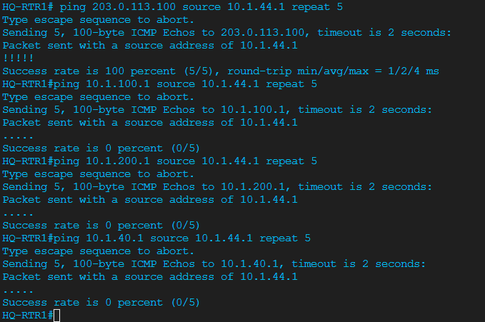

---

## Phase 6 — TCP MSS Clamping

### Why This Phase Exists

Large TCP packets can fragment or black-hole when a path has lower effective MTU. MSS clamping forces TCP sessions to negotiate a slightly smaller payload size at the edge.

### Configuration

```cisco
interface Ethernet0/3
 description ISP-TO-ISP-RTR1-E0/0
 ip tcp adjust-mss 1452
```

**Why 1452:** Ethernet MTU is 1500. IP and TCP headers normally leave 1460 bytes of TCP payload. Clamping to 1452 gives 8 bytes of headroom for NAT/PAT and possible provider encapsulation.

**Why E0/3:** This is the public ISP-facing interface where internet-bound TCP SYN packets cross the NAT boundary.

### Verification Proof

```text
interface Ethernet0/3
 description ISP-TO-ISP-RTR1-E0/0
 ip address 203.0.113.1 255.255.255.252
 ip nat outside
 ip tcp adjust-mss 1452
```

IOL does not provide a dedicated `show ip tcp adjust-mss` command, so the running interface config is the authoritative verification.

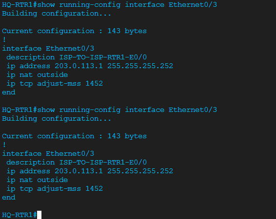

---

## Phase 7 — Branch Internet Verification

### Why This Phase Exists

The Branch site must use the OSPF default route from HQ, enter HQ-RTR1 through an inside NAT interface, translate to 203.0.113.1, and reach the external web server.

### BR-RTR1 Routing Proof

```text
Routing entry for 0.0.0.0/0
  Known via "ospf 1", distance 110, metric 1, candidate default path
  Last update from 10.0.0.9 on Ethernet0/2
```

BR-RTR1 also had full OSPF adjacencies to WAN-RTR1 and HQ-RTR1:

```text
Neighbor ID     State      Address     Interface
10.0.255.3      FULL/-     10.0.0.9    Ethernet0/2
10.0.255.1      FULL/-     10.0.0.1    Ethernet0/1
```

### Branch Traffic Proof

```cisco
ping 203.0.113.100 source 10.2.100.1 repeat 5
ping 203.0.113.100 source 10.2.200.1 repeat 5
```

Both tests returned `!!!!!`.

PC-BR1 also completed a real HTTP request:

```sh
wget -O - http://203.0.113.100
```

Result: Nginx welcome page returned successfully.

### Branch Path Proof

```text
traceroute to 203.0.113.100
 1  10.2.100.1
 2  10.0.0.9
 3  10.0.0.5
 4  203.0.113.2
 5  203.0.113.100
```

### HQ-RTR1 NAT Proof

```text
---  203.0.113.10       10.1.40.10          ---                 ---
icmp 203.0.113.1:1024   10.2.100.197:7152   203.0.113.100:7152  203.0.113.100:1024
tcp  203.0.113.1:4096   10.2.100.197:53152  203.0.113.100:80    203.0.113.100:80
```

`show ip nat statistics` confirmed:

```text
Total active translations: 3 (1 static, 2 dynamic; 2 extended)
Hits: 176  Misses: 0
Dynamic mappings:
[Id: 1] access-list NAT-PAT-SOURCES interface Ethernet0/3 refcount 2
```

This proves Branch endpoint traffic was translated through HQ PAT and not simply routed privately.

---

## Break/Fix Challenge — Bad NAT ACL

### Goal

Break Branch internet access by removing the Branch VLAN 100 subnet from the NAT object-group, then diagnose using routing and NAT show commands.

### Fault Injection

```cisco
! On HQ-RTR1
configure terminal
object-group network INSIDE-NAT-SOURCES
 no 10.2.100.0 255.255.255.0
 10.2.101.0 255.255.255.0
end
write memory
```

### Expected Symptom

PC-BR1 still has a route to the internet through BR-RTR1 and HQ, but HTTP and ping to EXT-WEB1 fail because the source address 10.2.100.x no longer matches the PAT source object-group.

### Diagnosis Commands

```cisco
! On BR-RTR1
show ip route 0.0.0.0
ping 203.0.113.100 source 10.2.100.1 repeat 5

! On HQ-RTR1
show ip access-lists NAT-PAT-SOURCES
show running-config | section object-group network INSIDE-NAT-SOURCES
show ip nat translations
show ip nat statistics
```

### Root Cause

Routing is still correct, but the NAT ACL no longer matches 10.2.100.0/24. The packet reaches HQ-RTR1 and exits toward ISP-RTR1 untranslated. The simulated ISP has no return route to private 10.2.100.x addresses, so the session fails.

### Fix

```cisco
! On HQ-RTR1
configure terminal
object-group network INSIDE-NAT-SOURCES
 no 10.2.101.0 255.255.255.0
 10.2.100.0 255.255.255.0
end
clear ip nat translation *
write memory
```

### Post-Fix Verification

```sh
# On PC-BR1
wget -O - http://203.0.113.100
```

```cisco
! On HQ-RTR1
show ip nat translations
show ip nat statistics
```

Expected: a PAT entry for 10.2.100.x translating to 203.0.113.1, and successful Nginx output on PC-BR1.

---

## Verification Summary

| Test | Command | Expected / Observed Result |
|------|---------|----------------------------|
| ISP cabling | `show cdp neighbors` | ISP-RTR1 on HQ-RTR1 E0/3 |
| ISP handoff | `ping 203.0.113.2` | 100% from HQ-RTR1 |
| ISP loopback | `ping 10.0.255.4` | 100% from HQ-RTR1 |
| Default route | `show ip route 0.0.0.0` on HQ-RTR1 | Static default via 203.0.113.2 |
| OSPF default LSA | `show ip ospf database external` | Type-5 0.0.0.0/0 from 10.0.255.1 |
| Branch default | `show ip route 0.0.0.0` on BR-RTR1 | O*E2 learned from HQ |
| PAT HTTP | `wget -O - http://203.0.113.100` | Nginx page returned |
| PAT table | `show ip nat translations` | 10.1.100.x and 10.2.100.x translated to 203.0.113.1 |
| Static NAT | `show ip nat translations` | Permanent 203.0.113.10 ↔ 10.1.40.10 entry |
| Inbound static NAT | `ping 203.0.113.10` from ISP-RTR1 | Static NAT session visible on HQ-RTR1 |
| Object-group ACL | `show ip access-lists NAT-PAT-SOURCES` | One line references INSIDE-NAT-SOURCES |
| Guest ACL applied | `show ip interface Ethernet0/0.300` | Inbound ACL is GUEST-RESTRICT |
| Guest internet | `ping 203.0.113.100 source 10.1.44.1` | Success |
| Guest internal block | sourced pings to 10.1.100.1 / 10.1.200.1 / 10.1.40.1 | Fail |
| MSS clamp | `show running-config interface Ethernet0/3` | `ip tcp adjust-mss 1452` present |
| Branch path | `traceroute 203.0.113.100` from PC-BR1 | Path crosses Branch, WAN, HQ, ISP, EXT-WEB1 |

---

## Troubleshooting Log

Project-level troubleshooting entries are in [TROUBLESHOOTING-LOG.md](TROUBLESHOOTING-LOG.md):

| ID | Issue | Lesson |
|----|-------|--------|
| P05-T01 | Object-group wildcard mask rejected | Object-group network context used subnet masks on this IOL image |
| P05-T02 | `wget` to 203.0.113.97 connection refused | Wrong HTTP target; 203.0.113.97 is a router interface |
| P05-T03 | No dedicated Guest PC for ACL counters | True inbound ACL hit counters require a real host in VLAN 300 |
| P05-T04 | First static NAT ping lost one packet | ARP resolution can drop the first packet during initial testing |

---

## Key Technologies

| Technology | Command / Feature | Purpose |
|------------|-------------------|---------|
| Static default route | `ip route 0.0.0.0 0.0.0.0 203.0.113.2` | Send unknown destinations to ISP |
| OSPF default origination | `default-information originate` | Propagate internet exit to Branch |
| NAT inside/outside | `ip nat inside`, `ip nat outside` | Define NAT boundary |
| PAT overload | `ip nat inside source list ... overload` | Many-to-one internet access |
| Static NAT | `ip nat inside source static` | Publish internal server publicly |
| ISP host route | `/32 route to 203.0.113.10` | Reach customer static NAT address |
| Extended ACL | `NAT-PAT-SOURCES` | Select which sources get translated |
| Object-group | `INSIDE-NAT-SOURCES` | Maintain NAT source networks cleanly |
| Guest isolation | `GUEST-RESTRICT` | Block Guest-to-internal traffic |
| TCP MSS clamp | `ip tcp adjust-mss 1452` | Prevent TCP fragmentation at edge |
| Nginx testing | `wget -O - http://...` | Verify real HTTP through NAT |
