# Project 06 — Security Hardening

**Series:** Enterprise Network Labs | **Platform:** Cisco CML 2.9 (IOL, IOL-L2, Alpine)
**Build Date:** 2026-05-02 | **Status:** ✅ All 7 Phases Complete

---

## STAR Summary

**Situation:** Projects 01–05 built a fully routed, dual-site enterprise with internet access and NAT. Every device was reachable from every VLAN. User ports accepted any device. The DHCP infrastructure had no validation layer. ARP tables could be poisoned by any host. There were no controls over which VLANs could reach the management plane.

**Task:** Harden the existing HQ campus against Layer 2 and Layer 3 attacks without rebuilding what already works. Implement port security, DHCP snooping, Dynamic ARP Inspection, IP Source Guard, inter-VLAN ACLs protecting OOB management, management plane hardening on all devices, and automated errdisable recovery. Prove each control by simulating a realistic attack and observing the block.

**Action:** Seven structured phases — port security with sticky MAC → DHCP snooping with static binding workaround → DAI with ARP ACLs → IP Source Guard → inter-VLAN ACLs blocking VLAN-to-management traffic → management plane hardening (login block-for, exec-timeout, service disable) → errdisable recovery. Each phase was verified with show commands and then tested by a simulated attack from an Alpine Linux attacker node.

**Result:** HQ campus access switches now enforce MAC-based port security that detects and blocks rogue devices. DAI prevents ARP poisoning using ARP ACLs as the validation source. IP Source Guard blocks IP spoofing on all access ports. Inter-VLAN ACLs prevent every user VLAN from reaching the management network (10.1.99.0/24), and all violations are logged to syslog. All three HQ devices implement brute-force login protection and session timeouts. A key platform limitation — IOL-L2 DHCP snooping enforcement — was discovered, documented, and worked around with static bindings, preserving full DAI and IP Source Guard functionality.

---

## Topology

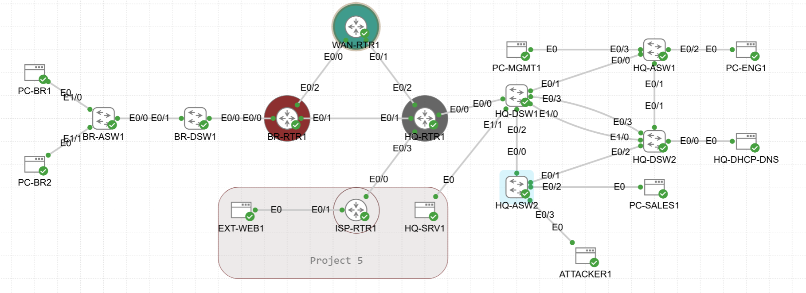
> Project 06 works exclusively on the existing HQ campus topology. No new nodes are added. Security controls are layered onto HQ-ASW1, HQ-ASW2, and HQ-RTR1.

---

## Topology Changes

No new nodes are required for Project 06. All security controls are applied to existing HQ devices.

| Device | Change |
|--------|--------|
| HQ-ASW1 | Port security, DHCP snooping, DAI, IP Source Guard, errdisable recovery, management hardening |
| HQ-ASW2 | Port security, DHCP snooping, DAI, IP Source Guard, errdisable recovery, management hardening |
| HQ-RTR1 | Inter-VLAN ACLs on all subinterfaces, management hardening, no CDP on WAN-facing port |

**Platform note:** An Alpine Linux endpoint replaced the Net-Tools node as the attacker simulation platform. Net-Tools does not provide an interactive CLI shell in CML. Alpine provides BusyBox with arping, ip, ping, and wget.

---

## Network Design

### Security Policy Matrix

| Source VLAN | Destination | Policy |
|-------------|-------------|--------|
| VLAN 100 (Engineering) | VLAN 200 (Sales) | Permit |
| VLAN 100 (Engineering) | VLAN 400 (Servers) | Permit |
| VLAN 100 (Engineering) | VLAN 999 (Management) | **Deny — logged** |
| VLAN 100 (Engineering) | VLAN 300 (Guest) | Deny |
| VLAN 200 (Sales) | VLAN 100 (Engineering) | Permit |
| VLAN 200 (Sales) | VLAN 400 (Servers) | Permit |
| VLAN 200 (Sales) | VLAN 999 (Management) | **Deny — logged** |
| VLAN 300 (Guest) | Any internal 10.x.x.x | Deny |
| VLAN 300 (Guest) | Internet | Permit (via existing PAT from P05) |
| VLAN 400 (Servers) | VLAN 999 (Management) | **Deny — logged** |
| VLAN 400 (Servers) | VLAN 100/200 return TCP | Permit established only |
| VLAN 999 (Management) | All | Permit |

### Port Security Policy

| Switch | Interface | Connected Device | Max MACs | Violation | Mode |
|--------|-----------|-----------------|----------|-----------|------|
| HQ-ASW1 | Ethernet0/2 | PC-ENG1 (VLAN 100) | 2 | Restrict | Sticky |
| HQ-ASW1 | Ethernet0/3 | MGMT1 (VLAN 999) | 1 | Shutdown | Sticky |
| HQ-ASW2 | Ethernet0/2 | PC-SALES1 (VLAN 200) | 2 | Restrict | Sticky |
| HQ-ASW2 | Ethernet0/3 | ATTACKER1 (VLAN 100) | 1 | Shutdown | Sticky |

### Static Source Bindings (DHCP Snooping Workaround)

| MAC Address | VLAN | IP Address | Interface | Device |
|-------------|------|------------|-----------|--------|
| 5254.00D7.CBBC | 100 | 10.1.100.194 | Et0/2 | PC-ENG1 (ASW1) |
| 5254.00B2.8D53 | 999 | 10.1.99.100 | Et0/3 | MGMT1 (ASW1) |
| 5254.001E.FAAF | 200 | 10.1.200.142 | Et0/2 | PC-SALES1 (ASW2) |
| 5254.0049.0158 | 100 | 10.1.100.170 | Et0/3 | ATTACKER1 (ASW2) |

---

## Pre-Work Checklist

Before configuring Project 06, verify the Project 05 baseline is stable.

```cisco
! On HQ-ASW1 and HQ-ASW2
show cdp neighbors
show interfaces trunk
show spanning-tree summary

! On HQ-RTR1
show ip interface brief
show ip route
show ip ospf neighbor
```

**Expected baseline:**
- OSPF adjacencies between HQ-RTR1, BR-RTR1, and WAN-RTR1 are FULL
- HQ-ASW1/ASW2 trunk ports to HQ-DSW1 are active and carrying correct VLANs
- HQ-RTR1 has a working default route via ISP-RTR1
- All user VLANs have working inter-VLAN routing

---

## Phase 1 — Port Security

### Why This Phase Exists

An attacker who physically connects to any user port can currently join any VLAN and communicate normally. Port security locks each access port to specific MACs, triggers an alert or shutdown on a violation, and prevents unauthorized devices from accessing the network without detection.

### HQ-ASW1 Configuration

```cisco
! ============================================================
! DEVICE: HQ-ASW1 | PROJECT: 06 — Security Hardening
! PHASE: 1 — Port Security
! ============================================================
enable
configure terminal

! --- Port Security on Ethernet0/2 (PC-ENG1, VLAN 100) ---
! WHY restrict: Drops frames from unknown MACs and logs — keeps port up for legitimate user
interface Ethernet0/2
 description ACCESS-PC-ENG1-VLAN100
 switchport port-security
 switchport port-security maximum 2
 switchport port-security mac-address sticky
 switchport port-security violation restrict

! --- Port Security on Ethernet0/3 (MGMT1, VLAN 999) ---
! WHY shutdown: Any unauthorized MAC on a management port is a critical event
interface Ethernet0/3
 description ACCESS-MGMT1-VLAN999
 switchport port-security
 switchport port-security maximum 1
 switchport port-security mac-address sticky
 switchport port-security violation shutdown

end
write memory

! --- VERIFICATION ---
! show port-security            → Both ports SecureUp
! show port-security address    → SecureSticky entries for both interfaces
! show port-security interface Ethernet0/2 → Max: 2, Mode: Restrict
! show port-security interface Ethernet0/3 → Max: 1, Mode: Shutdown
```

### HQ-ASW2 Configuration

```cisco
! ============================================================
! DEVICE: HQ-ASW2 | PROJECT: 06 — Security Hardening
! PHASE: 1 — Port Security
! ============================================================
enable
configure terminal

interface Ethernet0/2
 description ACCESS-PC-SALES1-VLAN200
 switchport port-security
 switchport port-security maximum 2
 switchport port-security mac-address sticky
 switchport port-security violation restrict

! WHY shutdown on attacker port: Demonstrates contrast with restrict; proves the control
interface Ethernet0/3
 description ACCESS-ATTACKER1-VLAN100
 switchport port-security
 switchport port-security maximum 1
 switchport port-security mac-address sticky
 switchport port-security violation shutdown

end
write memory
```

### Verification

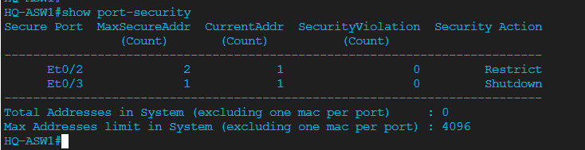

| Test | Command | Expected Result |
|------|---------|------------------|
| Port security state | `show port-security` | Both switches SecureUp on access ports |
| Interface detail | `show port-security interface Ethernet0/2` | Max: 2, Mode: Restrict, SecureUp |
| Sticky MACs | `show port-security address` | SecureSticky entries on all active ports |
| Running config | `show running-config interface Ethernet0/2` | All port security commands present |

### Attack Test — MAC Spoofing / Rogue Device

A rogue device was connected to HQ-ASW2 Ethernet0/3 (shutdown violation mode). The port immediately went err-disabled. After clearing the sticky MAC and recovering the port, the legitimate MAC was re-learned:

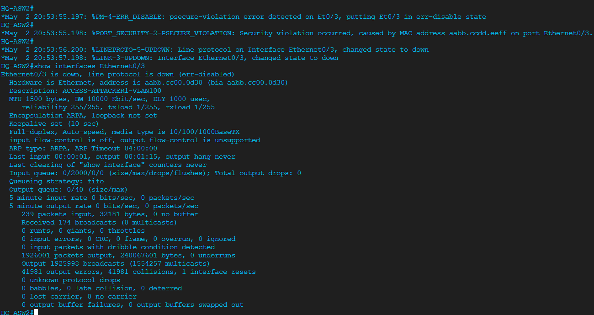
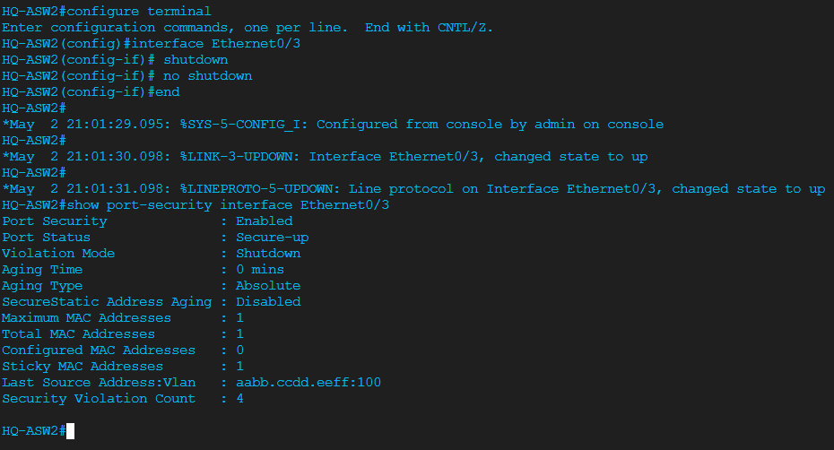

**IOL platform note:** `clear port-security sticky interface EthernetX/X` is not supported on IOL-L2. Workaround: remove and re-add the sticky command under the interface, then cycle shutdown/no shutdown. See [TROUBLESHOOTING-LOG.md — P06-T05](TROUBLESHOOTING-LOG.md).

> For all Phase 1 screenshots see [verification/screenshots/](verification/screenshots/).
> For design decisions see [decision-log.md — Phase 1](decision-log.md#phase-1--port-security).

---

## Phase 2 — DHCP Snooping

### Why This Phase Exists

Any device on an access VLAN can run a rogue DHCP server and distribute false gateway addresses, redirecting all client traffic through an attacker-controlled host. DHCP snooping marks uplink ports as trusted and drops all DHCP Offer/Ack messages arriving on untrusted access ports.

### Configuration (Both Switches)

```cisco
! ============================================================
! DEVICE: HQ-ASW1 | PROJECT: 06 — Security Hardening
! PHASE: 2 — DHCP Snooping
! ============================================================
enable
configure terminal

! --- Enable DHCP snooping globally ---
ip dhcp snooping
no ip dhcp snooping information option

! --- Enable on all user VLANs ---
ip dhcp snooping vlan 100,200,300,999

! --- Trust uplink trunk ports to HQ-DSW1 ---
! WHY: Legitimate DHCP responses from Dnsmasq arrive on these ports
interface Ethernet0/0
 description TRUNK-TO-HQ-DSW1-E0/1
 ip dhcp snooping trust

interface Ethernet0/1
 description TRUNK-TO-HQ-DSW1-E0/2
 ip dhcp snooping trust

! --- Rate limit access ports (DHCP starvation protection) ---
! WHY: 15 pps covers normal client DHCP; blocks flood scripts that generate 100s/sec
interface Ethernet0/2
 ip dhcp snooping limit rate 15

interface Ethernet0/3
 ip dhcp snooping limit rate 15

! --- Static bindings (workaround for IOL-L2 platform limitation) ---
! WHY: IOL-L2 snooping engine never populates the binding table from live traffic
! These entries serve Phase 3 (DAI) and Phase 4 (IP Source Guard) as the binding source
ip source binding 5254.00D7.CBBC vlan 100 10.1.100.194 interface Ethernet0/2
ip source binding 5254.00B2.8D53 vlan 999 10.1.99.100 interface Ethernet0/3

end
write memory

! HQ-ASW2 uses different MAC addresses and same structure:
! ip source binding 5254.001E.FAAF vlan 200 10.1.200.142 interface Ethernet0/2
! ip source binding 5254.0049.0158 vlan 100 10.1.100.170 interface Ethernet0/3
```

### Verification

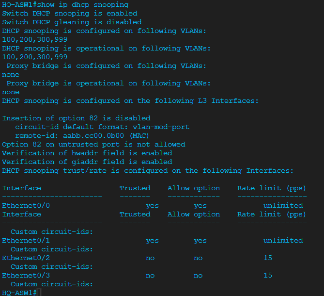
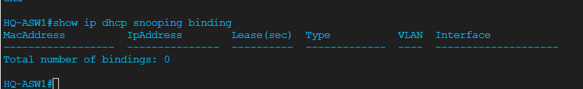

| Test | Command | Expected / Observed |
|------|---------|---------------------|
| Snooping enabled | `show ip dhcp snooping` | Enabled, option 82 off, uplinks trusted |
| Binding table | `show ip dhcp snooping binding` | Empty — IOL-L2 limitation (expected, documented) |
| Static bindings | `show ip source binding` | All 4 access clients present |
| Rate limits | `show running-config interface Ethernet0/2` | `ip dhcp snooping limit rate 15` present |

**Platform limitation — IOL-L2 DHCP snooping:** IOL-L2 is a software-forwarding switch with no ASIC for DHCP snooping interception. The snooping engine never activates, so the binding table stays empty regardless of client DHCP traffic. The configuration is correct and would enforce on real Catalyst hardware. Static `ip source binding` entries fill the binding database for Phase 3 and 4. This is fully documented in [decision-log.md — DL-08 and DL-09](decision-log.md#dl-08--static-ip-source-binding-entries-as-snooping-binding-table-workaround) and [TROUBLESHOOTING-LOG.md — P06-T06](TROUBLESHOOTING-LOG.md).

> For all Phase 2 screenshots see [verification/screenshots/](verification/screenshots/).
> For design decisions see [decision-log.md — Phase 2](decision-log.md#phase-2--dhcp-snooping).

---

## Phase 3 — Dynamic ARP Inspection

### Why This Phase Exists

ARP has no authentication. Any host can send a gratuitous ARP claiming any IP address, poisoning ARP caches and redirecting traffic through an attacker. DAI validates every ARP packet on untrusted ports against a known MAC-to-IP binding. Because the IOL-L2 DHCP snooping binding table is empty, ARP ACLs provide the static mappings instead.

### HQ-ASW1 Configuration

```cisco
! ============================================================
! DEVICE: HQ-ASW1 | PROJECT: 06 — Security Hardening
! PHASE: 3 — Dynamic ARP Inspection
! ============================================================
enable
configure terminal

! --- ARP ACLs — explicit MAC-to-IP bindings for DAI validation ---
! WHY: IOL-L2 binding table is empty; ARP ACLs are the validation source
arp access-list ARP-VLAN100
 permit ip host 10.1.100.194 mac host 5254.00D7.CBBC
 permit ip host 10.1.100.170 mac host 5254.0049.0158

arp access-list ARP-VLAN200
 permit ip host 10.1.200.142 mac host 5254.001E.FAAF

arp access-list ARP-VLAN999
 permit ip host 10.1.99.100 mac host 5254.00B2.8D53

! --- Enable DAI on user VLANs ---
ip arp inspection vlan 100,200,300,999

! --- Apply ARP ACLs to VLANs ---
ip arp inspection filter ARP-VLAN100 vlan 100
ip arp inspection filter ARP-VLAN200 vlan 200
ip arp inspection filter ARP-VLAN999 vlan 999

! --- Trust uplink ports ---
! WHY: Gateway ARP responses from HQ-RTR1 arrive on trunks; must be trusted
interface Ethernet0/0
 ip arp inspection trust

interface Ethernet0/1
 ip arp inspection trust

end
write memory

! --- VERIFICATION ---
! show ip arp inspection vlan 100    → ARP inspection enabled, ARP ACL applied
! show ip arp inspection interfaces  → E0/0, E0/1 trusted; E0/2, E0/3 untrusted
! show arp access-list               → ARP-VLAN100, ARP-VLAN200, ARP-VLAN999 present
```

### HQ-ASW2 Configuration

```cisco
! ATTACKER1 is a known node — its legitimate ARP passes; only spoofed ARPs are dropped
arp access-list ARP-VLAN100
 permit ip host 10.1.100.170 mac host 5254.0049.0158

arp access-list ARP-VLAN200
 permit ip host 10.1.200.142 mac host 5254.001E.FAAF

ip arp inspection vlan 100,200,300,999
ip arp inspection filter ARP-VLAN100 vlan 100
ip arp inspection filter ARP-VLAN200 vlan 200

interface Ethernet0/0
 ip arp inspection trust
interface Ethernet0/1
 ip arp inspection trust
```

### Verification

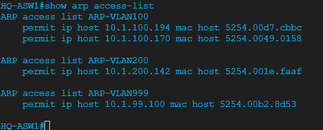

| Test | Command | Expected / Observed |
|------|---------|---------------------|
| DAI enabled | `show ip arp inspection vlan 100` | ARP inspection on, ARP ACL: ARP-VLAN100 |
| DAI interfaces | `show ip arp inspection interfaces` | Uplinks trusted, access ports untrusted |
| Baseline stats | `show ip arp inspection statistics vlan 100` | Counters at 0 before attack |

### Attack Test — ARP Spoofing

ATTACKER1 sent a gratuitous ARP claiming to own the gateway IP (10.1.100.1) with its own MAC. DAI dropped the packet on the untrusted access port. PC-ENG1's ARP table remained clean:

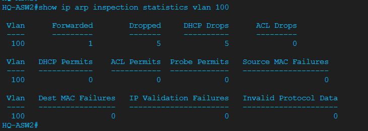


> For all Phase 3 screenshots see [verification/screenshots/](verification/screenshots/).
> For design decisions see [decision-log.md — Phase 3](decision-log.md#phase-3--dynamic-arp-inspection).

---

## Phase 4 — IP Source Guard

### Why This Phase Exists

Port security validates the MAC. DAI validates ARP. But a device can still spoof an IP address while keeping its legitimate MAC, then source packets from that fake IP to impersonate another host. IP Source Guard validates the source IP of every frame on untrusted access ports against the binding table, dropping any frame whose source IP does not match.

### Configuration

```cisco
! ============================================================
! DEVICE: HQ-ASW1 + HQ-ASW2 | PROJECT: 06 — Security Hardening
! PHASE: 4 — IP Source Guard
! ============================================================
enable
configure terminal

! --- Enable IP Source Guard with MAC check on access ports ---
! WHY mac-check: Validates both source IP and source MAC together against binding table
! WHY NOT port-security variant: Not supported on IOS 17.16 (IOL) — command rejected
interface Ethernet0/2
 ip verify source mac-check

interface Ethernet0/3
 ip verify source mac-check

end
write memory

! --- VERIFICATION ---
! show ip verify source     → Filter type: ip+mac, Source IP from static binding
! show ip source binding    → Static entries for all 4 access clients present
```

### Verification

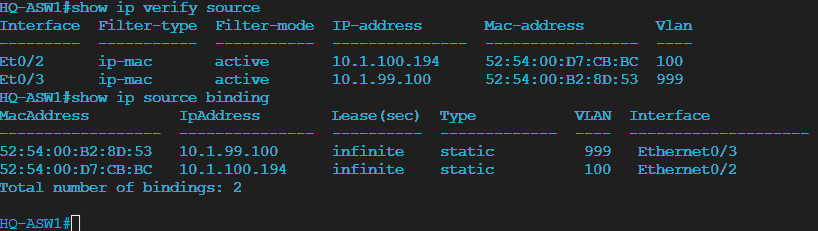

| Test | Command | Expected / Observed |
|------|---------|---------------------|
| Source guard enabled | `show ip verify source` | ip+mac filter on E0/2 and E0/3 |
| Binding table | `show ip source binding` | Static entries for all access clients |

### Attack Test — IP Spoofing

ATTACKER1 added the gateway IP (10.1.100.1) to its interface and attempted to ping PC-ENG1. All packets were dropped by IP Source Guard. Removing the spoofed IP and using the real address restored connectivity immediately:

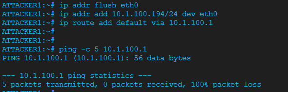
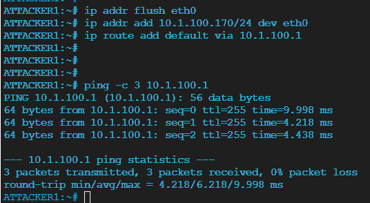

> For all Phase 4 screenshots see [verification/screenshots/](verification/screenshots/).
> For design decisions see [decision-log.md — Phase 4](decision-log.md#phase-4--ip-source-guard).

---

## Phase 5 — Inter-VLAN ACLs / OOB Management Protection

### Why This Phase Exists

User VLANs currently have full routed access to the management VLAN (10.1.99.0/24). A compromised user host gives an attacker direct SSH access to every switch and router management interface. Phase 5 applies extended ACLs inbound on each VLAN subinterface at HQ-RTR1, blocking all user-initiated access to management while preserving inter-user and internet reachability. All management access attempts are logged.

### HQ-RTR1 Configuration

```cisco
! ============================================================
! DEVICE: HQ-RTR1 | PROJECT: 06 — Security Hardening
! PHASE: 5 — Inter-VLAN ACLs / OOB Management Protection
! ============================================================
enable
configure terminal

! --- VLAN 100 (Engineering) ---
! WHY log on seq 10: All management access attempts are security events — they must be audited
ip access-list extended ACL-VLAN100-IN
 10 deny ip 10.1.100.0 0.0.0.255 10.1.99.0 0.0.0.255 log
 20 permit ip 10.1.100.0 0.0.0.255 10.1.200.0 0.0.0.255
 30 permit ip 10.1.100.0 0.0.0.255 10.1.40.0 0.0.0.255
 40 deny ip 10.1.100.0 0.0.0.255 10.1.44.0 0.0.0.255
 50 permit ip 10.1.100.0 0.0.0.255 any

! --- VLAN 200 (Sales) ---
ip access-list extended ACL-VLAN200-IN
 10 deny ip 10.1.200.0 0.0.0.255 10.1.99.0 0.0.0.255 log
 20 permit ip 10.1.200.0 0.0.0.255 10.1.100.0 0.0.0.255
 30 permit ip 10.1.200.0 0.0.0.255 10.1.40.0 0.0.0.255
 40 deny ip 10.1.200.0 0.0.0.255 10.1.44.0 0.0.0.255
 50 permit ip 10.1.200.0 0.0.0.255 any

! --- VLAN 300 (Guest) ---
! WHY deny all 10.0.0.0/8: Guests must not reach any enterprise subnet, not just HQ
ip access-list extended ACL-VLAN300-IN
 10 deny ip 10.1.44.0 0.0.0.255 10.1.99.0 0.0.0.255 log
 20 deny ip 10.1.44.0 0.0.0.255 10.0.0.0 0.255.255.255
 30 permit ip 10.1.44.0 0.0.0.255 any

! --- VLAN 400 (Servers) ---
! WHY established: Servers respond to user sessions; they must not initiate connections to users
ip access-list extended ACL-VLAN400-IN
 10 permit ip 10.1.40.0 0.0.0.255 10.1.99.0 0.0.0.255
 20 permit tcp 10.1.40.0 0.0.0.255 10.1.100.0 0.0.0.255 established
 30 permit tcp 10.1.40.0 0.0.0.255 10.1.200.0 0.0.0.255 established
 40 deny ip 10.1.40.0 0.0.0.255 10.1.100.0 0.0.0.255
 50 deny ip 10.1.40.0 0.0.0.255 10.1.200.0 0.0.0.255
 60 deny ip 10.1.40.0 0.0.0.255 10.1.44.0 0.0.0.255
 70 permit ip 10.1.40.0 0.0.0.255 any

! --- Apply inbound on each VLAN subinterface ---
! WHY inbound: Filters traffic before routing — more efficient and policy travels with source VLAN
interface Ethernet0/0.100
 ip access-group ACL-VLAN100-IN in

interface Ethernet0/0.200
 ip access-group ACL-VLAN200-IN in

interface Ethernet0/0.300
 ip access-group ACL-VLAN300-IN in

interface Ethernet0/0.400
 ip access-group ACL-VLAN400-IN in

end
write memory

! --- VERIFICATION ---
! show ip access-lists ACL-VLAN100-IN      → All sequences present
! show ip interface Ethernet0/0.100        → Inbound access list: ACL-VLAN100-IN
! ping 10.1.99.1 source 10.1.100.1        → 0% (denied)
! ping 10.1.200.1 source 10.1.100.1       → 100% (permitted)
```

### Verification

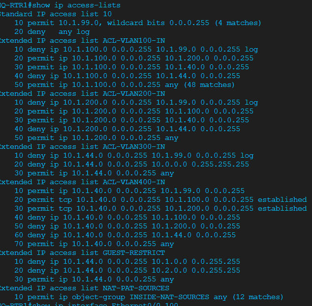
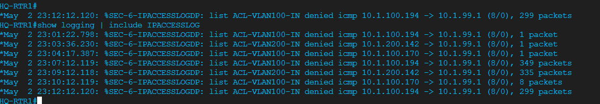

| Test | Source | Destination | Result |
|------|--------|-------------|--------|
| Engineering → Sales | PC-ENG1 (10.1.100.x) | 10.1.200.x | ✅ Success |
| Engineering → Mgmt | PC-ENG1 (10.1.100.x) | 10.1.99.x | ❌ Denied + syslog |
| Sales → Management | PC-SALES1 (10.1.200.x) | 10.1.99.x | ❌ Denied + syslog |
| ATTACKER1 → Mgmt | 10.1.100.x | 10.1.99.x | ❌ Denied + syslog |
| ACL hit counters | `show ip access-lists` | Deny seq 10 | Incrementing on violations |

> For all Phase 5 screenshots see [verification/screenshots/](verification/screenshots/).
> For design decisions see [decision-log.md — Phase 5](decision-log.md#phase-5--inter-vlan-acls--oob-management-protection).

---

## Phase 6 — Management Plane Hardening

### Why This Phase Exists

Open VTY lines with no timeout, no brute-force protection, and unnecessary services create administrative risk that exists independently of all the data-plane controls above. Phase 6 locks down the management plane on all three HQ devices: brute-force protection, session timeouts, unnecessary service removal, and CDP removal from untrusted external interfaces.

### Configuration (All Three HQ Devices)

```cisco
! ============================================================
! DEVICE: HQ-RTR1 | PROJECT: 06 — Security Hardening
! PHASE: 6 — Management Plane Hardening
! ============================================================
enable
configure terminal

! --- Brute-force login protection ---
! WHY: 3 failures in 60 seconds blocks scripts; 120-second lockout is short enough for humans
login block-for 120 attempt 3 within 60

! --- Remove CDP from ISP-facing interface ---
! WHY: CDP leaks device type, IOS version, and platform to untrusted external parties
interface Ethernet0/3
 no cdp enable

! --- Console session timeout ---
line console 0
 exec-timeout 10 0

! --- VTY session timeout ---
line vty 0 4
 exec-timeout 15 0

! --- Disable unnecessary services ---
no service tcp-small-servers
no service udp-small-servers
no ip bootp server
no ip http server
no ip http secure-server

end
write memory

! ============================================================
! DEVICE: HQ-ASW1 + HQ-ASW2 — same management hardening (no cdp change needed)
! ============================================================
login block-for 120 attempt 3 within 60

line console 0
 exec-timeout 10 0

line vty 0 4
 exec-timeout 15 0

no service tcp-small-servers
no service udp-small-servers
```

### Verification

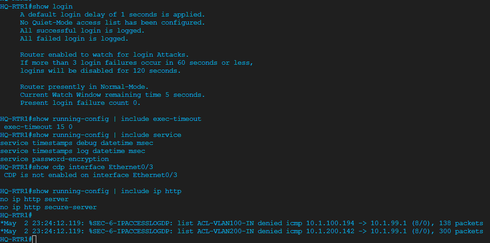

| Test | Command | Expected / Observed |
|------|---------|---------------------|
| Login protection | `show login` | Login delay active, block configured |
| Console timeout | `show running-config \| section line console` | exec-timeout 10 0 |
| VTY timeout | `show running-config \| section line vty` | exec-timeout 15 0 |
| CDP on E0/3 | `show cdp interface Ethernet0/3` | CDP not active on this interface |

> For design decisions see [decision-log.md — Phase 6](decision-log.md#phase-6--management-plane-hardening).

---

## Phase 7 — Errdisable Recovery

### Why This Phase Exists

When a port security or DAI violation fires a shutdown, the port goes err-disabled and stays down until manually recovered. Without an automated recovery timer, every triggered violation requires an engineer to manually bounce the port — operationally unsustainable at scale. Errdisable recovery provides a time-based automatic restoration.

### Configuration

```cisco
! ============================================================
! DEVICE: HQ-ASW1 + HQ-ASW2 | PROJECT: 06 — Security Hardening
! PHASE: 7 — Errdisable Recovery
! ============================================================
enable
configure terminal

! --- Enable recovery for each relevant violation cause ---
! WHY 300 seconds: Long enough to deter scripted attacks, short enough for legitimate recovery
errdisable recovery cause psecure-violation
errdisable recovery cause security-violation
errdisable recovery cause dhcp-rate-limit
errdisable recovery cause arp-inspection
errdisable recovery cause bpduguard
errdisable recovery interval 300

end
write memory

! --- VERIFICATION ---
! show errdisable recovery → 5 causes showing Enabled, Timer interval: 300 seconds
```

### Verification

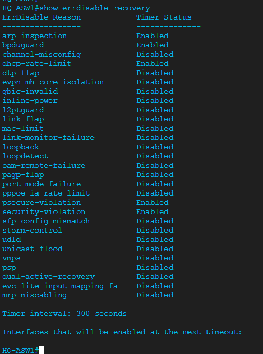

| Test | Command | Expected / Observed |
|------|---------|---------------------|
| Recovery causes | `show errdisable recovery` | psecure-violation, security-violation, dhcp-rate-limit, arp-inspection, bpduguard all Enabled |
| Recovery interval | `show errdisable recovery` | Timer interval: 300 seconds |

---

## Break/Fix Challenge — DHCP Snooping Trust Port Misconfiguration

### Goal

Simulate a common misconfiguration: DHCP snooping trust is placed on an **access port** (where an endpoint connects) instead of on the uplink trunk. This defeats the protection because the access port can now pass DHCP Offer messages from any device connected to it.

### Fault Injection

```cisco
! On HQ-ASW1 — move trust from the trunk to the access port
configure terminal
interface Ethernet0/0
 no ip dhcp snooping trust
interface Ethernet0/2
 ip dhcp snooping trust
end
```

### Expected Symptom

With trust on Ethernet0/2 (the PC-ENG1 access port), any device connected to that port can successfully send DHCP Offer/Ack frames. A rogue DHCP server on that port would not be blocked.

### Diagnosis Commands

```cisco
show ip dhcp snooping
show running-config interface Ethernet0/0
show running-config interface Ethernet0/2
```

`show ip dhcp snooping` will show E0/2 listed as Trusted and E0/0 as Untrusted — the inverse of correct policy.

### Fix

```cisco
configure terminal
interface Ethernet0/2
 no ip dhcp snooping trust
interface Ethernet0/0
 ip dhcp snooping trust
end
write memory
```

**Platform note:** On IOL-L2, DHCP snooping enforcement does not activate (hardware limitation). This break/fix is a conceptual exercise demonstrating the correct trust model. On real Catalyst hardware, the misconfigured trust port would allow a rogue DHCP server to pass offers through snooping unchallenged. The trust placement decision is documented in [decision-log.md — DL-06](decision-log.md#dl-06--trust-only-trunk-uplinks-not-access-ports).

---

## Verification Summary

| Phase | Test | Command | Result |
|-------|------|---------|--------|
| 1 | Port security active | `show port-security` | Both switches SecureUp on access ports |
| 1 | Sticky MACs learned | `show port-security address` | SecureSticky entries on all active ports |
| 1 | Violation triggered | Connect rogue device to E0/3 | Port err-disabled (shutdown mode) |
| 2 | Snooping config | `show ip dhcp snooping` | Uplinks trusted, rate limits on access ports |
| 2 | Binding table | `show ip dhcp snooping binding` | Empty (IOL-L2 limitation — documented) |
| 2 | Static bindings | `show ip source binding` | All 4 access clients present |
| 3 | DAI enabled | `show ip arp inspection vlan 100` | ARP inspection on, ARP ACL: ARP-VLAN100 |
| 3 | ARP spoofing blocked | Gratuitous ARP from ATTACKER1 | DAI drops, ARP table on victim unchanged |
| 4 | Source guard active | `show ip verify source` | ip+mac filter on E0/2 and E0/3 |
| 4 | IP spoofing blocked | Ping with spoofed source IP | 100% packet loss |
| 5 | ACL applied | `show ip interface Ethernet0/0.100` | Inbound ACL: ACL-VLAN100-IN |
| 5 | Mgmt access blocked | Ping to 10.1.99.x from VLAN 100/200 | 0% — ACL deny + syslog |
| 5 | Inter-VLAN working | Ping from VLAN 100 to VLAN 200 | 100% — ACL permit |
| 6 | Login protection | `show login` | Block-for 120s after 3 failures |
| 6 | Session timeouts | `show running-config \| include exec-timeout` | 10 0 console, 15 0 VTY |
| 7 | Errdisable recovery | `show errdisable recovery` | 5 causes enabled, interval 300s |

---

## Troubleshooting Log

Project-level troubleshooting entries are in [TROUBLESHOOTING-LOG.md](TROUBLESHOOTING-LOG.md):

| ID | Issue | Lesson |
|----|-------|--------|
| P06-T01 | Port security switchport commands at global config mode | `switchport` commands require interface context |
| P06-T02 | `switchport port-security` not activating despite parameters set | Bare `switchport port-security` activation command is required |
| P06-T03 | Net-Tools node has no interactive CLI | Use Alpine for attacker simulation in CML |
| P06-T04 | Err-disabled after replacing attacker node (sticky MAC mismatch) | Clear sticky MAC before intentionally replacing an endpoint |
| P06-T05 | `clear port-security sticky interface` not supported on IOL-L2 | Use config-mode toggle + shutdown cycle as workaround |
| P06-T06 | DHCP snooping binding table empty on IOL-L2 | Platform limitation — use static `ip source binding` workaround |
| P06-T07 | `ip verify source port-security` not supported on IOS 17.16 | Use `ip verify source mac-check` instead |
| P06-T08 | `arping -U -s` fails — bind: Address not available | Must assign the spoofed IP to the interface before arping |

---

## Key Technologies

| Technology | Command / Feature | Purpose |
|------------|-------------------|----------|
| Port security | `switchport port-security` | Restrict access ports to specific MACs |
| Sticky MAC | `mac-address sticky` | Dynamically learn and lock endpoint MACs |
| Violation modes | `violation restrict \| shutdown` | Control response to unauthorized MAC |
| DHCP snooping | `ip dhcp snooping` | Block rogue DHCP servers on untrusted ports |
| Snooping trust | `ip dhcp snooping trust` | Allow DHCP offers only from uplink ports |
| Static binding | `ip source binding MAC vlan VID IP int IF` | Workaround for IOL-L2 binding table limitation |
| DAI | `ip arp inspection vlan X` | Validate ARP against known bindings |
| ARP ACLs | `arp access-list NAME` | Static MAC-to-IP mappings for DAI validation |
| IP Source Guard | `ip verify source mac-check` | Block IP spoofing on access ports |
| Extended ACL | `ip access-list extended NAME` | Per-VLAN traffic policy enforcement |
| ACL inbound | `ip access-group NAME in` | Apply policy as traffic enters the router |
| ACL log | `deny ... log` | Audit unauthorized management access attempts |
| TCP established | `permit tcp ... established` | Allow server return traffic only |
| Login block-for | `login block-for X attempt Y within Z` | Brute-force login protection |
| Exec-timeout | `exec-timeout X Y` | Auto-disconnect idle management sessions |
| Errdisable recovery | `errdisable recovery cause X` | Auto-recover err-disabled ports after violation |
