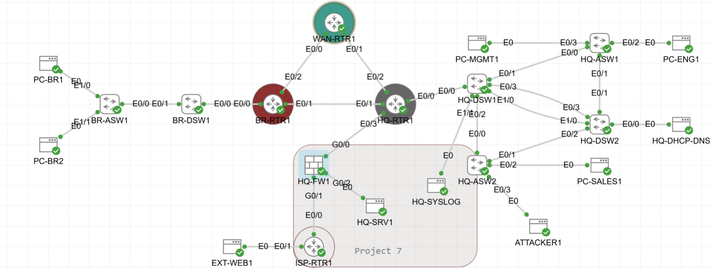
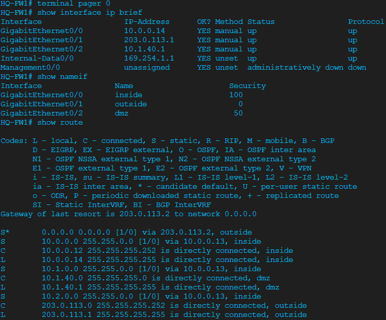
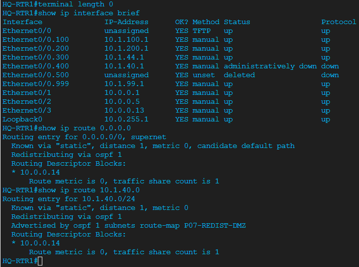
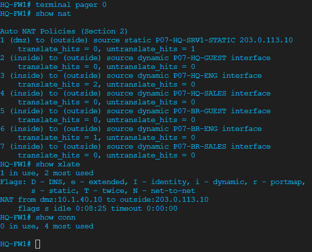
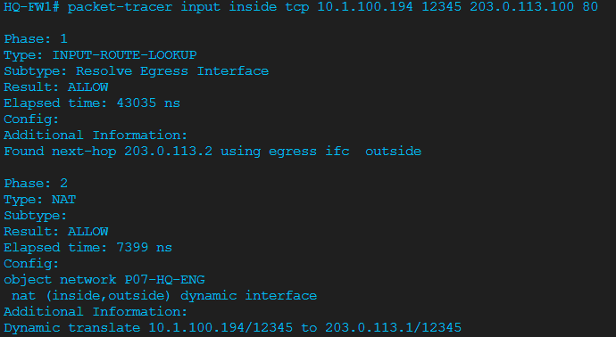
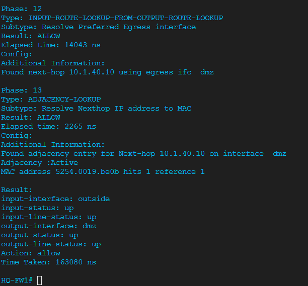
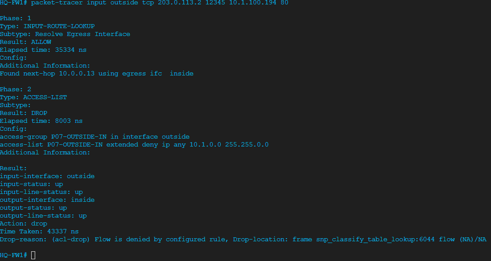
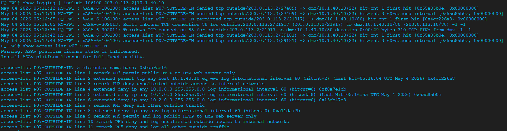
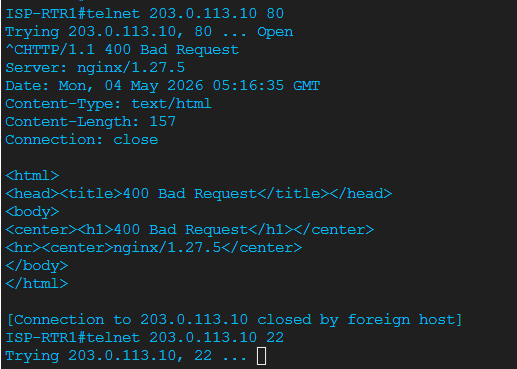
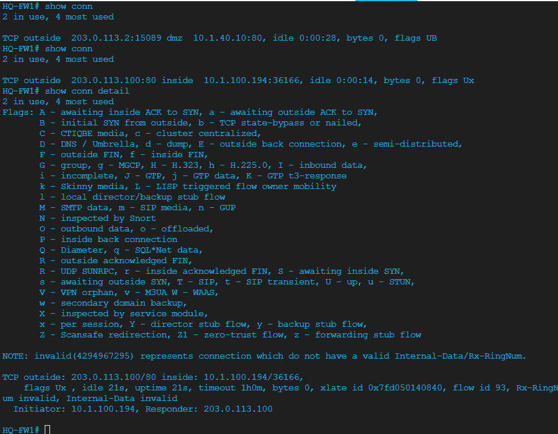

# Project 07 — ASAv Perimeter Firewall

**Series:** Enterprise Network Labs | **Platform:** Cisco CML 2.9 (IOL, ASAv, Alpine)
**Build Date:** 2026-05-04 | **Status:** Phases 1-6 Complete; Break/Fix Deferred

---

## STAR Summary

**Situation:** Projects 01-06 built a routed, NAT-enabled, hardened enterprise network, but HQ-RTR1 still carried three jobs at once: campus routing, NAT boundary, and internet security edge. The public server also lacked a dedicated firewall DMZ.

**Task:** Insert a Cisco ASAv firewall at the perimeter, move HQ-SRV1 into a DMZ, migrate NAT from HQ-RTR1 to HQ-FW1, enforce outside-to-inside and outside-to-DMZ policy, enable application inspection, and prove behavior with ASA verification tools.

**Action:** Added HQ-FW1 between HQ-RTR1 and ISP-RTR1, re-addressed the inside and outside firewall links, moved HQ-SRV1 to a DMZ, removed router NAT, rebuilt PAT and static NAT on ASAv, applied outside ACL policy, enabled HTTP/DNS/ICMP inspection, sent logs to HQ-SYSLOG, and captured packet-tracer plus `show conn` proof.

**Result:** Internet security now sits on a dedicated stateful firewall. Inside users PAT through HQ-FW1, inbound internet traffic is denied by default, public HTTP is allowed only to the DMZ server, firewall denies are logged, and active connections are visible in the ASAv state table.

---

## Topology



Project 07 changes the Project 06 edge by inserting HQ-FW1 between HQ-RTR1 and ISP-RTR1. HQ-SRV1 moves from the internal server VLAN to the ASAv DMZ.

---

## Topology Changes

| Change | Before Project 07 | After Project 07 |
|--------|-------------------|------------------|
| Internet boundary | HQ-RTR1 E0/3 to ISP-RTR1 E0/0 | HQ-RTR1 E0/3 to HQ-FW1 Gi0/0 to ISP-RTR1 E0/0 |
| NAT ownership | HQ-RTR1 PAT and static NAT | HQ-FW1 PAT and static NAT |
| Public server placement | HQ-SRV1 in internal server VLAN | HQ-SRV1 in ASAv DMZ |
| Security enforcement | Router ACLs plus NAT | Stateful ASA policy, inspection, NAT, and logging |

### Node Added

| Node | Image | Hostname | Role |
|------|-------|----------|------|
| ASAv | Cisco ASAv | HQ-FW1 | Stateful perimeter firewall |

### New Connections

| Side A | Side B | Purpose |
|--------|--------|---------|
| HQ-RTR1 Ethernet0/3 | HQ-FW1 GigabitEthernet0/0 | Inside transit link |
| HQ-FW1 GigabitEthernet0/1 | ISP-RTR1 Ethernet0/0 | Outside ISP handoff |
| HQ-FW1 GigabitEthernet0/2 | HQ-SRV1 eth0 | DMZ server segment |

---

## Network Design

### Addressing

| Device | Interface | IP Address | ASA Zone |
|--------|-----------|------------|----------|
| HQ-RTR1 | Ethernet0/3 | 10.0.0.13/30 | Inside transit |
| HQ-FW1 | GigabitEthernet0/0 | 10.0.0.14/30 | inside, security-level 100 |
| HQ-FW1 | GigabitEthernet0/1 | 203.0.113.1/30 | outside, security-level 0 |
| ISP-RTR1 | Ethernet0/0 | 203.0.113.2/30 | ISP |
| HQ-FW1 | GigabitEthernet0/2 | 10.1.40.1/24 | dmz, security-level 50 |
| HQ-SRV1 | eth0 | 10.1.40.10/24 | DMZ host |
| HQ-SRV1 public NAT | Static NAT | 203.0.113.10/32 | Outside representation |

### Security Policy

| Source | Destination | Policy |
|--------|-------------|--------|
| Inside campus | Outside internet | Permit with PAT through HQ-FW1 |
| Inside campus | DMZ server | Permit by security level |
| DMZ server | Inside campus | Deny by default |
| Outside internet | Inside campus | Deny and log |
| Outside internet | DMZ server HTTP | Permit TCP/80 to static NAT address |
| Outside internet | DMZ non-HTTP | Deny and log |
| Management VLAN | HQ-FW1 SSH | Permit from 10.1.99.0/24 only |

### NAT Policy

| Object | Real Network | Translation |
|--------|--------------|-------------|
| P07-HQ-ENG | 10.1.100.0/24 | Dynamic PAT to outside interface |
| P07-HQ-SALES | 10.1.200.0/24 | Dynamic PAT to outside interface |
| P07-HQ-GUEST | 10.1.44.0/24 | Dynamic PAT to outside interface |
| P07-BR-ENG | 10.2.100.0/24 | Dynamic PAT to outside interface |
| P07-BR-SALES | 10.2.200.0/24 | Dynamic PAT to outside interface |
| P07-BR-GUEST | 10.2.44.0/24 | Dynamic PAT to outside interface |
| P07-HQ-SRV1-STATIC | 10.1.40.10 | Static NAT to 203.0.113.10 |

---

## Pre-Work Checklist

Before configuring Project 07, verify the Project 06 baseline is stable.

```cisco
! On HQ-RTR1
show ip interface brief
show ip route
show ip ospf neighbor
show access-lists

! On ISP-RTR1
show ip interface brief
show ip route

! On HQ-SRV1
ip addr show eth0
ip route show
```

**Expected baseline:**
- HQ-RTR1 reaches ISP-RTR1 before the firewall cutover
- Project 06 hardening remains in place on HQ switches and HQ-RTR1
- HQ-SRV1 is reachable before it is moved to the firewall DMZ
- Existing NAT is present on HQ-RTR1 before Phase 2 migration

---

## Phase 1 — ASAv Basic Setup and Cutover

### Why This Phase Exists

The edge router should not be the only security boundary. This phase inserts HQ-FW1 as a dedicated firewall while keeping HQ-RTR1 responsible for campus routing.

### Key Configuration

```cisco
! HQ-FW1
interface GigabitEthernet0/0
 description INSIDE-TO-HQ-RTR1-E0/3
 nameif inside
 security-level 100
 ip address 10.0.0.14 255.255.255.252
 no shutdown

interface GigabitEthernet0/1
 description OUTSIDE-TO-ISP-RTR1-E0/0
 nameif outside
 security-level 0
 ip address 203.0.113.1 255.255.255.252
 no shutdown

interface GigabitEthernet0/2
 description DMZ-TO-HQ-SRV1-ETH0
 nameif dmz
 security-level 50
 ip address 10.1.40.1 255.255.255.0
 no shutdown

route outside 0.0.0.0 0.0.0.0 203.0.113.2 1
route inside 10.1.0.0 255.255.0.0 10.0.0.13 1
route inside 10.2.0.0 255.255.0.0 10.0.0.13 1
```

```cisco
! HQ-RTR1
interface Ethernet0/3
 description INSIDE-TO-HQ-FW1-GI0/0
 ip address 10.0.0.13 255.255.255.252
 no shutdown

no ip route 0.0.0.0 0.0.0.0 203.0.113.2
ip route 0.0.0.0 0.0.0.0 10.0.0.14
ip route 10.1.40.0 255.255.255.0 10.0.0.14
```

### Verification Proof

| Test | Command | Expected Result |
|------|---------|-----------------|
| ASA interfaces | `show interface ip brief` | Gi0/0, Gi0/1, Gi0/2 up/up with correct IPs |
| ASA zones | `show nameif` | inside 100, dmz 50, outside 0 |
| HQ-RTR1 route | `show ip route 0.0.0.0` | Default route points to 10.0.0.14 |
| ISP handoff | `ping 203.0.113.1` from ISP-RTR1 | ASA outside interface responds |




**Platform caveat:** ASAv uses `GigabitEthernet0/x` interface names in CML, while IOL routers use `Ethernet0/x`. Mixing these interface names is the easiest cutover mistake.

> For all Phase 1 screenshots see [verification/screenshots/](verification/screenshots/).
> For design decisions see [decision-log.md — Phase 1](decision-log.md#phase-1--asav-basic-setup-and-cutover).
> For full device configs see [configs/HQ-FW1.md](configs/HQ-FW1.md) and [configs/HQ-RTR1-changes.md](configs/HQ-RTR1-changes.md).

---

## Phase 2 — NAT Migration

### Why This Phase Exists

NAT and firewall policy should live on the same security device. If NAT stays on HQ-RTR1, HQ-FW1 sees already-translated traffic and loses useful source visibility.

### Key Configuration

```cisco
! HQ-FW1 inside PAT examples
object network P07-HQ-ENG
 subnet 10.1.100.0 255.255.255.0
 nat (inside,outside) dynamic interface

object network P07-BR-ENG
 subnet 10.2.100.0 255.255.255.0
 nat (inside,outside) dynamic interface

! HQ-SRV1 static NAT
object network P07-HQ-SRV1-STATIC
 host 10.1.40.10
 nat (dmz,outside) static 203.0.113.10
```

```cisco
! HQ-RTR1 NAT removal
no ip nat inside source list NAT-PAT-SOURCES interface Ethernet0/3 overload
no ip nat inside source static 10.1.40.10 203.0.113.10
clear ip nat translation *
```

### Verification Proof

| Test | Command | Expected Result |
|------|---------|-----------------|
| ASA NAT rules | `show nat detail` | Six PAT rules and one static NAT rule |
| ASA translations | `show xlate` | Inside sources translate to outside interface |
| Router NAT removed | `show running-config \| include ip nat` | No active HQ-RTR1 NAT rules |
| NAT decision path | `packet-tracer input inside tcp 10.1.100.194 12345 203.0.113.100 80` | Flow allowed with NAT translation |




**Platform caveat:** ASA object NAT is configured inside each network object. This differs from IOS NAT, where ACLs and `ip nat inside source` statements are separate global commands.

> For all Phase 2 screenshots see [verification/screenshots/](verification/screenshots/).
> For design decisions see [decision-log.md — Phase 2](decision-log.md#phase-2--nat-migration).
> For full device configs see [configs/HQ-FW1.md — Phase 2](configs/HQ-FW1.md#phase-2--nat-migration) and [configs/HQ-RTR1-changes.md — Phase 2](configs/HQ-RTR1-changes.md#phase-2--remove-nat).

---

## Phase 3 — ACL Policy and Application Inspection

### Why This Phase Exists

The firewall must deny outside-originated traffic by default while allowing only the required public service. Application inspection adds stateful handling for protocols used in this lab.

### Key Configuration

```cisco
! --- Outside ACL (P07-OUTSIDE-IN) ---
! WHY: ACL name includes project prefix so it is clearly project-specific config.
! WHY deny internal subnets explicitly: Prevents RFC1918 address spoofing from outside
!      even before the catch-all deny fires.
access-list P07-OUTSIDE-IN remark PH3 permit public HTTP to DMZ web server only
access-list P07-OUTSIDE-IN extended permit tcp any host 10.1.40.10 eq www log informational interval 60

access-list P07-OUTSIDE-IN remark PH3 deny unsolicited outside access to internal networks
access-list P07-OUTSIDE-IN extended deny ip any 10.0.0.0 255.255.0.0 log informational interval 60
access-list P07-OUTSIDE-IN extended deny ip any 10.1.0.0 255.255.0.0 log informational interval 60
access-list P07-OUTSIDE-IN extended deny ip any 10.2.0.0 255.255.0.0 log informational interval 60

access-list P07-OUTSIDE-IN remark PH3 deny all other outside traffic
access-list P07-OUTSIDE-IN extended deny ip any any log informational interval 60

access-group P07-OUTSIDE-IN in interface outside

! --- Application inspection ---
! WHY inspect icmp: Allows ICMP replies through without a broad outside permit.
!      ASA tracks ICMP request/reply pairs statefully — return traffic is matched.
! WHY inspect dns: Validates DNS message format, prevents cache poisoning.
! WHY inspect http: HTTP visibility; enables future URL filtering.
policy-map global_policy
 class inspection_default
  inspect icmp
  inspect dns
  inspect http
```

### Verification Proof

| Test | Command | Expected Result |
|------|---------|-----------------|
| Outside ACL | `show access-list P07-OUTSIDE-IN` | HTTP permit and deny entries present |
| Allowed HTTP | `packet-tracer input outside tcp 203.0.113.2 12345 203.0.113.10 80` | Allow to DMZ server |
| Blocked inside access | `packet-tracer input outside tcp 203.0.113.2 12345 10.0.0.14 22` | Drop |
| Inspection policy | `show service-policy global` | HTTP, DNS, and ICMP inspection counters visible |




**Platform caveat:** ASA ACLs on the outside interface are evaluated after NAT logic in a way that can be confusing when moving from IOS router ACLs. `packet-tracer` is the authoritative tool for confirming ASA order of operations.

> For all Phase 3 screenshots see [verification/screenshots/](verification/screenshots/).
> For design decisions see [decision-log.md — Phase 3](decision-log.md#phase-3--acl-policy-and-application-inspection).
> For full device configs see [configs/HQ-FW1.md — Phase 3](configs/HQ-FW1.md#phase-3--acl-policy-and-application-inspection).

---

## Phase 4 — packet-tracer Verification

### Why This Phase Exists

Endpoint tests prove symptoms, but `packet-tracer` explains the firewall decision path. This phase validates routing, NAT, ACL, and inspection handling before relying only on pings or HTTP tests.

### Key Tests

```cisco
packet-tracer input inside tcp 10.1.100.194 12345 203.0.113.100 80 detailed
packet-tracer input outside tcp 203.0.113.2 12345 203.0.113.10 80 detailed
packet-tracer input outside tcp 203.0.113.2 12345 10.0.0.14 22 detailed
packet-tracer input inside icmp 10.1.100.10 8 0 203.0.113.100 detailed
```

### Verification Proof

| Flow | Expected Result |
|------|-----------------|
| Inside to outside web | Allowed, source PAT applied |
| Outside to DMZ HTTP | Allowed, static NAT maps 203.0.113.10 to 10.1.40.10 |
| Outside to inside SSH | Dropped by outside policy |
| Inside to outside ICMP | Allowed, return path tracked by ICMP inspection |


> These packet-tracer screenshots are shared from Phase 3. Phase 4 is the interpretation layer — all remaining screenshots are in [verification/screenshots/](verification/screenshots/).

**Platform caveat:** `packet-tracer` can show an allowed decision even when an endpoint service is down. Use it to verify firewall policy, then use endpoint tests to verify the server/application.

> For all Phase 4 verification see [verification/screenshots/](verification/screenshots/).
> For design decisions see [decision-log.md — Phase 4](decision-log.md#phase-4--packet-tracer-verification).

---

## Phase 5 — Firewall Logging

### Why This Phase Exists

A firewall that blocks traffic silently is difficult to operate. This phase makes permit and deny decisions visible through local logging, ACL counters, and central syslog.

### Key Configuration

```cisco
logging enable
logging timestamp
logging device-id hostname
logging buffered informational
logging trap informational
logging host inside 10.1.99.51

threat-detection basic-threat
threat-detection statistics access-list
threat-detection statistics host
```

### Verification Proof

| Test | Command | Result |
|------|---------|--------|
| Logging active | `show running-config logging` | `logging host inside 10.1.99.51` present |
| Syslog forwarding | `show logging` | `Logging to inside 10.1.99.51, UDP TX:58` |
| HTTP permitted + logged | `show logging \| include 106100` | `P07-OUTSIDE-IN permitted tcp outside/203.0.113.2 -> dmz/10.1.40.10(80)` |
| SSH denied + logged | `show logging \| include 106100` | `P07-OUTSIDE-IN denied tcp outside/203.0.113.2 -> dmz/10.1.40.10(22)` |
| ACL hit counters | `show access-list P07-OUTSIDE-IN` | HTTP permit: hitcnt=1, deny 10.1.0.0/16: hitcnt=4 |

**Actual log output captured:**

```
%ASA-6-106100: access-list P07-OUTSIDE-IN permitted tcp outside/203.0.113.2(12655) -> dmz/10.1.40.10(80) hit-cnt 1 first hit
%ASA-6-302013: Built inbound TCP connection 85 for outside:203.0.113.2/12655 to dmz:10.1.40.10/80

%ASA-6-106100: access-list P07-OUTSIDE-IN denied tcp outside/203.0.113.2(27409) -> dmz/10.1.40.10(22) hit-cnt 1 first hit
```




**Platform caveat:** Informational logging is useful in a lab but can be noisy in production. Production firewalls normally tune message severity, ACL logging, and rate limits.

> For all Phase 5 screenshots see [verification/screenshots/](verification/screenshots/).
> For design decisions see [decision-log.md — Phase 5](decision-log.md#phase-5--firewall-logging).
> For full device configs see [configs/HQ-FW1.md — Phase 5](configs/HQ-FW1.md#phase-5--firewall-logging).

---

## Phase 6 — Stateful Connection Analysis

### Why This Phase Exists

The main reason to add ASAv is stateful inspection. This phase proves HQ-FW1 tracks active flows instead of relying only on stateless packet filtering.

### Key Commands

```cisco
show conn
show conn detail
show conn count
show local-host
```

### Verification Proof

| Test | Command | Result |
|------|---------|--------|
| Outside → DMZ connection | `show conn` while ISP-RTR1 telnet open | `TCP outside 203.0.113.2:15089 dmz 10.1.40.10:80, flags UB` |
| Inside → outside connection | `show conn` while PC-ENG1 telnet open | `TCP outside 203.0.113.100:80 inside 10.1.100.194:36166, flags Ux` |
| DMZ session detail | `show conn detail` | Initiator/Responder, xlate id, flow id visible |

**Actual `show conn` output captured:**

```
! Outside-to-DMZ (ISP-RTR1 → HQ-SRV1)
TCP outside  203.0.113.2:15089 dmz  10.1.40.10:80, idle 0:00:28, bytes 0, flags UB

! Detail:
TCP outside: 203.0.113.2/15089 dmz: 10.1.40.10/80,
    flags UB , idle 21s, uptime 21s, timeout 1h0m, bytes 0
  Initiator: 203.0.113.2, Responder: 10.1.40.10

! Inside-to-outside (PC-ENG1 → EXT-WEB1)
TCP outside  203.0.113.100:80 inside  10.1.100.194:36166, idle 0:00:14, bytes 0, flags Ux

! Detail:
TCP outside: 203.0.113.100/80 inside: 10.1.100.194/36166,
    flags Ux , idle 21s, uptime 21s, timeout 1h0m
  Initiator: 10.1.100.194, Responder: 203.0.113.100
```



**Platform caveat:** Connection entries are time-sensitive. If `show conn` is empty, generate traffic again and immediately rerun the command.

> For all Phase 6 screenshots see [verification/screenshots/](verification/screenshots/).
> For design decisions see [decision-log.md — Phase 6](decision-log.md#phase-6--stateful-connection-analysis).

---

## Break/Fix Status — Deferred

Break/fix is intentionally deferred for a future video demonstration. The planned challenge is an incorrect inside security level on HQ-FW1, but it has not been injected, fixed, or marked complete in this repository.

### Planned Fault

```cisco
interface GigabitEthernet0/0
 security-level 0
```

### Expected Symptom

Inside users lose inside-to-outside connectivity because the ASA treats the inside interface as untrusted.

### Planned Diagnosis Commands

```cisco
packet-tracer input inside tcp 10.1.100.10 12345 203.0.113.100 80
show nameif
show interface ip brief
show running-config interface GigabitEthernet0/0
```

### Planned Fix

```cisco
interface GigabitEthernet0/0
 security-level 100
end
write memory
```

**Status note:** This is a future demonstration plan only. Do not treat it as completed break/fix evidence.

---

## Verification Summary

| Phase | Evidence |
|-------|----------|
| Phase 1 | Topology, interface status, nameif/security levels, HQ-RTR1 route, ISP outside ping |
| Phase 2 | ASA NAT table and packet-tracer NAT path |
| Phase 3 | Outside ACL, allowed HTTP packet-tracer, denied outside-to-inside packet-tracer, inspection test |
| Phase 4 | packet-tracer proof for allowed, denied, and translated flows |
| Phase 5 | Logging config, live syslog proof, ACL/log-triggering tests |
| Phase 6 | `show conn` proof for outside-to-DMZ stateful session |

All screenshot evidence is stored under [verification/screenshots/](verification/screenshots/).

---

## Troubleshooting Log

Project 07 did not produce a completed live fault during phases 1-6. The break/fix is deferred for a future video demonstration.

| ID | Issue | Status | Lesson |
|----|-------|--------|--------|
| P07-BF-01 | Inside interface security-level set to 0 — all inside-to-outside traffic denied | Deferred — not yet demonstrated | `show nameif` and `packet-tracer` reveal security level misconfiguration immediately |

Full details and planned diagnosis path: [TROUBLESHOOTING-LOG.md](TROUBLESHOOTING-LOG.md)

---

## Key Technologies

- Cisco ASAv security levels and named interfaces
- Routed firewall insertion between campus and ISP
- DMZ segmentation for public server isolation
- ASA object NAT, dynamic PAT, and static NAT
- Outside interface ACL policy with logging
- HTTP, DNS, and ICMP inspection
- ASA `packet-tracer` troubleshooting
- Central syslog and threat-detection visibility
- Stateful connection verification with `show conn`
