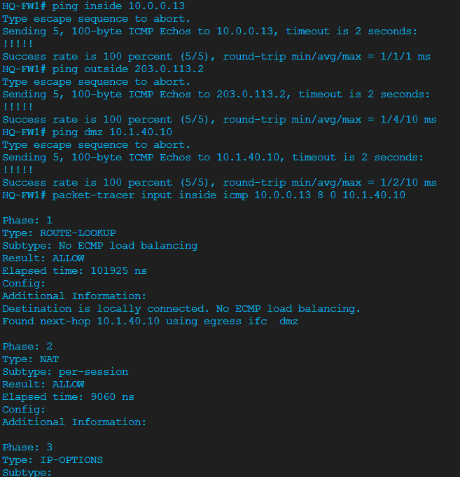
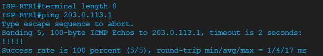
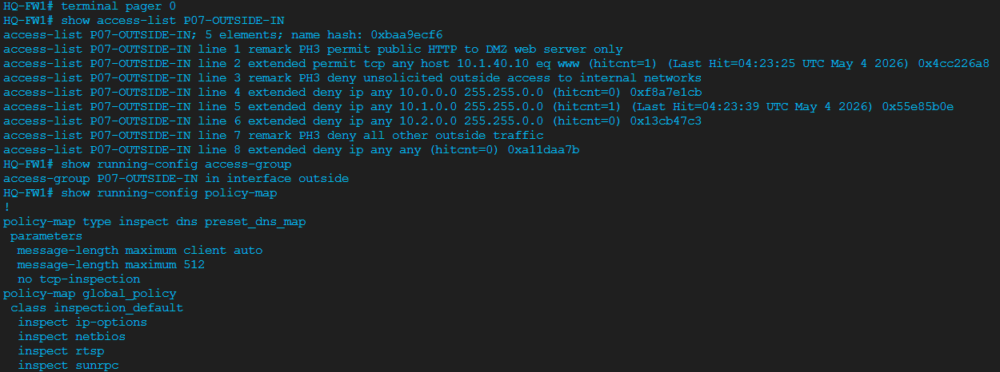
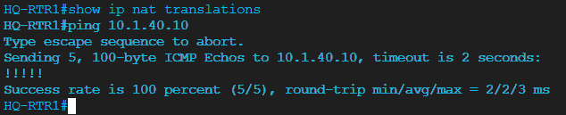
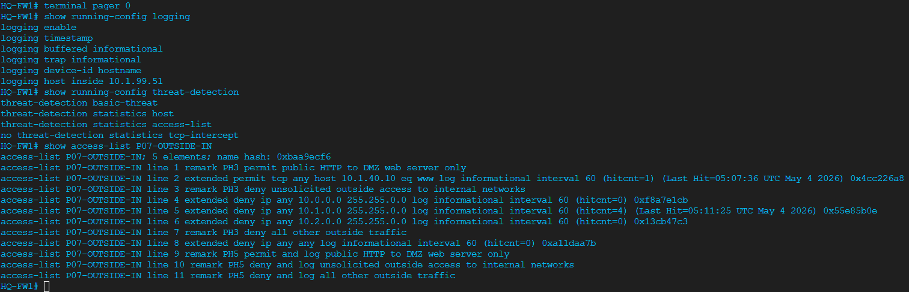

# Project 07 — ASAv Perimeter Firewall

**Series:** Enterprise Network Labs | **Platform:** Cisco CML 2.9 (IOL, ASAv, Alpine)
**Build Status:** Phases 1-6 complete | **Break/Fix:** Deferred for future video demonstration

---

## STAR Summary

**Situation:** Projects 01-06 produced a routed, NAT-enabled, hardened enterprise network, but HQ-RTR1 still acted as the campus router, NAT boundary, and internet security edge. Public server access depended on router NAT and stateless ACLs, and HQ-SRV1 was still tied to an internal campus segment.

**Task:** Insert a dedicated Cisco ASAv firewall at the perimeter, move HQ-SRV1 into an isolated DMZ, migrate NAT from HQ-RTR1 to HQ-FW1, enforce outside-to-inside/DMZ policy, enable application inspection, and prove firewall state with packet-tracer, syslog, and `show conn`.

**Action:** Added HQ-FW1 between HQ-RTR1 and ISP-RTR1, re-addressed the inside and outside links, moved HQ-SRV1 to a firewall DMZ, removed router NAT, rebuilt PAT and static NAT on ASAv, applied explicit outside ACLs, enabled HTTP/DNS/ICMP inspection, sent firewall logs to HQ-SYSLOG, and captured stateful connection verification.

**Result:** The enterprise edge now uses a dedicated stateful firewall. Internal users NAT through HQ-FW1, inbound internet traffic is denied by default, only HTTP to the DMZ server is explicitly permitted, DMZ traffic is isolated from the inside campus, deny events are logged, and active flows are visible in the ASA connection table.

---

## Topology

Project 07 changes the Project 06 edge by inserting HQ-FW1 between HQ-RTR1 and ISP-RTR1 and moving HQ-SRV1 behind a dedicated firewall DMZ interface.

---

## Topology Changes

| Change | Before Project 07 | After Project 07 |
|--------|-------------------|------------------|
| Internet boundary | HQ-RTR1 E0/3 to ISP-RTR1 E0/0 | HQ-RTR1 E0/3 to HQ-FW1 Gi0/0 to ISP-RTR1 E0/0 |
| NAT ownership | HQ-RTR1 PAT and static NAT | HQ-FW1 PAT and static NAT |
| Public server placement | HQ-SRV1 in internal server VLAN | HQ-SRV1 in ASAv DMZ |
| Security enforcement | Router ACLs plus NAT | Stateful ASA policy, inspection, NAT, and logging |

### Node Added

| Node | Image | Hostname | Role |
|------|-------|----------|------|
| ASAv | Cisco ASAv | HQ-FW1 | Stateful perimeter firewall |

### Connections

| Side A | Side B | Purpose |
|--------|--------|---------|
| HQ-RTR1 Ethernet0/3 | HQ-FW1 GigabitEthernet0/0 | Inside transit link |
| HQ-FW1 GigabitEthernet0/1 | ISP-RTR1 Ethernet0/0 | Outside ISP handoff |
| HQ-FW1 GigabitEthernet0/2 | HQ-SRV1 eth0 | DMZ server segment |

---

## IP Address Plan

| Device | Interface | IP Address | ASA Zone |
|--------|-----------|------------|----------|
| HQ-RTR1 | Ethernet0/3 | 10.0.0.13/30 | Inside transit |
| HQ-FW1 | GigabitEthernet0/0 | 10.0.0.14/30 | inside, security-level 100 |
| HQ-FW1 | GigabitEthernet0/1 | 203.0.113.1/30 | outside, security-level 0 |
| ISP-RTR1 | Ethernet0/0 | 203.0.113.2/30 | ISP |
| HQ-FW1 | GigabitEthernet0/2 | 10.1.40.1/24 | dmz, security-level 50 |
| HQ-SRV1 | eth0 | 10.1.40.10/24 | DMZ host |
| HQ-SRV1 public NAT | Static NAT | 203.0.113.10/32 | Outside representation |

---

## Security Policy

| Source | Destination | Policy |
|--------|-------------|--------|
| Inside campus | Outside internet | Permit with PAT through HQ-FW1 |
| Inside campus | DMZ server | Permit by security level |
| DMZ server | Inside campus | Deny by default |
| Outside internet | Inside campus | Deny and log |
| Outside internet | DMZ server HTTP | Permit TCP/80 to static NAT address |
| Outside internet | DMZ non-HTTP | Deny and log |
| Management VLAN | HQ-FW1 SSH | Permit from 10.1.99.0/24 only |

---

## Phase Summary

| Phase | Status | Focus |
|-------|--------|-------|
| 1 | Complete | ASAv insertion, interfaces, security levels, static routes, HQ-RTR1 cutover |
| 2 | Complete | NAT migration from HQ-RTR1 to HQ-FW1 |
| 3 | Complete | Outside ACL policy and application inspection |
| 4 | Complete | packet-tracer validation for allowed, denied, and translated flows |
| 5 | Complete | Firewall syslog, ACL hit logging, and threat-detection |
| 6 | Complete | Stateful connection table analysis with `show conn` |
| Break/Fix | Deferred | Future video demonstration; not marked complete |

---

## Phase 1 — ASAv Basic Setup and Cutover

HQ-FW1 was inserted as the routed perimeter firewall. The inside interface faces HQ-RTR1, the outside interface faces ISP-RTR1, and the DMZ interface becomes the default gateway for HQ-SRV1.

**Config references:**
- [configs/HQ-FW1.txt](configs/HQ-FW1.txt)
- [configs/HQ-RTR1-changes.txt](configs/HQ-RTR1-changes.txt)
- [configs/ISP-RTR1-changes.txt](configs/ISP-RTR1-changes.txt)
- [configs/HQ-SRV1.txt](configs/HQ-SRV1.txt)

**Verification evidence:**
- 
- 
- 
- 

---

## Phase 2 — NAT Migration

NAT was removed from HQ-RTR1 and rebuilt on HQ-FW1. Internal user VLANs use per-VLAN dynamic PAT objects, while HQ-SRV1 uses static NAT from 10.1.40.10 to 203.0.113.10.

**Verification evidence:**
- 
- 

---

## Phase 3 — ACL Policy and Application Inspection

An outside ACL permits only HTTP to the DMZ server and denies all other outside-originated traffic. HTTP, DNS, and ICMP inspection were enabled in the global policy.

**Verification evidence:**
- 
- 
- 
- 

---

## Phase 4 — packet-tracer Verification

ASA `packet-tracer` was used as the primary policy debugger to prove three paths: inside-to-outside NAT, outside-to-DMZ HTTP permit, and outside-to-inside deny. This phase validates the firewall decision path before relying only on endpoint tests.

**Evidence location:** packet-tracer screenshots are captured in the Phase 2 and Phase 3 screenshot set.

---

## Phase 5 — Firewall Logging

HQ-FW1 now sends timestamped informational logs to HQ-SYSLOG at 10.1.99.51. ACL entries use the `log` keyword so denied flows and permitted outside-to-DMZ HTTP hits are visible during troubleshooting.

**Verification evidence:**
- 
- 
- 

---

## Phase 6 — Stateful Connection Analysis

`show conn`, `show conn detail`, and `show conn count` were used to confirm ASAv tracks state for allowed flows and records outside-to-DMZ server sessions after ACL and NAT processing.

**Verification evidence:**
- 

---

## Break/Fix Status

Break/fix is intentionally deferred for a future video demonstration. The planned challenge is an incorrect inside security level on HQ-FW1, but it has not been executed, fixed, or marked complete in this repository.

---

## Project Files

| Path | Purpose |
|------|---------|
| [requirement.md](requirement.md) | Business and technical requirements |
| [decision-log.md](decision-log.md) | Design decisions and trade-offs |
| [TROUBLESHOOTING-LOG.md](TROUBLESHOOTING-LOG.md) | Project-local troubleshooting record |
| [configs/](configs/) | Final device configuration snippets |
| [verification/post-change/verification-commands.md](verification/post-change/verification-commands.md) | Verification command checklist |
| [verification/screenshots/](verification/screenshots/) | Captured visual proof for phases 1-6 |
