# Project 08 — Site-to-Site VPN

**Series:** Enterprise Network Labs | **Platform:** Cisco CML 2.9 (IOL)
**Build Date:** 2026-05-11 | **Status:** All Phases Complete ✅

---

## STAR Summary

**Situation:** Projects 01-07 built a fully routed, NAT-enabled, ASAv-protected enterprise network, but all inter-site traffic between HQ and Branch crossed the WAN in plaintext. Anyone with access to the WAN segment could read or manipulate the traffic.

**Task:** Encrypt all inter-site traffic using GRE over IKEv2/IPsec, keep OSPF dynamic routing working over the encrypted path, verify the tunnel is the preferred route, and demonstrate structured crypto troubleshooting by deliberately breaking and fixing a VPN proposal mismatch.

**Action:** Built a GRE Tunnel0 between HQ-RTR1 and BR-RTR1, migrated OSPF to the tunnel (cost 5 vs. physical fallback paths at cost 10-100), layered IKEv2/IPsec encryption with AES-256/SHA-256/DH14 in transport mode, verified crypto session health with `show crypto session` and `show crypto ikev2 sa`, proved route preference with `show ip route` and traceroute, then injected an IKEv2 proposal mismatch (AES-128 on Branch vs. AES-256 on HQ) and diagnosed the failure using only show commands before restoring the VPN.

**Result:** All inter-site traffic is now encrypted. OSPF routes dynamically over the encrypted GRE tunnel and automatically fails over to backup paths if the tunnel drops. Can diagnose a VPN proposal mismatch from `show crypto ikev2 sa` returning empty output, identify the root cause with `show running-config | section crypto ikev2 proposal`, and restore service without debug.

---

## Topology

No new nodes were added in Project 08. The topology is the same 19-node lab from Project 07 — GRE/IPsec creates an encrypted overlay on top of the existing physical WAN connections.

| WAN Connection | Role |
|----------------|------|
| HQ-RTR1 Ethernet0/1 ↔ BR-RTR1 Ethernet0/1 | GRE tunnel source/destination (10.0.0.1 ↔ 10.0.0.2) |
| HQ-RTR1 Ethernet0/2 ↔ WAN-RTR1 | Secondary WAN path (OSPF fallback) |
| BR-RTR1 Ethernet0/2 ↔ WAN-RTR1 | Secondary WAN path (OSPF fallback) |

### Tunnel Addressing

| Interface | Device | IP Address | Role |
|-----------|--------|------------|------|
| Tunnel0 | HQ-RTR1 | 10.0.100.1/30 | Tunnel overlay — HQ end |
| Tunnel0 | BR-RTR1 | 10.0.100.2/30 | Tunnel overlay — Branch end |

### OSPF Cost Hierarchy (inter-site routing)

| Path | Interface | Cost | Route Metric to Remote Site |
|------|-----------|------|-----------------------------|
| GRE/IPsec tunnel | Tunnel0 | 5 | 15 (preferred) |
| WAN-RTR1 transit | Ethernet0/2 | 10 | higher |
| Direct physical WAN | Ethernet0/1 | 100 | higher |

---

## Pre-Work Checklist

Before applying Phase 1 config, verify the existing baseline:

```text
! On HQ-RTR1:
show ip interface brief
! Confirm Ethernet0/1 is 10.0.0.1 and up/up

show ip ospf neighbor
! Confirm existing adjacencies over Ethernet0/1 and Ethernet0/2

show ip route 10.2.0.0
! Confirm route to Branch exists (before tunnel — should go via physical WAN)

! On BR-RTR1:
show ip interface brief
! Confirm Ethernet0/1 is 10.0.0.2 and up/up

show ip ospf neighbor
show ip route 10.1.0.0
```

---

## Phase 1 — GRE Tunnel Without Encryption

### Why This Phase Exists

Building the GRE tunnel first, without encryption, lets us verify OSPF adjacency and route preference before adding crypto complexity. If Phase 1 fails, the problem is GRE or OSPF — not IKEv2/IPsec. This phased approach makes troubleshooting much cleaner.

### Configuration

**HQ-RTR1:**

```
interface Tunnel0
 description GRE-TO-BR-RTR1-TUN0-P08
 ip address 10.0.100.1 255.255.255.252
 ip mtu 1400
 ip tcp adjust-mss 1360
 ip ospf 1 area 0
 ip ospf network point-to-point
 ip ospf authentication message-digest
 ip ospf message-digest-key 1 md5 OSPF-WAN-KEY
 ip ospf cost 5
 tunnel source Ethernet0/1
 tunnel destination 10.0.0.2
 tunnel mode gre ip
 no shutdown

router ospf 1
 no passive-interface Tunnel0
```

**BR-RTR1:**

```
interface Tunnel0
 description GRE-TO-HQ-RTR1-TUN0-P08
 ip address 10.0.100.2 255.255.255.252
 ip mtu 1400
 ip tcp adjust-mss 1360
 ip ospf 1 area 0
 ip ospf network point-to-point
 ip ospf authentication message-digest
 ip ospf message-digest-key 1 md5 OSPF-WAN-KEY
 ip ospf cost 5
 tunnel source Ethernet0/1
 tunnel destination 10.0.0.1
 tunnel mode gre ip
 no shutdown

router ospf 1
 no passive-interface Tunnel0
```

**Key design choices:**
- `ip mtu 1400` + `ip tcp adjust-mss 1360`: GRE adds 24 bytes of overhead; IPsec transport mode adds ~50 more. Without MSS clamping, TCP connections would silently fail or fragment on the tunnel.
- `ip ospf network point-to-point`: Suppresses unnecessary DR/BDR election on a two-router GRE tunnel link. Adjacency forms faster.
- `ip ospf cost 5`: Makes the tunnel the lowest-cost inter-site path. The physical direct WAN link (cost 100) and WAN-RTR1 path (cost 10) remain as fallback.
- `no passive-interface Tunnel0`: Required explicitly because earlier projects may have set OSPF passive on WAN-facing interfaces. Tunnel0 must send OSPF hellos to form the adjacency.

### Verification

```text
show interface Tunnel0
! Expected: Tunnel0 is up, line protocol is up

show ip ospf neighbor
! Expected: BR-RTR1 (or HQ-RTR1) FULL/- over Tunnel0
! Note: Seeing the same neighbor twice (Tunnel0 AND Ethernet0/1) is expected and correct.
! HQ and Branch are physically adjacent AND tunnel-adjacent.

show ip route 10.2.0.0   (on HQ-RTR1)
! Expected: via 10.0.100.2, Tunnel0, metric 15

show ip route 10.1.0.0   (on BR-RTR1)
! Expected: via 10.0.100.1, Tunnel0, metric 15

traceroute 10.2.100.1 source 10.1.100.1   (HQ to Branch)
! Expected: first hop 10.0.100.2

traceroute 10.1.100.1 source 10.2.100.1   (Branch to HQ)
! Expected: first hop 10.0.100.1
```

**Phase 1 Evidence:**

HQ-RTR1 Tunnel0 up and OSPF FULL over Tunnel0:

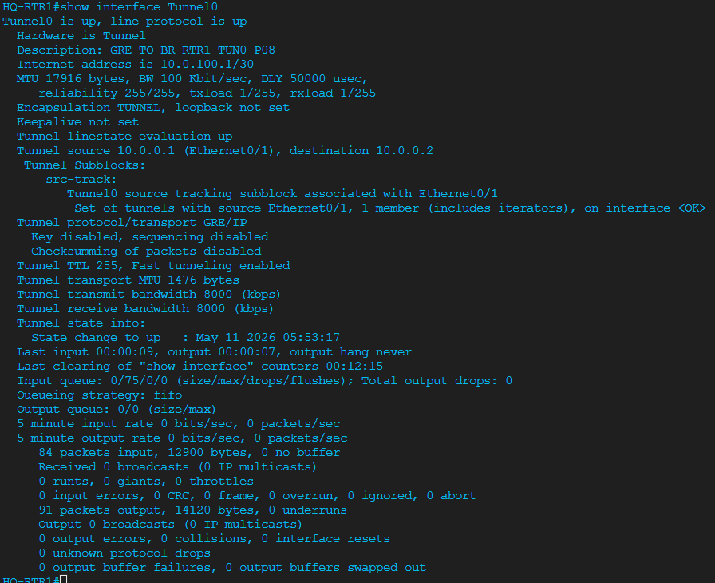

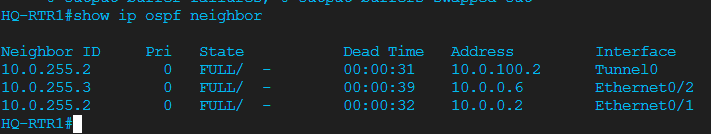

HQ-RTR1 OSPF cost and MD5 auth on Tunnel0:

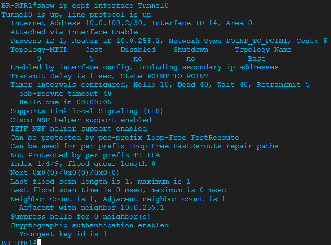

HQ-RTR1 route and traceroute to Branch via Tunnel0:

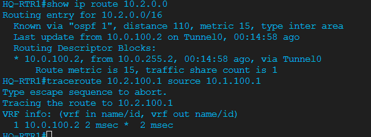

BR-RTR1 Tunnel0 up and OSPF FULL over Tunnel0:

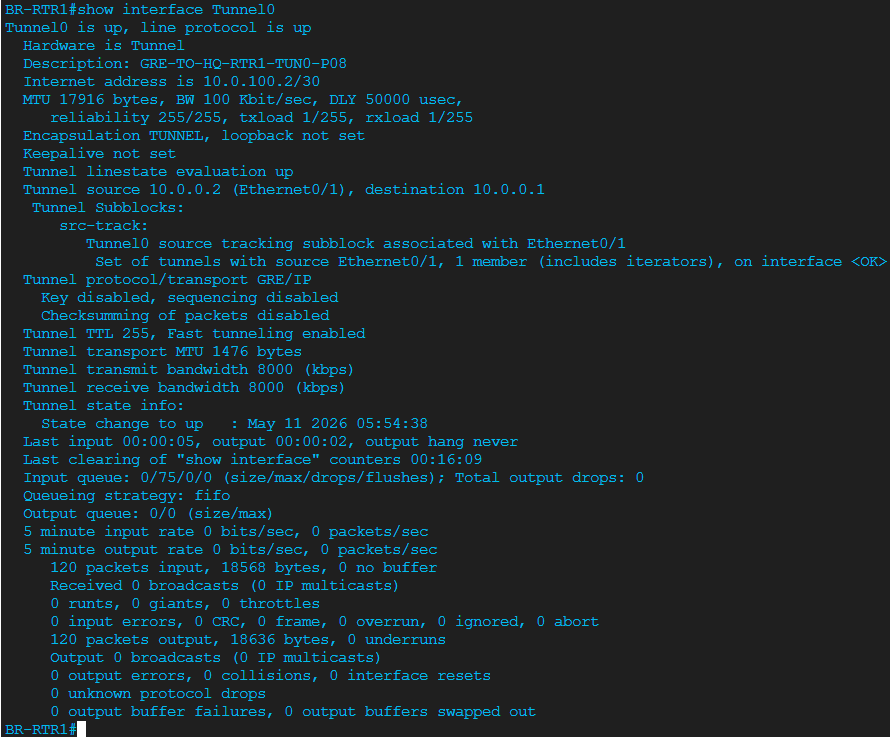

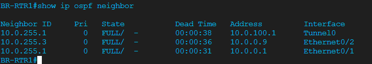

BR-RTR1 route and traceroute to HQ via Tunnel0:

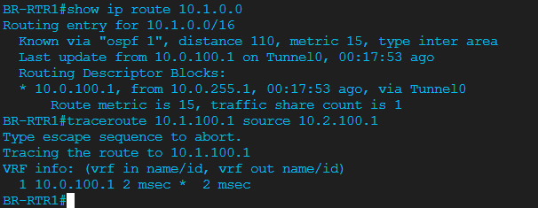

---

## Phase 2 — IKEv2/IPsec Encryption

### Why This Phase Exists

Phase 1 proved the GRE tunnel and OSPF work correctly. Now we add IKEv2/IPsec encryption in transport mode so the GRE packets crossing the physical WAN are unreadable without the session keys. Transport mode encrypts the GRE payload without adding a redundant outer IP header (tunnel mode would add one that GRE already provides).

### Configuration

Applied identically to HQ-RTR1 and BR-RTR1, with peer addresses swapped. Full config is in `configs/HQ-RTR1.txt` and `configs/BR-RTR1.txt`.

**IKEv2 hierarchy:**

```
crypto ikev2 proposal P08-IKEV2-PROP
 encryption aes-cbc-256
 integrity sha256
 group 14

crypto ikev2 policy 10           ! NOTE: IOL requires numeric priority, not a name
 proposal P08-IKEV2-PROP

crypto ikev2 keyring P08-IKEV2-KEYRING
 peer BR-RTR1                    ! (peer HQ-RTR1 on BR side)
  address 10.0.0.2               ! (10.0.0.1 on BR side)
  pre-shared-key local P08IKEV2LabKey2026
  pre-shared-key remote P08IKEV2LabKey2026

crypto ikev2 profile P08-IKEV2-PROFILE
 match identity remote address 10.0.0.2 255.255.255.255
 authentication remote pre-share
 authentication local pre-share
 keyring local P08-IKEV2-KEYRING
 dpd 10 3 periodic

crypto ipsec transform-set P08-IPSEC-TS esp-aes 256 esp-sha256-hmac
 mode transport

crypto ipsec profile P08-IPSEC-PROFILE
 set transform-set P08-IPSEC-TS
 set ikev2-profile P08-IKEV2-PROFILE
 set pfs group14

interface Tunnel0
 tunnel protection ipsec profile P08-IPSEC-PROFILE
```

**Key design choices:**
- IKE peer addresses are physical WAN IPs (10.0.0.1/10.0.0.2), not Tunnel0 IPs — IKE/IPsec operates between the GRE endpoints, not the overlay addresses.
- `mode transport`: GRE already creates the tunnel. Transport mode encrypts the GRE PDU between physical WAN endpoints without a second IP tunnel header.
- `dpd 10 3 periodic`: DPD sends IKE liveness probes every 10 seconds, declares the peer dead after 3 failures. Allows faster recovery than waiting for OSPF dead-interval on the tunnel.
- `set pfs group14`: Requires a fresh DH key exchange at every IPsec rekey so a compromised session key does not expose previous sessions.

**IOL platform note — PFS display:**
`show crypto ipsec sa | include PFS` shows `PFS (Y/N): N` on IOL even when `set pfs group14` is configured. This is an IOL limitation — the platform accepts the command and stores it correctly (`show crypto ipsec profile P08-IPSEC-PROFILE` shows `PFS (Y/N): Y, DH group: group14`) but does not perform the DH exchange during `CREATE_CHILD_SA` rekey. On physical Cisco hardware or IOS XE this would show Y.

### Verification

```text
show crypto session
! Expected:
! Interface: Tunnel0
! Profile: P08-IKEV2-PROFILE
! Session status: UP-ACTIVE
! Peer: 10.0.0.x port 500
! IKEv2 SA: local .../500 remote .../500 Active
! Active SAs: 2

show crypto ikev2 sa
! Expected:
! Local 10.0.0.x/500 remote 10.0.0.x/500 Status READY
! Encr: AES-CBC, keysize: 256, PRF: SHA256, Hash: SHA256, DH Grp:14
! Auth sign: PSK, Auth verify: PSK

show crypto ipsec sa
! Expected:
! transform: esp-256-aes esp-sha256-hmac
! in use settings ={Transport,}
! Status: ACTIVE(ACTIVE)
! encaps/decaps counters increasing

show ip ospf neighbor
! Expected: FULL/- still present over Tunnel0

traceroute 10.2.100.1 source 10.1.100.1
! Expected: first hop 10.0.100.2 (same as Phase 1 — traffic path unchanged)
```

**Phase 2 Evidence:**

HQ-RTR1 crypto session UP-ACTIVE, IKEv2 SA READY, and IPsec SA counters:

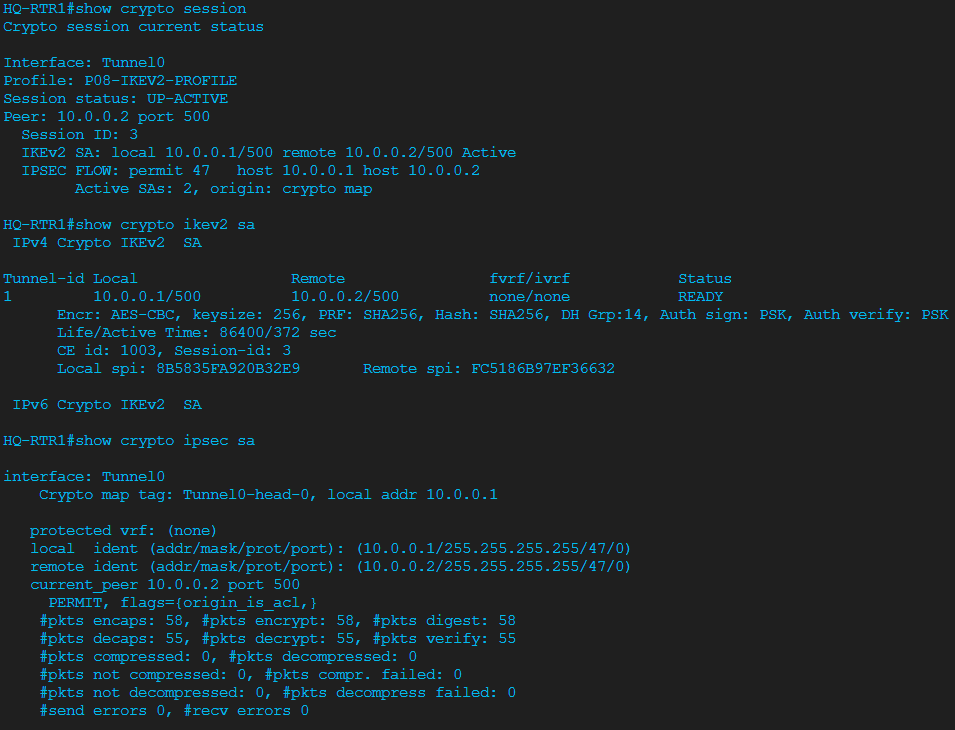

HQ-RTR1 IPsec profile PFS confirmation (profile level shows Y):

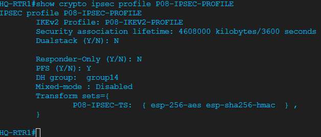

BR-RTR1 crypto session UP-ACTIVE, IKEv2 SA READY, and IPsec SA counters:

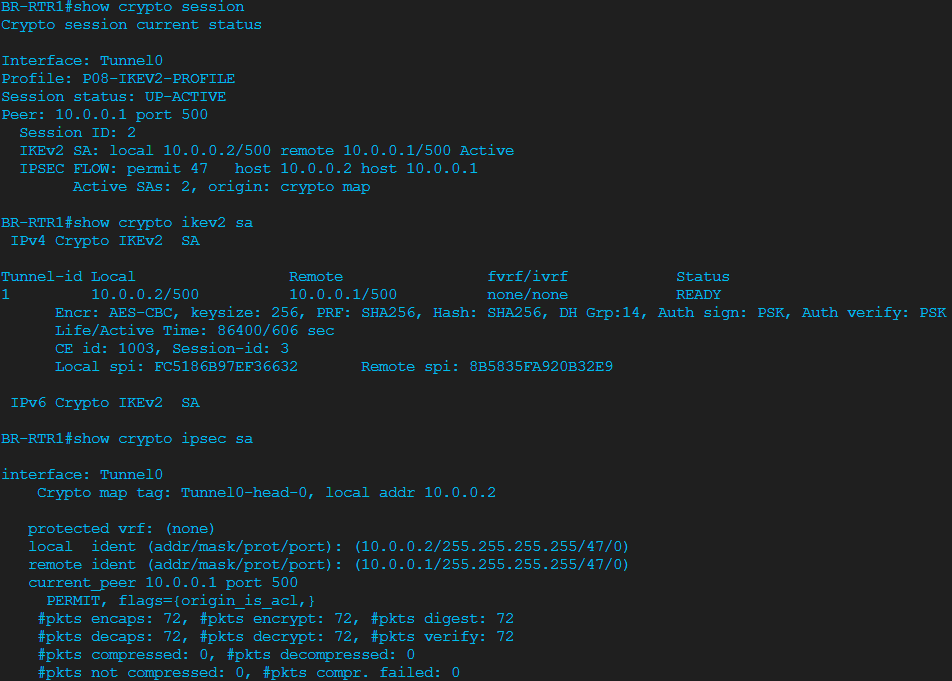

BR-RTR1 IPsec profile PFS confirmation:

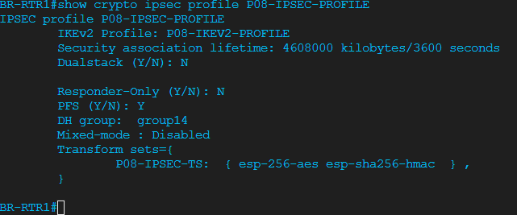

---

## Phase 3 — Route Preference Verification

### Why This Phase Exists

With encryption running, Phase 3 proves the encrypted GRE tunnel is the active preferred inter-site OSPF path — not just present, but actually carrying traffic — while the physical backup paths remain ready for failover.

### Verification

No new configuration in Phase 3. Commands run against the live network to confirm the OSPF cost hierarchy is working.

**HQ-RTR1 evidence:**

```text
show ip ospf neighbor
10.0.255.2 FULL/- 10.0.100.2 Tunnel0      ← preferred, cost 5
10.0.255.3 FULL/- 10.0.0.6   Ethernet0/2  ← WAN-RTR1 backup, cost 10
10.0.255.2 FULL/- 10.0.0.2   Ethernet0/1  ← direct physical backup, cost 100

show ip route 10.2.0.0
Routing entry for 10.2.0.0/16
Known via "ospf 1", distance 110, metric 15, type inter area
* 10.0.100.2, from 10.0.255.2, via Tunnel0

traceroute 10.2.100.1 source 10.1.100.1
1 10.0.100.2 2 msec * 2 msec              ← Tunnel0 first hop

show crypto ipsec sa
#pkts encaps: 140, #pkts encrypt: 140, #pkts digest: 140
#pkts decaps: 135, #pkts decrypt: 135, #pkts verify: 135
#send errors 0, #recv errors 0            ← counters confirming traffic is encrypted
transform: esp-256-aes esp-sha256-hmac
in use settings ={Transport,}
Status: ACTIVE(ACTIVE)
```

**BR-RTR1 evidence:**

```text
show ip ospf neighbor
10.0.255.1 FULL/- 10.0.100.1 Tunnel0      ← preferred, cost 5
10.0.255.3 FULL/- 10.0.0.9   Ethernet0/2  ← WAN-RTR1 backup, cost 10
10.0.255.1 FULL/- 10.0.0.1   Ethernet0/1  ← direct physical backup, cost 100

show ip route 10.1.0.0
Routing entry for 10.1.0.0/16
Known via "ospf 1", distance 110, metric 15, type inter area
* 10.0.100.1, from 10.0.255.1, via Tunnel0

traceroute 10.1.100.1 source 10.2.100.1
1 10.0.100.1 3 msec * 3 msec              ← Tunnel0 first hop

show crypto ipsec sa
#pkts encaps: 142, #pkts encrypt: 142, #pkts digest: 142
#pkts decaps: 144, #pkts decrypt: 144, #pkts verify: 144
#send errors 0, #recv errors 0
transform: esp-256-aes esp-sha256-hmac
Status: ACTIVE(ACTIVE)
```

**Design summary:**
- Primary path: Tunnel0, cost 5, total metric 15 — encrypted with IKEv2/IPsec
- First fallback: WAN-RTR1 via Ethernet0/2, cost 10
- Final fallback: Direct physical WAN via Ethernet0/1, cost 100 (unencrypted — deliberately left as emergency path)

---

## Phase 4 — Break/Fix: IKEv2 Proposal Mismatch

### The Fault

On BR-RTR1 only, change the IKEv2 proposal from AES-256 to AES-128. Clear crypto SAs to force immediate renegotiation.

```text
! BR-RTR1 — inject fault:
crypto ikev2 proposal P08-IKEV2-PROP
 no encryption aes-cbc-256
 encryption aes-cbc-128

clear crypto ikev2 sa
clear crypto sa
```

### Expected Symptoms

```text
%LINEPROTO-5-UPDOWN: Line protocol on Interface Tunnel0, changed state to down
%OSPF-5-ADJCHG: Process 1, Nbr 10.0.255.1 on Tunnel0 from FULL to DOWN,
Neighbor Down: Interface down or detached
```

### Diagnosis Path (show commands only)

```text
show crypto session
! Expected: Session status: DOWN, Active SAs: 0
! Key observation: DOWN means IKEv2 control-plane failed — not just traffic down

show crypto ikev2 sa
! Expected: no output at all
! Key observation: empty output = no IKE SA exists = negotiation failed, not formed

show ip ospf neighbor
! Expected: Tunnel0 neighbor missing; Ethernet0/1 and Ethernet0/2 still FULL
! This tells you routing has failed over to backup paths automatically

show crypto ipsec sa
! Expected: all encaps/decaps 0, no inbound or outbound ESP SAs

! Root cause command — compare on both routers:
show running-config | section crypto ikev2 proposal
! BR-RTR1 shows: encryption aes-cbc-128   ← fault
! HQ-RTR1 shows: encryption aes-cbc-256   ← correct
! Mismatch confirmed without any debug
```

**Pre-fault baseline evidence (BR-RTR1):**

```text
show crypto session
Interface: Tunnel0
Profile: P08-IKEV2-PROFILE
Session status: UP-ACTIVE
Peer: 10.0.0.1 port 500
IKEv2 SA: local 10.0.0.2/500 remote 10.0.0.1/500 Active
Active SAs: 2
```

**Broken state evidence (BR-RTR1):**

```text
show crypto session
Interface: Tunnel0
Session status: DOWN
Peer: 10.0.0.1 port 500
Active SAs: 0

show crypto ikev2 sa
(no output — no IKEv2 SA present)

show ip ospf neighbor
10.0.255.3 FULL/- 10.0.0.9 Ethernet0/2
10.0.255.1 FULL/- 10.0.0.1 Ethernet0/1
(Tunnel0 neighbor 10.0.255.1 is missing)

show crypto ipsec sa
#pkts encaps: 0, #pkts encrypt: 0, #pkts digest: 0
current outbound spi: 0x0(0)
No inbound ESP SAs.
No outbound ESP SAs.
```

**Root cause confirmed:**

```text
show running-config | section crypto ikev2 proposal
! BR-RTR1:
crypto ikev2 proposal P08-IKEV2-PROP
 encryption aes-cbc-128    ← fault — HQ still expects AES-256
 integrity sha256
 group 14
```

### Fix

```text
! BR-RTR1 — restore matching proposal:
crypto ikev2 proposal P08-IKEV2-PROP
 no encryption aes-cbc-128
 encryption aes-cbc-256

clear crypto ikev2 sa
clear crypto sa
```

### Post-Fix Recovery Evidence

OSPF reconvergence happened within one second of the crypto fix:

```text
07:48:01: %LINEPROTO-5-UPDOWN: Tunnel0 changed state to up
07:48:01: %OSPF-5-ADJCHG: Process 1, Nbr 10.0.255.1 on Tunnel0 from DOWN to FULL
```

Full OSPF state machine traversal was visible: DOWN → INIT → 2WAY → EXSTART → EXCHANGE → LOADING → FULL.

```text
show crypto session
Interface: Tunnel0
Profile: P08-IKEV2-PROFILE
Session status: UP-ACTIVE
Peer: 10.0.0.1 port 500
IKEv2 SA: local 10.0.0.2/500 remote 10.0.0.1/500 Active
Active SAs: 2

show crypto ikev2 sa
Local 10.0.0.2/500 remote 10.0.0.1/500 Status READY
Encr: AES-CBC, keysize: 256, PRF: SHA256, Hash: SHA256, DH Grp:14
Auth sign: PSK, Auth verify: PSK
Life/Active Time: 86400/17 sec

show ip ospf neighbor
10.0.255.1 FULL/- 10.0.100.1 Tunnel0
10.0.255.3 FULL/- 10.0.0.9   Ethernet0/2
10.0.255.1 FULL/- 10.0.0.1   Ethernet0/1

show crypto ipsec sa
#pkts encaps: 9, #pkts encrypt: 9, #pkts digest: 9
#pkts decaps: 10, #pkts decrypt: 10, #pkts verify: 10
#send errors 0, #recv errors 0
transform: esp-256-aes esp-sha256-hmac
in use settings ={Transport,}
Status: ACTIVE(ACTIVE)

traceroute 10.1.100.1 source 10.2.100.1
1 10.0.100.1 3 msec * 2 msec    ← Tunnel0 path restored
```

---

## Verification Summary

| Check | HQ-RTR1 | BR-RTR1 |
|-------|---------|---------|
| Tunnel0 line protocol | up/up | up/up |
| OSPF over Tunnel0 | FULL/- | FULL/- |
| OSPF cost on Tunnel0 | 5 | 5 |
| Inter-site route metric | 15 via Tunnel0 | 15 via Tunnel0 |
| Traceroute first hop | 10.0.100.2 (BR Tunnel0) | 10.0.100.1 (HQ Tunnel0) |
| show crypto session | UP-ACTIVE, Active SAs: 2 | UP-ACTIVE, Active SAs: 2 |
| show crypto ikev2 sa | READY, AES-256, SHA256, DH14 | READY, AES-256, SHA256, DH14 |
| IPsec transform | esp-256-aes esp-sha256-hmac | esp-256-aes esp-sha256-hmac |
| IPsec mode | Transport | Transport |
| ESP counters | Increasing, 0 errors | Increasing, 0 errors |
| Physical fallback paths | Present (E0/1, E0/2) | Present (E0/1, E0/2) |
| Break/fix recovery | N/A (initiator) | Full recovery confirmed |

---

## Troubleshooting Log

See [TROUBLESHOOTING-LOG.md](TROUBLESHOOTING-LOG.md) for detailed entries on:
- IKEv2 policy name vs. numeric priority (IOL syntax requirement)
- PFS display inconsistency on IOL platform
- Phase 4 IKEv2 proposal mismatch break/fix

Also recorded in the root [TROUBLESHOOTING-LOG.md](../TROUBLESHOOTING-LOG.md).

---

## Key Technologies

| Technology | What Was Built |
|------------|---------------|
| GRE tunnel | Tunnel0 overlay between HQ-RTR1 and BR-RTR1, 10.0.100.0/30 |
| IKEv2 | Proposal, policy, keyring, and profile for control-plane security |
| IPsec ESP | Transport-mode encryption of GRE packets (AES-256/SHA-256) |
| Dead Peer Detection | DPD 10/3 periodic — faster crypto failure detection |
| Perfect Forward Secrecy | PFS group14 in IPsec profile |
| OSPF over GRE | Tunnel0 cost 5 as preferred inter-site path, physical paths as fallback |
| OSPF MD5 auth | Applied to Tunnel0 for control-plane integrity |
| MTU/MSS tuning | ip mtu 1400 + ip tcp adjust-mss 1360 for fragmentation prevention |
| Break/fix methodology | Proposal mismatch diagnosed with show commands — no debug required |
