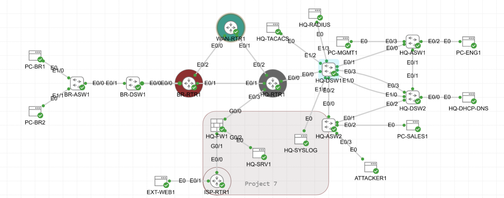

# Project 10 — AAA and Network Access Control

**Series:** Enterprise Network Labs | **Platform:** Cisco CML 2.9 (IOL / IOL-L2 / ASAv)
**Build Date:** 2026-05-22 | **Status:** All Phases Complete ✅ (Phase 4 platform limitation documented)

---

## STAR Summary

**Situation:** Projects 01-09 built a fully routed, firewalled, encrypted, and monitored enterprise network — but every device still accepted any login with no central control over who logged in, what privilege level they received, or what commands they ran. There was no audit trail and no way to revoke access from a single point.

**Task:** Deploy centralized AAA across the enterprise lab using TACACS+ for device administration. Separate privilege levels by role, restrict CLI access with parser views, verify accounting records, and prove that local fallback works correctly when the TACACS+ server is unreachable. Use RADIUS as the foundation for 802.1X port authentication.

**Action:** Added HQ-TACACS (tac_plus, TCP/49) and HQ-RADIUS (FreeRADIUS, UDP/1812/1813) nodes to the CML topology, cabled to HQ-DSW1 in VLAN 999. Rolled out TACACS+ to 7 IOS/IOL devices using a Phase A / Phase B split — method lists configured and tested with `test aaa group tacacs+` before vty lines were changed. Applied a console safeguard (`aaa authentication login CONSOLE local`) on every device before Phase B. Fixed WAN-RTR1 which had no RSA keys. Configured privilege separation — admin/tacadmin receive priv 15, tacoper receives priv 1 and is denied `configure terminal`. Created a `NOC-VIEW` parser view on HQ-RTR1 permitting 8 operational commands and blocking configuration, show running-config, and reload. Attempted 802.1X on HQ-ASW1 — IOL-L2 accepted config syntax but rejected all operational verification commands; documented honestly as a platform limitation. Verified AAA accounting through TACACS server-side auth logs. Ran break/fix — proved local fallback triggers on TACACS unreachability (not on rejection), and diagnosed a wrong shared key using `debug aaa authentication` and `debug tacacs`.

**Result:** Centralized TACACS+ authentication and authorization operational across 7 devices. Role-based privilege separation proven — admin at priv 15, operator at priv 1 with configuration blocked. NOC-VIEW parser view verified with all permitted and restricted commands tested. AAA accounting configured with TACACS server-side auth/authz log evidence. Break/fix proven: unreachable TACACS triggers local fallback at priv 15; wrong key produces `User rejected` with `Continous Authc fail count: 1`, repaired and re-verified. 802.1X platform limitation documented — IOSvL2 required for future completion. All platform limitations documented in `LIMITATIONS-AND-HOMELAB-EXPANSION.md`.

---

## Summary

Deployed centralized AAA across the enterprise CML lab using TACACS+ for device administration and RADIUS as the foundation for network access control. The project covered TACACS+ server integration, privilege-level separation, parser-view role-based CLI, 802.1X port authentication (documented as a platform limitation), AAA accounting verification, and AAA failover break/fix testing.

## Topology



## AAA Servers

| Server | IP | Protocol | Port | Purpose |
|--------|----|----------|------|---------|
| HQ-TACACS | 10.1.99.52 | TACACS+ | TCP/49 | Device administration AAA |
| HQ-RADIUS | 10.1.99.53 | RADIUS | UDP/1812 auth, UDP/1813 acct | Network access / 802.1X foundation |

Both servers are Linux nodes in VLAN 999 (management), cabled to HQ-DSW1.

## Devices in Scope

| Device | Role | TACACS+ Enrolled | Phase 1 Status |
|--------|------|-----------------|----------------|
| HQ-RTR1 | HQ core router | Yes | ✅ Pilot device |
| WAN-RTR1 | WAN router | Yes | ✅ SSH keys added |
| BR-RTR1 | Branch core router | Yes | ✅ |
| HQ-DSW1 | HQ distribution switch | Yes | ✅ |
| HQ-DSW2 | HQ distribution switch | Yes | ✅ |
| BR-DSW1 | Branch distribution switch | Yes | ✅ |
| HQ-ASW1 | HQ access switch | Yes | ✅ |
| HQ-ASW2 | HQ access switch | Yes | ⏸ Deferred — same process |
| BR-ASW1 | Branch access switch | Yes | ⏸ Deferred — same process |
| HQ-FW1 | ASA firewall | No | ASA uses `aaa-server` — separate syntax |

---

## Phase 1 — TACACS+ Device Administration Rollout

### Goal

Enable TACACS+ authentication, authorization, and accounting on all IOS/IOL routers and switches. Maintain local fallback and console access at all times.

### Key Design Decisions

**Phase A / Phase B split** — AAA method lists (Phase A) are configured and tested with `test aaa group tacacs+` before vty lines are changed (Phase B). This prevents a simultaneous commit of both changes, ensuring vty lines are never attached to an unverified method list.

**Console safeguard applied before Phase B on every device:**

```ios
aaa authentication login CONSOLE local
line con 0
 login authentication CONSOLE
```

This keeps console authentication on the local user database regardless of TACACS+ state.

**IOL source-interface syntax** — IOS on IOL rejects `source-interface Loopback0` inside the `tacacs server` block. The correct syntax is the global command:

```ios
ip tacacs source-interface Loopback0
```

### Phase A Configuration (applied to each device)

```ios
configure terminal
aaa new-model
!
tacacs server HQ-TACACS
 address ipv4 10.1.99.52
 key tacacs123
 exit
!
ip tacacs source-interface Loopback0
!
aaa authentication login default group tacacs+ local
aaa authorization exec default group tacacs+ local
aaa accounting exec default start-stop group tacacs+
aaa accounting commands 15 default start-stop group tacacs+
end
write memory
```

### Phase A Test (run before Phase B)

```ios
test aaa group tacacs+ tacadmin admin123 new-code
test aaa group tacacs+ tacoper oper123 new-code
show tacacs
```

Expected:

```
User successfully authenticated
Server Status: Alive
Failed Connect Attempts: 0
```

### Phase B Configuration (vty lines — applied only after Phase A tests pass)

```ios
configure terminal
line vty 0 4
 login authentication default
 authorization exec default
 transport input ssh
end
write memory
```

### WAN-RTR1 SSH Fix

WAN-RTR1 had no domain name and no RSA keys — SSH was disabled:

```
SSH Disabled - version 2.0
Please create EC or RSA keys to enable SSH
```

Fix applied:

```ios
configure terminal
ip domain name lab.local
crypto key generate rsa general-keys modulus 2048
ip ssh version 2
end
write memory
```

### TACACS+ Server Configuration (tac-plus.conf on HQ-TACACS)

```
key = tacacs123
accounting file = /var/log/tacplus-acct.log

group = netadmin {
  default service = permit
  service = exec {
    priv-lvl = 15
  }
}

group = netoper {
  default service = permit
  service = exec {
    priv-lvl = 1
  }
}

user = admin {
  login = cleartext chongong
  member = netadmin
}

user = tacadmin {
  login = cleartext admin123
  member = netadmin
}

user = tacoper {
  login = cleartext oper123
  member = netoper
}
```

### Phase 1 Rollout Verification Results

All 7 enrolled devices confirmed:

```
test aaa group tacacs+ tacadmin admin123 new-code
User successfully authenticated

test aaa group tacacs+ tacoper oper123 new-code
User successfully authenticated

Server Status: Alive
Socket errors: 0
Failed Connect Attempts: 0
```

SSH from HQ-RTR1 to each device:

```
ssh -l tacadmin <device-ip>   →  device# (privilege 15)
ssh -l tacoper  <device-ip>   →  device> (privilege 1)
```

---

## Phase 2 — Privilege Level Separation

### Goal

Prove that TACACS+ assigns different privilege levels to different user groups, and that the operational `admin` username works via TACACS+.

### TACACS+ User Table

| User | Password | TACACS Group | Privilege Level |
|------|----------|-------------|-----------------|
| admin | chongong | netadmin | 15 |
| tacadmin | admin123 | netadmin | 15 |
| tacoper | oper123 | netoper | 1 |

### Verification — SSH Privilege Separation on HQ-DSW1

From HQ-RTR1:

```ios
ssh -l admin 10.1.99.11
```

```
HQ-DSW1#
```

Prompt `#` confirms privilege 15. ✅

```ios
ssh -l tacoper 10.1.99.11
```

```
HQ-DSW1>show privilege
Current privilege level is 15

HQ-DSW1>configure terminal
           ^
% Invalid input detected at '^' marker.
```

Privilege 1, configuration mode denied. ✅

### Verification — HQ-RTR1

```
HQ-RTR1#show privilege
Current privilege level is 15    (admin)

HQ-RTR1>show privilege
Current privilege level is 1     (tacoper)
```

### Admin SSH confirmed on all 7 enrolled devices

| Device | Admin SSH result | Operator restricted |
|--------|-----------------|---------------------|
| HQ-RTR1 | priv 15 ✅ | priv 1, configure denied ✅ |
| HQ-DSW1 | priv 15 ✅ | priv 1, configure denied ✅ |
| WAN-RTR1 | priv 15 ✅ | confirmed during Phase 1 |
| BR-RTR1 | priv 15 ✅ | confirmed during Phase 1 |
| HQ-DSW2 | priv 15 ✅ | confirmed during Phase 1 |
| BR-DSW1 | priv 15 ✅ | confirmed during Phase 1 |
| HQ-ASW1 | priv 15 ✅ | confirmed during Phase 1 |

---

## Phase 3 — Parser Views / Role-Based CLI

### Goal

Create a `NOC-VIEW` parser view on HQ-RTR1 that restricts users to operational read and connectivity commands only, blocking configuration and disruptive commands.

### Prerequisites

Parser views require `aaa new-model` (already active) and an `enable secret`:

```ios
show running-config | include ^aaa new-model|^enable secret|^parser view
```

Result:

```
aaa new-model
enable secret 9 ...
```

Root view entry:

```ios
enable view
show parser view
```

```
Current view is 'root'
```

### NOC-VIEW Configuration

From root view on HQ-RTR1:

```ios
configure terminal
parser view NOC-VIEW
 secret 0 NOCview2026
 commands exec include show privilege
 commands exec include show version
 commands exec include show ip interface brief
 commands exec include show interfaces description
 commands exec include show ip route
 commands exec include show cdp neighbors
 commands exec include show lldp neighbors
 commands exec include all ping
end
write memory
```

Note: `commands exec include exit` was rejected — `exit` is a default parser-view command and cannot be added manually:

```
% Addition/Deletion of default commands not possible
```

### View Presence Verification

```ios
show parser view all
```

```
Views/SuperViews Present in System:
 NOC-VIEW
```

### NOC-VIEW Test Results

Enter the view:

```ios
enable view NOC-VIEW
show parser view
```

```
Current view is 'NOC-VIEW'
```

**Permitted commands — all verified:**

```ios
show privilege                        ✅
show version                          ✅
show ip interface brief               ✅
show interfaces description           ✅
show ip route                         ✅
show cdp neighbors                    ✅
show lldp neighbors                   ✅
ping 10.1.99.52 source Loopback0      ✅  Success rate 100% (5/5)
```

**Restricted commands — all denied:**

```ios
configure terminal       → % Invalid input detected
show running-config      → % Invalid input detected
reload                   → % Invalid input detected
```

---

## Phase 4 — 802.1X Port Authentication

### Planned Scope

Pilot RADIUS-backed IEEE 802.1X on `HQ-ASW1 Ethernet0/2` using `HQ-RADIUS` at `10.1.99.53`.

### Platform Finding

HQ-ASW1 runs IOL-L2. Configuration syntax is present:

```ios
dot1x system-auth-control        ← accepted
authentication port-control auto ← accepted
authentication open              ← accepted
dot1x pae authenticator          ← accepted
```

Operational verification commands are not available:

```
HQ-ASW1#show dot1x all
                 ^
% Invalid input detected at '^' marker.

HQ-ASW1#show authentication sessions
                ^
% Invalid input detected at '^' marker.
```

All alternative commands tested — all rejected:

```
show dot1x
show dot1x interface Ethernet0/2
show dot1x interface Ethernet0/2 detail
show authentication interface Ethernet0/2
show eap registrations
```

`show aaa sessions` returns management AAA session data only — cannot validate 802.1X port state.

`IOSvL2` image (which supports full 802.1X operational commands) is not available in this CML installation.

### Decision

**Phase 4 not completed — platform verification limitation.**

No RADIUS or port-authentication configuration was applied. Claiming an 802.1X implementation that cannot be verified would be dishonest.

**Future completion path:** Repeat when a CML image supporting `show dot1x all` and `show authentication sessions` is available (IOSvL2 recommended).

---

## Phase 5 — AAA Accounting Verification

### Goal

Verify that TACACS+ records administrator logins and privilege-15 commands. Accounting was already configured in Phase 1.

### Accounting Configuration on HQ-RTR1

```ios
aaa accounting exec default start-stop group tacacs+
aaa accounting commands 15 default start-stop group tacacs+
```

Both lines confirmed present. No new configuration needed.

### Test Session Generated

From HQ-DSW1:

```ios
ssh -l admin 10.0.255.1
```

```
HQ-RTR1#show privilege
Current privilege level is 15
```

Commands run in session: `show privilege`, `show clock detail`, `show ip interface brief`, `show ip route`

Session closed cleanly:

```
[Connection to 10.0.255.1 closed by foreign host]
```

### TACACS Server Activity

After session:

```
Total Packets Sent: 95
Total Packets Recv: 95
Server Status: Alive
Socket errors: 0
```

Server-side auth/authz log confirmed the admin session:

```
login query for 'admin' port tty2 from 10.0.255.1 accepted
authorization query for 'admin' tty2 from 10.0.255.1 accepted
server:priv-lvl=15 -> add priv-lvl=15
```

### Limitation

The TacPlus CML node does not expose `/var/log/tacplus-acct.log` via its console interface. Accounting START/STOP records and per-command records could not be retrieved directly.

Phase 5 documented as: **accounting configured and test activity generated; direct server-log proof unavailable due to TacPlus node console/log-access limitation.**

---

## Phase 6 — AAA Failover and Break/Fix

### Goal

Prove that local fallback works when TACACS+ is unreachable, and demonstrate break/fix diagnosis for a wrong TACACS shared key.

### Safety Baseline

Before any fault was introduced:

- Local `admin` privilege-15 user confirmed and password explicitly set
- Console protected with local-only method list (`CONSOLE local`)
- TACACS baseline: 105/105 packets, 0 errors, `Server Status: Alive`
- `test aaa group tacacs+ admin chongong new-code` → `User successfully authenticated`
- Unused address `10.1.99.250` confirmed unreachable: ping 0/3

### Part A — Local Fallback with Unreachable TACACS

**Fault introduced** (console only, not saved):

```ios
configure terminal
tacacs server HQ-TACACS
 no address ipv4 10.1.99.52
 address ipv4 10.1.99.250
 exit
end
```

**Fallback test from HQ-DSW1:**

```ios
ssh -l admin 10.0.255.1
```

```
HQ-RTR1#show privilege
Current privilege level is 15
```

Local fallback to `admin / chongong` succeeded. TACACS was unreachable → IOS returned an error → fell through to `local`. ✅

Note: IOL retained last-known server state in `show tacacs` and did not increment timeout counters during the unreachable test — IOL platform limitation documented.

**TACACS restored and verified:**

```ios
configure terminal
tacacs server HQ-TACACS
 no address ipv4 10.1.99.250
 address ipv4 10.1.99.52
 key tacacs123
 exit
end
test aaa group tacacs+ admin chongong new-code
```

```
User successfully authenticated
Server Status: Alive
```

### Part B — Wrong Shared Key Break/Fix

**Diagnostics enabled:**

```ios
terminal monitor
debug aaa authentication
debug tacacs
```

**Fault introduced:**

```ios
configure terminal
tacacs server HQ-TACACS
 key P10-WRONG-KEY
 exit
end
test aaa group tacacs+ admin chongong new-code
```

**Failure evidence:**

```
User rejected
Server Status: Alive
Continous Authc fail count: 1
```

Server reachable but authentication fails — shared key mismatch. Wrong key causes the server to reject, not timeout. IOS does NOT fall back to local when a reachable server rejects. ✅

**Key distinction proven:**

| Condition | TACACS result | Local fallback triggered? |
|-----------|--------------|--------------------------|
| Server unreachable (Part A) | Error / no response | ✅ Yes |
| Wrong shared key (Part B) | Server rejects (User rejected) | ❌ No |

**Repair:**

```ios
configure terminal
tacacs server HQ-TACACS
 key tacacs123
 exit
end
undebug all
test aaa group tacacs+ admin chongong new-code
write memory
```

```
User successfully authenticated
Server Status: Alive
Total Packets Sent: 133
Total Packets Recv: 133
```

`Continous Authc fail count: 1` remains as historical evidence of the deliberate wrong-key test.

---

## Platform Limitations

| # | Limitation | Impact |
|---|-----------|--------|
| L-01 | IOL-L2 lacks `show dot1x all` and `show authentication sessions` | Phase 4 802.1X could not be verified — config not applied |
| L-02 | IOL does not update `show tacacs` timeout counters during unreachable test | Cannot show counter evidence of TACACS timeout in Phase 6 Part A |
| L-03 | `test aaa local auth default` not supported on IOL | Local password confirmed by explicit reset before Phase 6 |
| L-04 | HQ-TACACS TacPlus node does not expose accounting log via CML console | Phase 5 accounting log could not be read directly |
| L-05 | `show aaa servers` returns no output on IOL | `show tacacs` used as alternative throughout |
| L-06 | IOL rejects `source-interface Loopback0` inside `tacacs server` block | Global `ip tacacs source-interface Loopback0` required |
| L-07 | HQ-ASW2 and BR-ASW1 Phase 1 deferred | Same config as all other switches — no design issue |
| L-08 | HQ-FW1 (ASAv) excluded | ASA uses `aaa-server` object — different syntax, separate phase |

---

## Troubleshooting Log

| ID | Issue | Root Cause | Fix |
|----|-------|-----------|-----|
| T-01 | HQ-TACACS and HQ-RADIUS unreachable — ARP incomplete | Nodes not in CML topology — missing from the lab | Added TacPlus and RADIUS nodes in CML, cabled to HQ-DSW1 Et1/2 and Et1/3, assigned VLAN 999 |
| T-02 | WAN-RTR1 SSH disabled | No domain name, no RSA keys | `ip domain name lab.local` + `crypto key generate rsa general-keys modulus 2048` + `ip ssh version 2` |
| T-03 | Console lockout after `aaa new-model` | Console used the `default` method list which includes TACACS+ | Console safeguard: `aaa authentication login CONSOLE local` + `line con 0 / login authentication CONSOLE` |
| T-04 | IOL rejected `source-interface Loopback0` inside `tacacs server` block | IOL platform limitation — per-server source not supported | Used global command `ip tacacs source-interface Loopback0` |
| T-05 | HQ-TACACS ARP stale after node restart | Node came back with new MAC address | `clear arp 10.1.99.52` on HQ-RTR1, then re-ping to refresh ARP |
| T-06 | 802.1X `show dot1x all` rejected on HQ-ASW1 | IOL-L2 lacks 802.1X operational show commands | Phase 4 documented as platform limitation — no config applied |

---

## Key AAA Behavioral Rules (Proven in This Project)

1. **`aaa new-model` changes all IOS authentication immediately** — configure method lists and local fallback before enabling.

2. **Local fallback triggers on ERROR, not REJECT** — `group tacacs+ local` falls back to local only when TACACS is unreachable or returns an error. A reachable server that rejects authentication terminates the attempt — no local fallback.

3. **Console and VTY must be decoupled** — after `aaa new-model`, the console uses the `default` method list unless explicitly assigned `CONSOLE local`. Always apply the console safeguard before Phase B.

4. **Test before committing VTY lines** — `test aaa group tacacs+` before `transport input ssh` on vty lines. Once SSH-only is committed and TACACS is broken, VTY is inaccessible.

5. **Source interface must match the management path** — TACACS packets must originate from the same IP that the server's client list permits. `ip tacacs source-interface Loopback0` ensures all devices use their stable Loopback0 address.

---

## Troubleshooting

### P10-T01: HQ-TACACS and HQ-RADIUS Unreachable — Nodes Missing from CML

**Symptom:** `ping 10.1.99.52` and `ping 10.1.99.53` from HQ-RTR1 returned incomplete ARP. VLAN 999 MAC table on HQ-DSW1 was empty.

**Root Cause:** HQ-TACACS and HQ-RADIUS nodes had not been added to the CML topology. The switch had no connected devices on those ports.

**Fix:** Added TacPlus and RADIUS Linux nodes in CML, cabled to HQ-DSW1 Ethernet1/2 and Ethernet1/3, configured those switchports as VLAN 999 access ports. Updated boot.sh on each node with correct IPs.

---

### P10-T02: WAN-RTR1 SSH Disabled — No Domain Name, No RSA Keys

**Symptom:** Phase B `transport input ssh` committed on WAN-RTR1 but SSH connections failed:

```
SSH Disabled - version 2.0
Please create EC or RSA keys to enable SSH
IOS Keys in SECSH format(ssh-rsa, base64 encoded): NONE
```

**Root Cause:** WAN-RTR1 had no `ip domain name` configured so RSA keys were never generated.

**Fix:**

```ios
configure terminal
ip domain name lab.local
crypto key generate rsa general-keys modulus 2048
ip ssh version 2
end
write memory
```

---

### P10-T03: Console Lockout After `aaa new-model`

**Symptom:** After enabling `aaa new-model`, console login required TACACS credentials. Local `admin` console login failed even when TACACS was reachable, because `admin` was not yet in tac-plus.conf.

**Root Cause:** `aaa new-model` changes the console to use the `default` method list which includes `group tacacs+`. If TACACS is reachable and rejects the user (user not in TACACS), IOS does not fall through to local.

**Fix:** Applied on all devices before Phase B:

```ios
configure terminal
aaa authentication login CONSOLE local
line con 0
 login authentication CONSOLE
end
write memory
```

This keeps console authentication permanently on the local database regardless of TACACS state.

---

### P10-T04: IOL Rejects `source-interface Loopback0` Inside `tacacs server` Block

**Symptom:** IOS rejected the command when entered inside the `tacacs server HQ-TACACS` configuration block:

```
tacacs server HQ-TACACS
 source-interface Loopback0
         ^
% Invalid input detected at '^' marker.
```

**Root Cause:** IOL platform does not support per-server source-interface in the new-style `tacacs server` block.

**Fix:** Used the global command instead:

```ios
ip tacacs source-interface Loopback0
```

---

### P10-T05: HQ-TACACS ARP Stale After Node Restart

**Symptom:** After HQ-TACACS was restarted, `ping 10.1.99.52` failed. `show tacacs` showed `Failed Connect Attempts` increasing. `show arp` showed an incomplete entry for 10.1.99.52.

**Root Cause:** CML node restart assigned a new MAC address. HQ-RTR1 ARP cache held the old MAC from before the restart.

**Fix:**

```ios
clear arp 10.1.99.52
ping 10.1.99.52 source Loopback0 repeat 5
```

---

### P10-T06: 802.1X `show dot1x all` Rejected on IOL-L2

**Symptom:** All 802.1X operational verification commands were rejected on HQ-ASW1:

```
HQ-ASW1#show dot1x all
                 ^
% Invalid input detected at '^' marker.

HQ-ASW1#show authentication sessions
                ^
% Invalid input detected at '^' marker.
```

Configuration syntax (`dot1x system-auth-control`, `authentication port-control auto`) was accepted, but no operational show commands were available.

**Root Cause:** IOL-L2 implements 802.1X configuration syntax but not the authentication manager operational commands. This is a platform limitation of the IOL-L2 image.

**Fix:** Phase 4 was not applied. Documented as a platform limitation. IOSvL2 image required for proper 802.1X verification (`show dot1x all`, `show authentication sessions`, `show authentication sessions interface GigabitEthernetX/X detail`).
